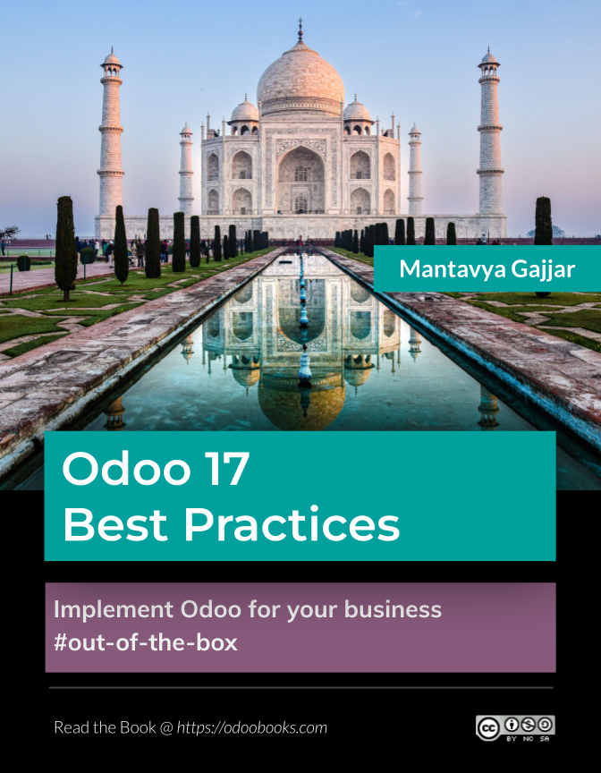

.. _about:

.. meta::
   :description: Title: Odoo 17 Best Practices, Author: Mantavya Gajjar, Category: Books, Price: Free
   :keywords: Odoo Online Book, Odoo Functional Book, Odoo CookBook, Implement Odoo, Mantavya, Gajjar

.. index::
   single: About Online Book
   single: Odoo 17 Best Practices
   single: About Author
   single: About Reviewer

==============
About The Book
==============

**Mastering Odoo: A Comprehensive Guide to Successful Implementation** is the ultimate resource for individuals and businesses seeking to harness the full potential of Odoo, the powerful and flexible open-source ERP system. This comprehensive guide takes readers on a step-by-step journey, providing expert insights, practical advice, and hands-on techniques for a seamless Odoo implementation.

From understanding the fundamentals to advanced customization and optimization, this book covers every aspect of implementing Odoo with precision and success. Whether you are a business owner, project manager, consultant, or developer, "Mastering Odoo" equips you with the knowledge and skills needed to leverage Odoo's capabilities and drive business growth.

Key Features
============

- **Comprehensive Coverage**: Gain a deep understanding of Odoo's architecture, modules, and functionalities, empowering you to make informed decisions during the implementation process.
- **Best Practices and Strategies**: Learn proven techniques and strategies from experienced Odoo professionals to ensure a smooth implementation, optimize workflows, and maximize the system's potential.
- **Step-by-Step Approach**: Follow a structured, step-by-step approach that guides you through the entire implementation process, from planning and configuration to customization, data migration, and post-implementation support.
- **Real-World Examples**: Benefit from real-world use cases and examples that illustrate how Odoo can be customized and tailored to meet specific business requirements across various industries.
- **Practical Tips and Tricks**: Discover valuable tips, tricks, and troubleshooting techniques that will help you overcome challenges and ensure a successful implementation.
- **User Adoption and Training**: Learn how to effectively train users, promote user adoption, and manage change to ensure a smooth transition and maximize the benefits of implementing Odoo.
- **Performance Optimization and Scalability**: Explore techniques to optimize the performance of your Odoo instance and scale it to accommodate growing business needs.
- **Continuous Improvement**: Understand the importance of continuous improvement and explore strategies for enhancing and upgrading your Odoo implementation as your business evolves.

With its comprehensive coverage and practical approach, "Mastering Odoo" empowers readers to implement, customize, and optimize Odoo ERP with confidence. Whether you are a small business looking to streamline operations or an enterprise seeking a robust ERP solution, this book is your go-to guide for harnessing the power of Odoo and achieving successful implementation.

Why this book?
==============

After writing `Odoo 10 Implementation
Cookbook <https://www.packtpub.com/application-development/odoo-10-implementation-cookbook>`__,
I realized that it is too difficult to have the latest and up-to-date
printed book of each version for the fast evolving business application.
Odoo release its stable version every 12 to 15 months. The aim of this
book is to guide you through step-by-step configuration for business
problems.

Credits
=======

Thanks to all the contributors of Odoo Official Documentation project as
many pages/topics of this book was actually taken from
https://www.odoo.com/documentation.

License
=======

All the pages, images and videos of Odoo Books are free to use modify
and reuse on blog, forum, support platform, etc. They are provided under
Creative Commons Attribution-NonCommercial-ShareAlike 4.0 International
License. Please credits to https://odoobooks.com when using page(s) from
Odoo Online Book.

.. |image0| image:: ./images/licenses.png
   :width: 0.91667in
   :height: 0.32292in

Creative Commons License

Odoo Book is licensed under a Creative Commons
Attribution-NonCommercial-ShareAlike 4.0 International License.

Updates
=======
You can subscribe to `Youtube <https://www.youtube.com/channel/UCX4UHpNrqjyp2Sr1de-c5Pg>`_
channel to receive an instance update about the new videos and pages on this book.

You can follow `Twitter <https://www.twitter.com/mantavyagajjar>`_ channel
to get the updates about the book.

About the Author
================

Mantavya Gajjar has 17 years’ experience in Odoo, starting from TinyERP
and OpenERP. He started his career as a developer, he developed many new
features in TinyERP, OpenERP and Odoo. He has graduate and postgraduate
degrees in Computer Applications from Gujarat Vidyapith. In June 2006,
he started working for Axelor and TinyERP at Ahmadabad. He has initiated
web client for TinyERP and mobile application project for Odoo.

He was the first international employee appointed to establish a branch
of TinyERP in India (Ahmadabad, Gujarat). He has done everything from
registering a legal company to setting up the physical office and
recruitment at India. He has interviewed more than eight thousand
candidates in the last 12 years, and he has selected and trained more
then four hundred employees for the Indian branch. Most professionals
working on Odoo in India are trained by him. As a result, today India
(Ahmadabad, Gujarat) is called the Hub of Odoo Developers, and over a
thousand Odoo developers are available only in Gujarat.

Mantavya is actively engaged with many universities in preparing and
reviewing the syllabus for the Computer Applications and Computer
Science courses. He has reviewed thousands of academic student projects.
As an alumnus of the Gujarat Vidyapith Computer Science Alumni
Association, he contributes his free time to various social activities.
He also plays the role of a trustee member and treasurer at Gujarat
Vidyapith Computer Science Alumni Association.

About the Reviewer
==================

Nikunj Jani earned a masters degree in computer applications from
Gujarat, India. He began his career in 2007 as a software engineer with
an MNC called SATYAM COMPUTERS. In 2009, he joined TinyERP, a division
of Odoo, S.A. in India as a team lead. During his tenure of 8+ years
with Odoo, he has worked with several versions, including 5.0, 6.0, 6.1,
7.0, 8.0, 9.0, 10.0, and 11.0. He has worked as a functional consultant
(business analyst), training manager, and project manager.

Currently, he is the product owner and heads a usability and testing
team at Odoo (India) for the upcoming versions. Nikunj is an open source
enthusiast who has given 35+ international functional
trainings/consultancies to Odoo partners, prospects, and end customers.

Nikunj has a total of 14 years of IT experience, and his specialties
include training, consultancy, analysis, project management, usability,
and testing new features of Odoo.

Preface
=======

The Odoo online book covers the implementation best practices and
approach to configure the business applications out-of-the-box. With
this approach you can configure your Odoo online instance or Odoo.sh or
locally installed Odoo on your server.

Page structure
==============

Each single page on this book have the real time business case and how
that business can be configure with Odoo standard features. The page
divides in the specific sections, each sections give you enough
information to solve the business problem. The major sections as below.

Problem statement
-----------------

The page has a single line problem statement such as “Create my first quotation”,
give you brief information about the business situation, where it uses and which
business requires to deal with such situation. Most of the problem
statement are “how to ..” questions.

Business case
-------------

This section gives you a real-life business case.

Configuration
-------------

this sections give you a step-by-step configuration, that help you to
fit the real-life business problem in Odoo using the standard features. Some of
the page give you steps to configure the options.

Video
-----

This section gives you a link on the PDF or embedded videos on the
online book, that shows you the detailed configuration steps and the
steps to execute the business case. You can get access to all the videos
used in this book at `Youtube <https://www.youtube.com/channel/UCX4UHpNrqjyp2Sr1de-c5Pg>`_.

See also
--------

This section has the useful links to the related business cases.

Conventions
===========

There are different text styles, that used to differentiate the
informations, like **Bold text** used to name any screen label, menus,
or static information available on the screen while *Italic text* always
represents the value.

Images are used to illustrate the confirmation or result, you can
understand the topics explain about the which business features and
configuration.
