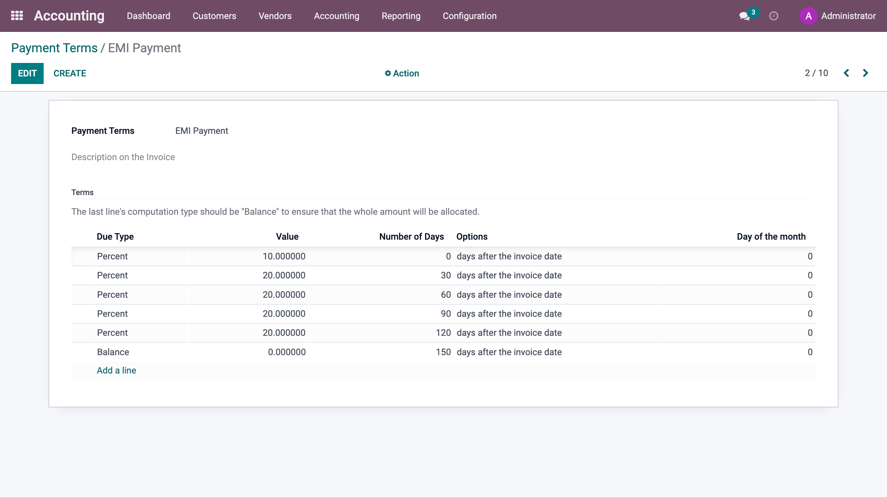

.. _installmentplans:

.. index::
   single: Installments Plan
   single: EMI Payment

=======================================================
Define an EMI Plan on customer invoices - Payment terms
=======================================================

Business Case
-------------
Define the EMI Payment for the regular customers.

Immediate - 10% Payment
Phase 1 - 20% Payment in 30 days
Phase 2 - 20% Payment in 60 days
Phase 3 - 20% Payment in 90 days
Phase 3 - 20% Payment in 120 days
Balance - Balance Payment in 150 days

Configuration
-------------
Create a payment term as below.

|image1|

Video
-----
Access the video at https://www.youtube.com/watch?v=kD8pM58YNsY

.. raw:: html

    

    <iframe width="100%" class="youtube-video" src="https://www.youtube.com/embed/kD8pM58YNsY" frameborder="0" allow="autoplay; encrypted-media" allowfullscreen></iframe>
    

