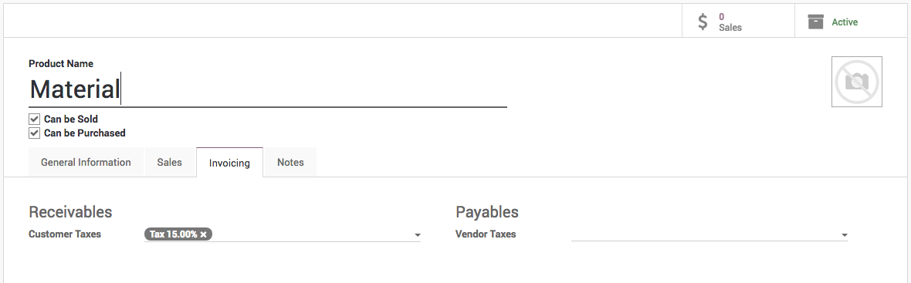

.. index::
   single: Apply default tax

Apply default taxes on products or sales order
==============================================

Taxes applied in your country are installed automatically for most
localizations. Default taxes set in orders and invoices come from each
product’s Invoicing tab. Such taxes are used when you sell to companies
that are in the same country/state than you.

Business case
-------------

Let’s set the default sales and purchase tax to Tax 15.00%.

Configuration
-------------

All the new products created in the Odoo take the default tax set in the
**Accounting/Invoicing** **Settings**. To change the default taxes set
for any new product created, goto **Invoicing / Configuration /
Settings**.

|image0|

Create new product
------------------

Let’s create a new product, the default tax which was applied should be
applied on this product.

|image1|

Create sales order
------------------

Let’s create a new order and select the same product on the order line,
the tax which was set on the products should be applied on the sales
order line tax field.

|image2|

Now, your salesman do not have to remember that what taxes to be applied
on which product.

.. |image0| image:: static/default_tax/media/image6.png

.. |image2| image:: static/default_tax/media/image4.png
