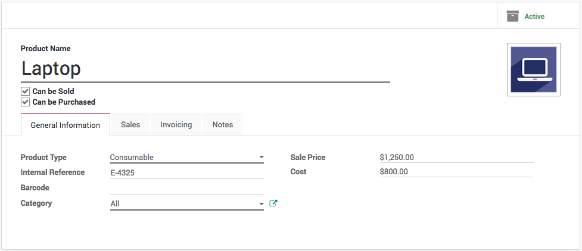
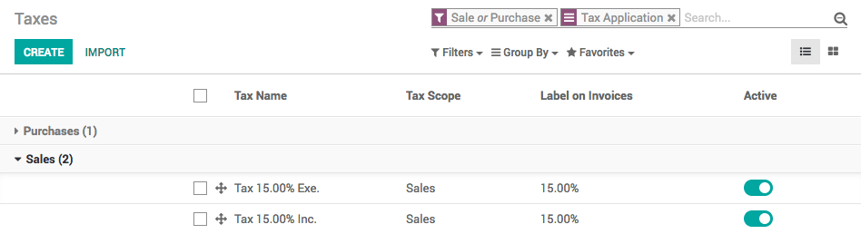
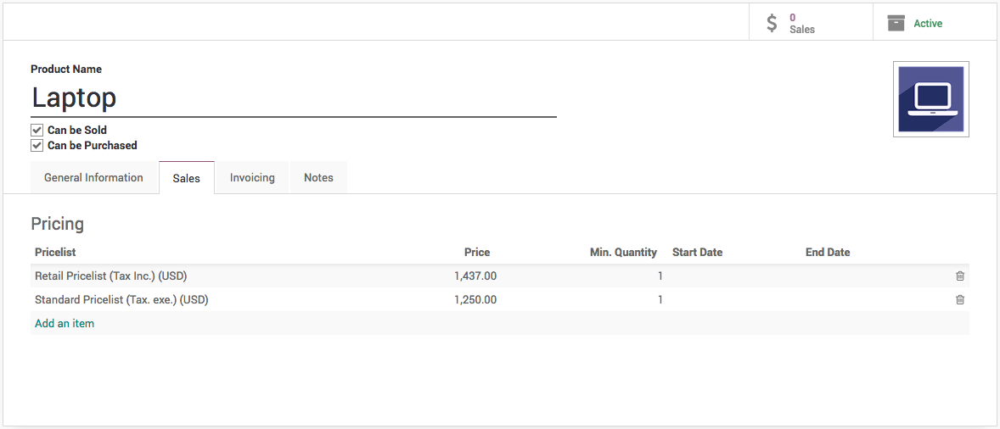
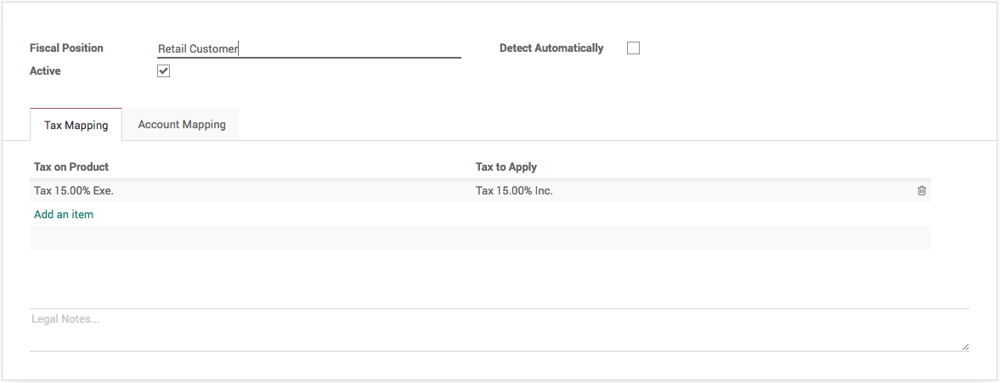
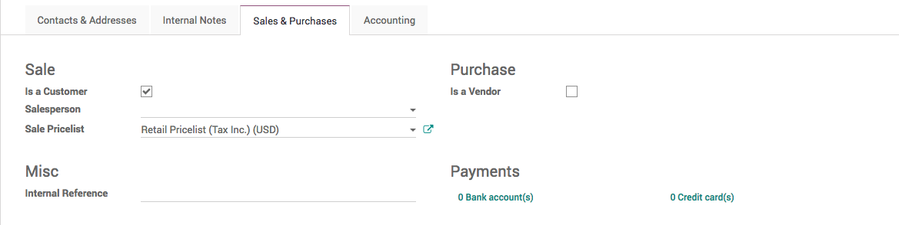
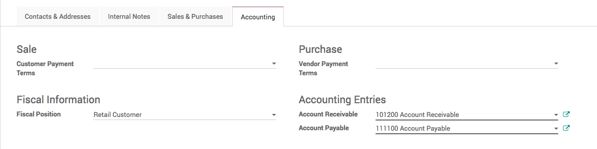
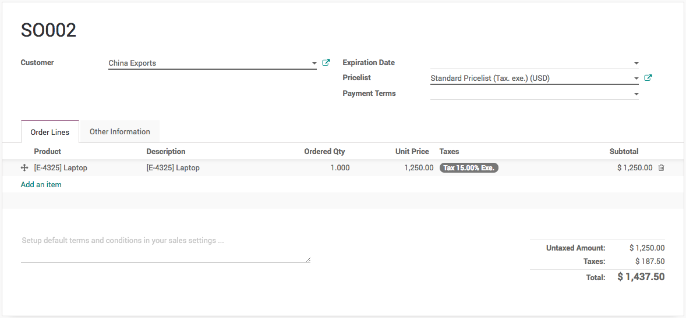

.. index::
   single: Business to Business, Tax Excluded
   single: Business to Customer, Tax Included

Manage product prices for B2B (tax excluded) and B2C (tax included)
===================================================================

When working with consumers, prices are usually expressed with taxes
included in the price (e.g., in most eCommerce). But, when you work in a
business environment, companies usually negotiate prices without taxes.

You can manage both use cases easily, as long as you register your
prices on the product with taxes excluded or included, but not both
together. If you manage all your prices with tax included (or excluded)
only, you can still easily do sales order with a price having taxes
excluded (or included): that's easy.

Let’s see how you can manage the product pricing for both customer at
once. When you have a retailer customer on eCommerce store you can show
the price and send the quotation with tax included in price and for same
product you can prepare and send the quotation excluded price for back
office sales to the business customer.

Configuration
-------------

The best way to simplify the price by setting the product price as tax
excluded by default, so all the price defined on the product are always
tax excluded. The other way will be computed automatically.

Product Price
~~~~~~~~~~~~~

Make sure that when you define the product price it will always tax
excluded, and apply the default tax on the product form.

|image0|

Create taxes
~~~~~~~~~~~~

Create a different taxes with the same percentage 15%, one define as
**Included in Price** and for other one which is tax excluded rename the
existing ‘Tax 15.00%’ to ‘Tax 15.00% Exe.’

|image1|

Price List
~~~~~~~~~~

Create a pricelist that have the product price always tax included. So,
If you define the product *Laptop* price $1250 and default tax is 15%
define the product price on price list as $1437.5.

|image2|

Create a Fiscal Position
~~~~~~~~~~~~~~~~~~~~~~~~

Create a fiscal position that use to swap taxes. When you are selling to
wholesale(b2b) customer, the default tax we have applied on the product
is always tax excluded but when you sell to retail customer you have to
apply the price which is tax included and tax which actually computed
the tax included.

|image3|

Create a retail customer (b2c)
------------------------------

There are two important fields has to be set correctly when you create a
retail customer, **Sales** **Pricelist** has to be set to *Retail
Pricelist (Tax. Inc.) (USD)* under the **Sales & Purchase** tab.
|image4|

The **Fiscal Position** should be set to *Retail Customer* under the
**Accounting** and tab.

|image5|

Create a normal customer (b2b)
------------------------------

By default all the customer are created are considered as business
customers with the default pricelist and tax is applied which is always
the tax excluded.

Create a test quotation
-----------------------

Create a quotation from the Sale application, using the Sales /
Quotations menu. Select the *Ajay Patel* as a customer, sell *Laptop*
product, you should have the following result: 1250€ + 187.50€ =
1437.50€.

|image6|

When you create a quotation for the normal customer which has tax
excluded will be looking as below.

|image7|

.. tip:: If you negotiate a contract with a customer, whether you
  negotiate tax included or tax excluded, you can set the pricelist and
  the fiscal position on the customer form so that it will be applied
  automatically at every sale of this customer.

.. |image6| image:: static/business_to_business/media/image16.png

