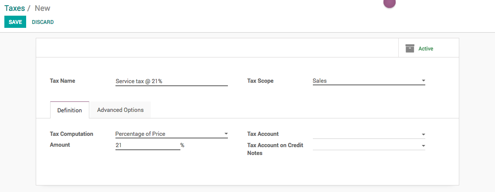
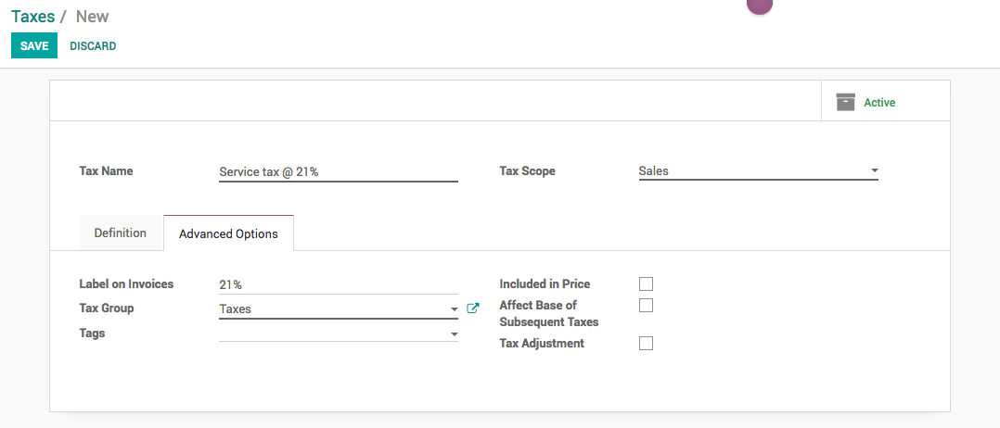

.. index::
   single: Create New Tax

Create a new taxes
==================

Odoo's tax engine is very flexible and support many different type of
taxes: value added taxes (VAT), eco-taxes, federal/states/city taxes,
retention, withholding taxes, etc. For most countries, your system is
pre-configured with the right taxes.

Business case
-------------

Let’s create a service tax that computes the tax @ 21% of the service
price.

Configuration
-------------

Assumed that the you have already installed either **Invoicing** or
**Financial Accounting** application.

Create a tax
~~~~~~~~~~~~

The new tax can be created from **Invoicing / Configuration / Taxes** or
**Accounting / Configuration / Taxes**, create a new tax and enter Tax
Name, Tax Scope, Tax Computation.

|image0|

**Tax Name** is a label to the tax that will be displayed on the sales
or purchase order form during sales or purchase process, on the printed
invoice **Label on Invoices** will be printed, can be set under the
**Advance Options** tab.

**Tax Scope** is used to define the tax application, it can be *Sales*
or *Purchase* or *None*. You can set None when tax is deprecated or tax
is used in a group but not applicable directly.

.. note:: If you want to avoid using a tax, you can not delete it
  because the tax is probably used in several invoices. So, in order to
  avoid users to continue using this tax, you should set the field Tax
  Scope to None.

**Tax Computation** is a type that can be selected according to the tax
computation required

-  Fixed: eco-taxes, etc.

-  Percentage of Price: most common (e.g. 15% sales tax)

-  Percentage of Price Tax Included: used in Brazil.

-  Group of taxes: allows to have a compound tax

.. tip:: If you need more advanced tax mechanism, you can install the
  module \`account_tax_python\` and you will be able to define new taxes
  with Python code.

Advanced configuration
~~~~~~~~~~~~~~~~~~~~~~

|image1|

**Label on Invoices** is a short text on how you want this tax to be
printed on invoice line. For example, a tax named "*Service tax @ 21%*"
can have the following label on invoice "*21%*".

**Tax Group** defines where this tax is summed in the invoice footer.
All the tax belonging to the same tax group will be grouped on the
invoice footer. Examples of tax group: VAT, Retention.

**Included in Price** can be selected when the tax is to be defined as
included in price. i.e. *Product Price is 100 and Service tax @ 21% is
defined as included in price then product cost will be set as 82.64 and
tax amount will be 17.35.*

**Tags**: are used for custom reports. Usually, you can keep this field
empty.

