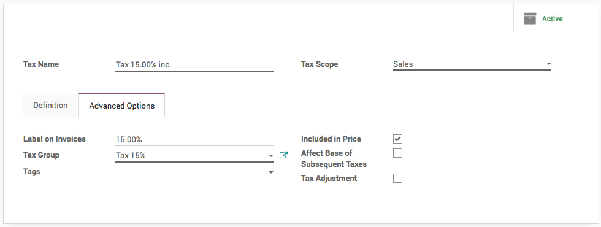

.. index::
   single: Business to Customer (tax included)

Define product prices for Business to Customer (tax included)
=============================================================

In most countries, business to customers prices are tax-included. Check
**Included in Price** for each of your sales taxes in **Accounting /
Configuration / Taxes**.

|image0|

This way the price set on the product form includes the tax. As an
example, let's say you have a product with a sales tax of 10%. The sales
price on the product form is $100.

If the tax is **not included** in the price, you will get:

+-------------------+------+
| Price without tax | $100 |
+===================+======+
| Taxes             | $15  |
+-------------------+------+
| Total to pay      | $115 |
+-------------------+------+

If the tax is **included** in the price:

+-------------------+--------+
| Price without tax | $86.96 |
+===================+========+
| Taxes             | $13.04 |
+-------------------+--------+
| Total to pay      | $100   |
+-------------------+--------+

