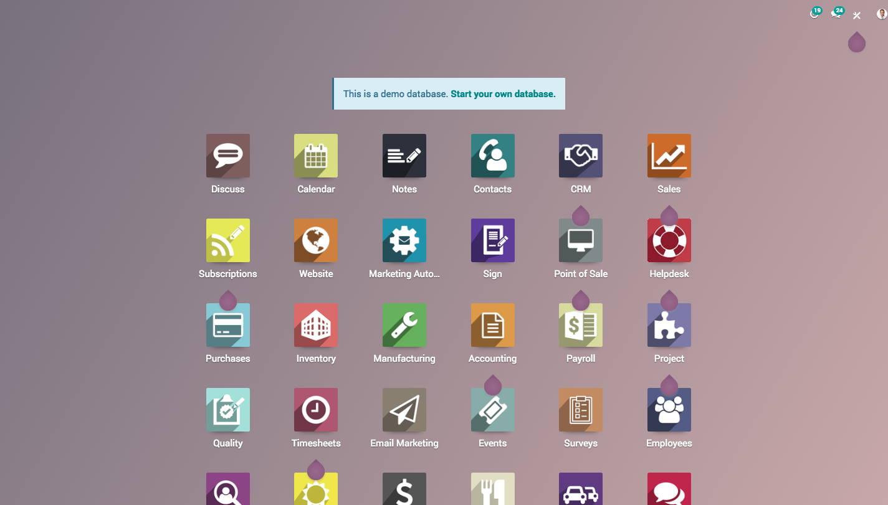
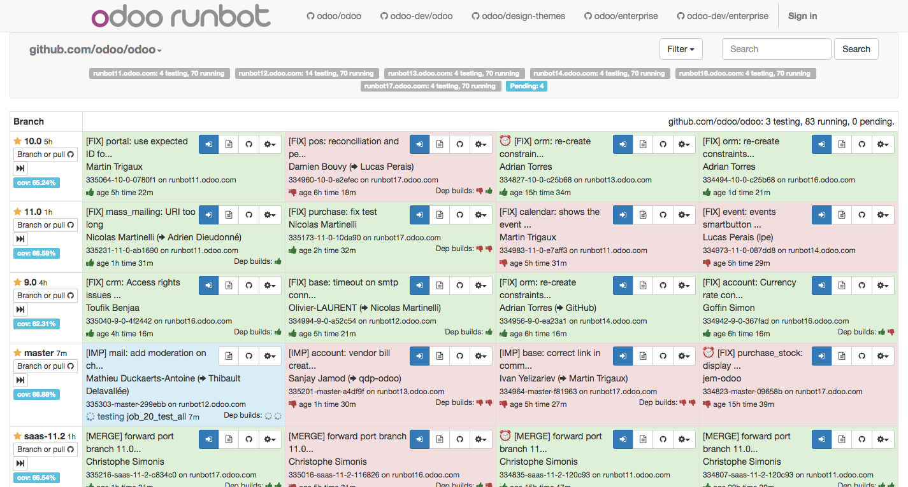

.. _testdrive:

==============================
How to test upcoming features?
==============================
Odoo offers a platform where you can test latest stable version of the Odoo software or you can also test the upcoming features from development version.

Odoo Online Demo
----------------
Odoo instant demonstration can be found at https://demo.odoo.com. Online demo is perfect fit for the visitors who wanted to test the latest stable Odoo software without installing or creating an online instance, demo instance will be refreshed every 24 hours automatically so all the data created by you will be erased automatically.

.. tip:: Don't worry if your URL will be changed form https://demo.odoo.com to https://demo1.odoo.com, https://demo2.odoo.com or https://demo3.odoo.com, Odoo started many demo instance, you will be redirected to the instance having low traffic.

Test upcoming features
----------------------
**Odoo Runbot** is automated test platform user for the continuous integration designed and developed by Odoo SA. It is integrated with github.com to test each and every committee made by the Odoo developers. Odoo Employees worldwide use this platform for the internal testing before merging any feature into the master branch.

Background colours of committee represents the status of the committee, Green represents successfully tested without any ERROR while Red represents ERROR in the code, either code is not clean or there is any test-case failed. You can not connect the committee which are in Blue color as there are currently being tested by the runbot.

Most of the features under development can be found under ``odoo-dev/odoo`` or ``odoo-dev/enterprise`` menu, branche name started with master- are the features under development while ``10-xxx-xxx`` or ``11-xxx-xxx`` are the fixes for the respective versions.

Connect to the test instance
----------------------------
You can connect and test every single committee on the development branch, click on the ``Sign in to this build`` icon.

.. tip:: The default username will be admin and password will be admin too for all the instance, if may not able to connect in case some visitor has changed the password.

You can perform the test on two different databases:

* Installed all the applications with demo data
* Installed only base application without demo data - you have to install additional applications you want to test.

.. danger:: **Online Demo** and **Runbot** is not suitable platform to prepare the demo as no guarantee to get the same data all the time, because several users using those instances so data may change without notifications.