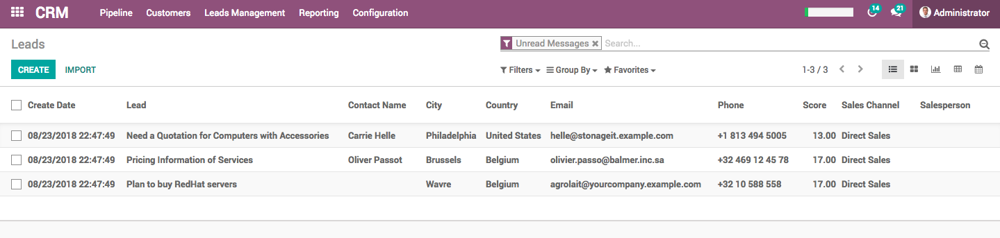

Convert leads into opportunities
================================

Opportunity is a qualified lead, specific deal has met certain criteria
which indicate a high value to the business, or a high probability of
closing but when you have details of your visitors, it is just a lead.
You have to get the enough details form you visitors, if matches with
your business interest you can convert them into opportunity.

You can collect the leads instead of creating an opportunity and setup
the process to qualify those leads before you convert them into
opportunity.

Business case
-------------

Assumed that **My company** is collecting contacts of all the visitors,
through contact us page or visitor tracking system. Create an leads from
the contact information and qualify them before converting them into an
opportunities.

Configuration
-------------

By default you have an opportunity created in the sales channel, you can
have a leads when someone contact you on the website contact us page or
send an email to sales@mycompany.com, to activate leads goto **CRM /
Configuration / Settings** and activate the **Leads** feature.

|image0|

You will now have a new submenu **Leads** under **Pipeline** where they
will aggregate.

Qualify Leads
-------------

Send the mass mail on new leads received everyday, prepare a good
description of your product service details in an email and try to get
more information from leads and their expectations from your products or
service.

|image1|

.. tip:: Define a good subject, include your product / service name into
  the [ ] square bracket, that make sure that your email will not go to
  the spam.

You can convert those leads into the opportunity, when your visitor
reply to your email which was sent in mass mail.

Convert lead into an opportunity
--------------------------------

The leads can be converted to an opportunity either manually or
automatic depending on the volume of leads you have.

Manual conversion
~~~~~~~~~~~~~~~~~

Every day review your leads having reply from the prospects and convert
all those leads into an opportunities. You can apply filter **Unread
Messages**

|image2|

Open the wizard Convert to Opportunity wizard form the Action menu and
you are ready to convert selected leads into opportunities.

|image3|

**Apply duplication** option will be selected automatically when system
detect the duplicate leads in the system based on the email or phone
number, duplicated leads will be displayed below form.

You can change the **Sales channel** if you would like to transfer the
opportunity in other channel. You can choose either you would like to
link the opportunity with customer by selecting existing or create a new
or leave empty. You can create a customer later at the time of create a
proposal for them.

The **Salesman** has to be assigned manually while converting leads into
opportunity.

Automatic conversion
~~~~~~~~~~~~~~~~~~~~

The automatic conversion and assignation of the opportunity can be done
with the help of Lead Score application. You have to install and
configure the scoring rules and assignation rules in order to convert
leads into opportunity and assign to the correct member in the team.

You can define domain on the sales channel which will fetch leads
accordingly and convert it into the opportunity. The domain may include
lead scores, page visited by visitor, and other information such as
country, city, availability of the email or phone.

Please go through **Automatic leads assignation to team members** topic
in Customer Relationship Management section.

.. |image0| image:: ./static/convert_lead/media/image7.png

.. |image1| image:: ./static/convert_lead/media/image5.png

.. |image3| image:: ./static/convert_lead/media/image6.png
