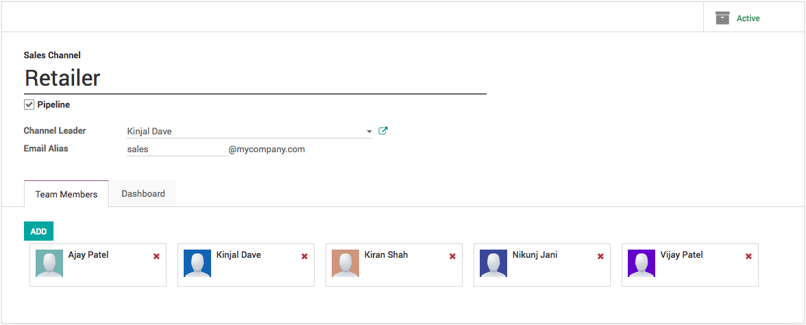

.. index::
   single: Generate leads from emails

Generate leads/opportunities from emails
========================================

Every sales channel is capable create lead/opportunity form the incoming
emails. You can define the email alias when that receive an email the
lead/opportunity will be created in that sales channel.

|image0|

By default, any email sent to *sales@mycompany.com* will create an
opportunity in the pipeline of the default sales channel.

Configure email aliases
-----------------------

Each sales channel can have its own email alias, to generate
leads/opportunities automatically assigned to it. It is useful if you
manage several sales teams with specific business processes.

You will find the configuration of sales channels under **Configuration
/ Sales Channels**.

|image1|

Video
-----
Access the video at https://www.youtube.com/watch?v=79OehLEHOYU

.. raw:: html

    

        <iframe src="https://www.youtube.com/embed/79OehLEHOYU" frameborder="0" allowfullscreen style="position: absolute; top: 0; left: 0; width: 700px; height: 385px;"></iframe>
    

.. |image1| image:: ./static/generate_from_email/media/image4.png
