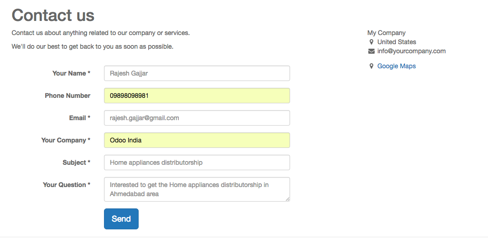

.. index::
   single: Generate leads from website

Generate leads/opportunities from your website contact page
===========================================================

Automating the lead/opportunity generation will considerably improve
your efficiency. Any visitor using the contact form on your website will
create a lead/opportunity in the pipeline.

Configuration
-------------

To activate the contact us page on your website you have to install the
Contact Form application form the Apps.

|image0|

Contact us page
~~~~~~~~~~~~~~~

You benefit from ready-to-use contact form on your Odoo website that
will generate leads/opportunities automatically.

|image1|

Default sales team
~~~~~~~~~~~~~~~~~~

Contact form creates an lead/opportunity into the specific sales
channel, to change that specific sales channel, go to **Website /
Configuration / Settings** under **Communication** section you will find
the **Contact Form** info and where to change the default **Sales
Channel** or **Salesperson**.

|image2|

.. note:: If the same visitors uses the contact form twice, the second
  information will be added to the first lead/opportunity in the chatter.

.. _contact-us-page-1:

Contact us page
---------------

Let’s go and fill some information into the contact us page and submit
the form.

|image3|

Submit for form, visitor will get the **thank you** page having the
emergency contact detail in case if they would like to connect quickly
before sales people contact them.

Opportunity in the sales pipe
-----------------------------

The opportunity will be created in the default sales channel set on the
configuration.

|image4|

Formatting the phone or mobile numbers
--------------------------------------

Validate contact (phone,mobile) numbers and normalize them on leads and
contacts, use the national format for your company country.

|image5|

Video
-----
Access the video at https://www.youtube.com/watch?v=Q4FujRKnUHM

.. raw:: html

    

        <iframe src="https://www.youtube.com/embed/Q4FujRKnUHM" frameborder="0" allowfullscreen style="position: absolute; top: 0; left: 0; width: 700px; height: 385px;"></iframe>
    

.. |image0| image:: ./static/generate_lead_from_webstie/media/image10.png

.. |image1| image:: ./static/generate_lead_from_webstie/media/image8.png

.. |image2| image:: ./static/generate_lead_from_webstie/media/image7.png

.. |image4| image:: ./static/generate_lead_from_webstie/media/image9.png

.. |image5| image:: ./static/generate_lead_from_webstie/media/image12.png
