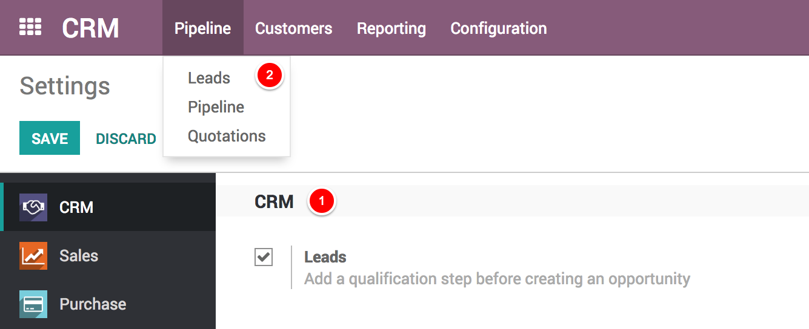

.. _convertlead:

================================
Convert leads into opportunities
================================
The system can generate leads instead of opportunities, in order to add a qualification step before converting a Lead into an Opportunity and assigning to the right sales people. You can activate this mode from the CRM Settings. It applies to all your sales channels by default. But you can make it specific for specific channels from their configuration form.

Configuration
-------------
For this feature to work, go to ``CRM / Configuration / Settings`` and activate the Leads feature.

You will now have a new submenu Leads under Pipeline where they will aggregate.

Convert a lead into an opportunity
----------------------------------
When you click on a Lead you will have the option to convert it to an opportunity and decide if it should still be assigned to the same channel/person and if you need to create a new customer.

If you already have an opportunity with that customer Odoo will automatically offer you to merge with that opportunity. In the same manner, Odoo will automatically offer you to link to an existing customer if that customer already exists.

.. seealso::
   * :doc:`generate_from_email`
   * :doc:`generate_lead_from_webstie`