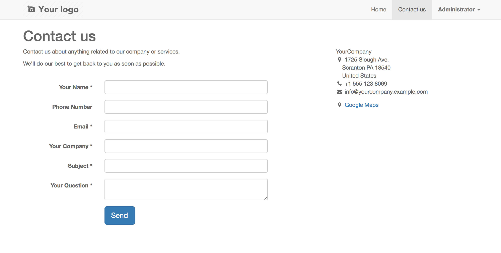
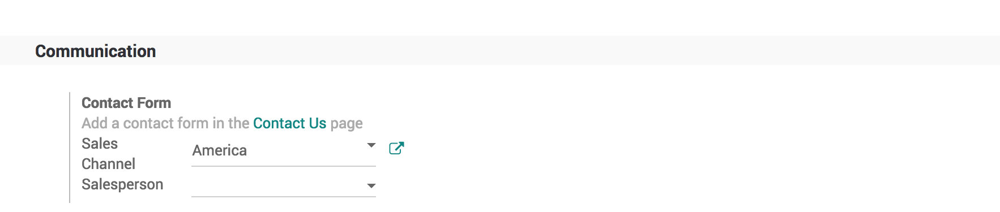

.. _leadfromwebsite:

===========================================================
Generate leads/opportunities from your website contact page
===========================================================
Automating the lead/opportunity generation will considerably improve your efficiency. Any visitor using the contact form on your website will create a lead/opportunity in the pipeline.

Use the contact us on your website
----------------------------------
You should first go to your website app.

With the CRM app installed, you benefit from ready-to-use contact form on your Odoo website that will generate leads/opportunities automatically.

To change to a specific sales channel, go to Website ‣ Configuration ‣ Settings under Communication you will find the Contact Form info and where to change the Sales Channel or Salesperson.

.. note:: If the same visitors uses the contact form twice, the second information will be added to the first lead/opportunity in the chatter.

Video
-----
Access the video at https://www.youtube.com/watch?v=Q4FujRKnUHM

.. raw:: html

    

        <iframe src="https://www.youtube.com/embed/Q4FujRKnUHM" frameborder="0" allowfullscreen style="position: absolute; top: 0; left: 0; width: 700px; height: 385px;"></iframe>
    

Generate leads instead of opportunities
---------------------------------------
When using a contact form, it is advised to use a qualification step before assigning to the right sales people. To do so, activate Leads in CRM settings and refer to :doc:`convert_lead`.