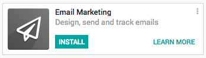
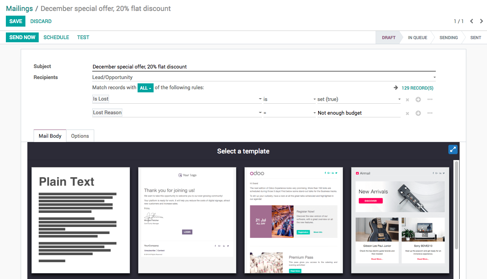

.. index::
   single: Reactive the lost leads

Email marketing on the lost activity to reactive them
=====================================================

Massmail is a great tool to send the bulk emails to your contacts.
Reactive the old leads could bring your a business, nothing wrong to
send them an email which could reactive opportunities from them lost
once.

.. tip:: The correct reason required on the old leads before you send
  email to them, like discount on the product/service to only those
  customers who lost actually because of the budget.

Business case
-------------

Let’s send the offer to have 20% discount on the product/service, who
actually lost because they did not have a budget.

Configuration
-------------

**Email Marketing** is a separate app required to be installed
separately, this app is not limited to use with the CRM or Sales, It can
be used to send the email in bulk for Recruitment, Mailing List,
Participants of the Event, etc.

|image0|

Create mass mail
----------------

Create a mass mail from the Email Marketing / Mailings, you need an
attractive subject, choose *Leads / Opportunity* in the **Recipients**
field, below that you can actually defines the criteria to choose the
leads / opportunities which will receive the email from this mass
mailing.

I choose all the leads which was Lost and the reason for mark as lost
because, they do not have Not enough budget.

|image1|

Send Emails
-----------

The process of sending an email takes time based on the number of email
to send and how fast your email service provider.

Test before you send
~~~~~~~~~~~~~~~~~~~~

It is advisable to check how email looks in your mailbox before you send
it to the prospects, you can check by sending a copy of the email to
your own email account by clicking on **Test** button.

|image2|

Send to all
~~~~~~~~~~~

If you found the email looks well on your mailbox, you can send email to
all the leads/opportunities who are selected on the mailing.

By default email marketing will be scheduled for the specific date and
time and will be processed accordingly. Emails will be generated and
queued in the system, automatic scheduler will process that email queue
and send those emails.

.. note:: Some mail marketing may take time to send the emails depending
  on the email providers, some email may go to spam if if your provider
  does not configure well or the subject and content of the email looks
  like a spam mail.

Statistics
~~~~~~~~~~

Statistics will be enabled as soon as schedule start processing the
email, you can actually see the number of email sent, bounced, opened by
the receiver, replied on that email or number of user clicks on the link
if you attached any links in the email.

|image3|

.. |image2| image:: ./static/active_lost_leads/media/image8.png

.. |image3| image:: ./static/active_lost_leads/media/image7.png
