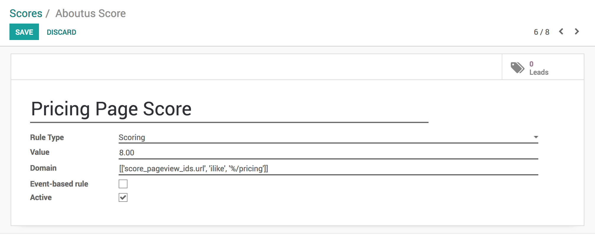

.. index::
   single: Assign leads based on scoring

Assign leads based on scoring
=============================

With Leads Scoring you can automatically rank your leads based on
selected criterias. See how you can *measure the score for an
opportunity based on the user behaviour on website.*

For example you could score customers from your country higher or the
ones that visited specific pages on your website.

Configuration
-------------

Install a module **Lead Scoring** under your **Apps** page available in
Odoo Enterprise only.

|image0|

Generate Leads
~~~~~~~~~~~~~~

Leads/Opportunities can be generated through the below listed methods

-  Generate leads/opportunities from emails

-  Generate leads/opportunities from your website contact page

Create scoring rules
~~~~~~~~~~~~~~~~~~~~

You now have a new menu in your **CRM** app called **Leads Management /
Scoring Rules** where you can manage your scoring rules. Here's an
example for a *Pricing Page Score*, you can modify for whatever criteria
you wish to score your leads on. You can add as many criterias as you
wish.

|image1|

Every hour every lead without a score will be automatically scanned and
assigned their right score according to your scoring rules.

Assign leads
------------

Once the scores computed, leads can have enough information to classify
that it is belongs to which sales team. Lead be assigned to specific
teams using the same domain mechanism. To do so go to **CRM / Leads
Management / Team Assignation** and apply a specific domain on each
team.

This domain may include lead scores, page visited by visitor, and other
information such as country, city, availability of the email or phone.

Please go through **Automatic leads assignation to team members** topic
in Customer Relationship Management section.

.. |image0| image:: ./static/assign_leads_based_on_score/media/image2.png

