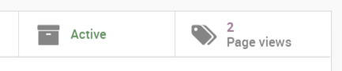

.. index::
   single: Measure the leads score

Measure the score for an opportunity based on the user behavior on your website
===============================================================================

Tracking your website pages will give you much more information about
the interests of your website visitors. Every tracked page they visit
will be recorded on your lead/opportunity if they use the contact form
on your website.

Configuration
-------------

To use this feature, install the module **Lead Scoring** under your Apps
page available in Odoo Enterprise only.

|image0|

Track a webpage
~~~~~~~~~~~~~~~

You can track any static page you want on your website under the
**Promote tab** you will find **Optimize SEO**. There you will see a
**Track Page** checkbox to track this page.

|image1|

You have to visit all the pages and enabled this option for individual
pages you want to track on your website.

Create scoring rules
~~~~~~~~~~~~~~~~~~~~

You now have a new menu in your **CRM** app called **Leads Management /
Scoring Rules** where you can manage your scoring rules. Here's an
example for a *Pricing Page Score*, you can modify for whatever criteria
you wish to score your leads on. You can add as many criterias as you
wish.

|image2|

Every hour a new leads without a score will be automatically scanned and
assigned their right score according to your scoring rules.

.. tip:: You can select **Event-based rule** for new rule you are about
  to create if you want to apply on all the existing leads which was
  previously computed.

**Value** on the score rules will be count cumulative to compute the
leads/opportunities score when more then one rule found applied for the
lead/opportunity.

See visited pages in opportunities
----------------------------------

Now each time a lead is created from the contact page it will keep track
of the pages visited by that visitor. You have two ways to see those
pages, on the top right corner of your lead/opportunity you can see a
**Page Views** button but also further down you will see them in the
chatter too.

Both will update if the viewers comes back to your website and visits
more pages.

|image3|

The feature will not repeat multiple viewings of the same pages in the
chatter. Your customers will no longer be able to keep any secrets from
you!

Compute Score
-------------

The scheduler executes every hours and compute the score for newly added
lead/opportunity.

The **Scoring rules** will be applied those are matching with the
lead/opportunities details and score will be the summation of values
from all those rules.

|image4|

.. |image0| image:: ./static/lead_score/media/image8.png

.. |image1| image:: ./static/lead_score/media/image5.png

.. |image2| image:: ./static/lead_score/media/image4.png

.. |image4| image:: ./static/lead_score/media/image10.png
