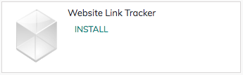

.. index::
   single: Which marketing platform bring more visitors

Which marketing platform bring more visitors
============================================

The biggest challenge for every business is *how do I drive more traffic
to my online store?*, If you able to get the visitor you can convert
them into customers. There are many ways to increase the visitors,
advertise on the social media marketing is one of the proven way to get
attract move visitor.

But the questions is *which social media can bring more visitor and
where to invest?*, depending on your product and consumer you should
choose the social media platform to invest for the marketing, still it
is worth to track which marketing platform bring how many users on your
website.

Business case
-------------

The *My Company* is running a electronic ecommerce store, they want to
invest in the paid marketing on different social media platform such as
Facebook, Pinterest, Instagram and Google.

The want to see which marketing platform drives how many new users so
that they can focus more on the platform which brings more traffic.

Configuration
-------------

Assumed that the **Website Builder** and **eCommerce** applications are
already installed. What we need is an Link tracker application which is
supporting application to the website.

|image0|

Install the Website Link Tracker application if it is not installed
automatically.

Create a link to share
----------------------

You can share any website page from your website with the link tracker,
It can be a Product, Shop, Home Page, Job Post or News from the Blogs.
To create a sharable link that generates statistics, visit that page and
go to **Promote / Track this Page**.

|image1|

Click on the **Get tracked link** button will generate the link that can
be share and that link generates the statistical analysis, such as how
many people visited by date, and form which country.

.. tip:: To generate the correct statistics, you have to set up Odoo
  correctly on reverse proxy and GeoIP data on Nginx. If not configure
  correctly you may get the number of visits but not the country
  information.

The statistics will be looks as below.

|image2|

.. |image1| image:: ./static/track_visitor/media/image4.png

.. |image2| image:: ./static/track_visitor/media/image6.png
