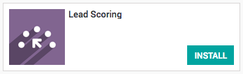
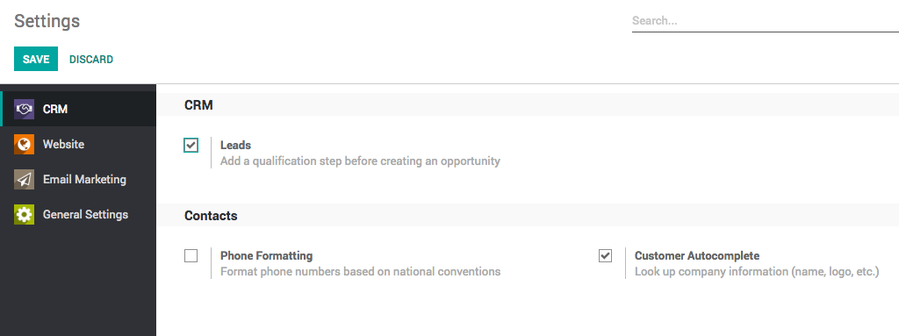
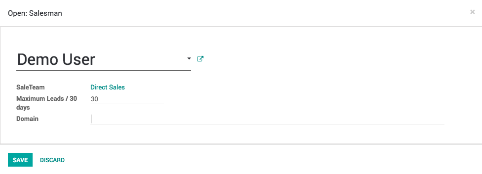
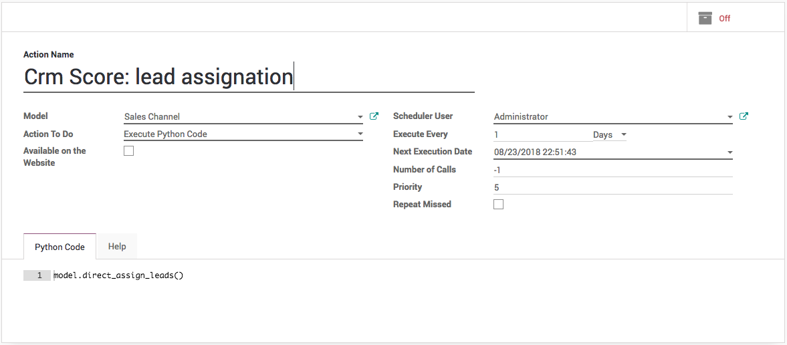
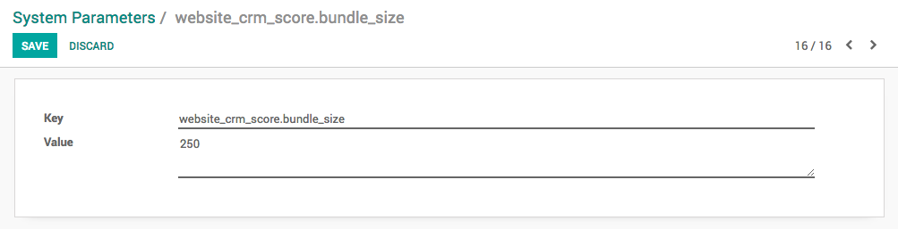

.. index::
   single: Automatic leads assignation

Automatic leads assignation to team members
===========================================

There are multiple sales people working within the sales team, the
number of leads increased you have to increased the number of people to
work on. The problem starts for the team manager to assign the leads to
them when team grows, let’s see how you can make the team manager life
easy with automatic leads assignation.

Business case
-------------

The company have a increased the team size to process the maximum leads
per day as they start getting many new leads. They would like to first
convert leads into opportunity and assign to the team members within
team.

Configuration
-------------

Install a module **Lead Scoring** under your **Apps** page available in
Odoo Enterprise only.

|image0|

Qualification step before creating an opportunity
~~~~~~~~~~~~~~~~~~~~~~~~~~~~~~~~~~~~~~~~~~~~~~~~~

The default sales activity is managed with the opportunity pipeline, you
can change that to add the qualification stage before creating an
opportunity.

|image1|

Assumed that you start getting leads into the team, by default all those
leads are unassigned.

Add members to your sales channel
---------------------------------

You can add members to the sales team; that way those members will see
the pipeline structure of the sales team when opening it. Any
lead/opportunity assigned to them will link to the sales team.
Therefore, you can only be a member of one channel.

You can define maximum leads that should be assigned to the member
within 30 days, this will ease the process of assigning the leads to the
member easily.

|image2|

You can also add the specific domain on each user to be sure that each
user get the specific leads to work on based on their expertise or
country, etc…

.. tip:: You can define the size of batch using system parameters
  *website_crm_score.bundle_size* that defines the number of leads going
  to be process on each lead assignation schedule.

Activate the lead assignation scheduler
---------------------------------------

Enable into the debug mode and goto Schedule Action form home screen,
just type the word.

|image3|

Search for the *Crm Score: lead assignation* and **Switch On** the
schedule action, it will automatically process 50 leads every day. If
you want to assign frequent you can switch to Hours instead of Days.

.. tip:: You can check leads assignation manually by clicking on the Run
  Manually button on the schedule action.

As soon as the number of leads increase, on each schedule action you
have to process more leads, you can do it by setting the system
parameters. Create a new system parameters with key
*website_crm_score.bundle_size* and set the value.

|image4|

Video
-----
Access the video at https://drive.google.com/file/d/1EJsfk3MtppcdyzhB_xCvHqC05ZNkPSRj/preview

.. raw:: html

  

      <iframe src="https://drive.google.com/file/d/1EJsfk3MtppcdyzhB_xCvHqC05ZNkPSRj/preview" frameborder="0" allowfullscreen style="position: absolute; top: 0; left: 0; width: 700px; height: 385px;"></iframe>
  

