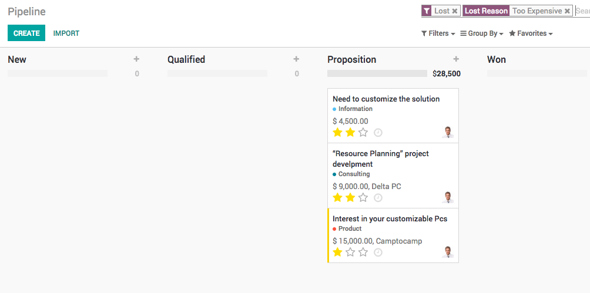
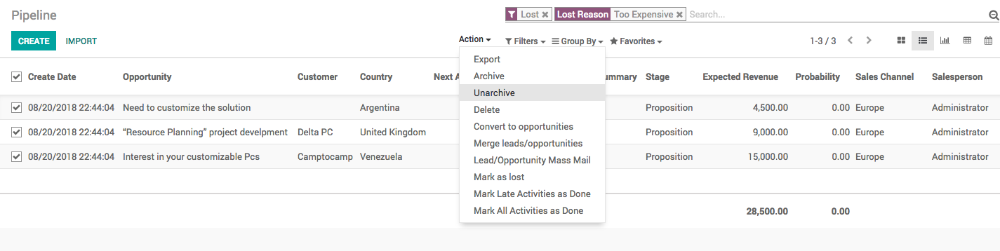

Manage lost opportunities
=========================

While working with your opportunities, you might lose some of them. You
may want to keep track of those opportunities with the reasons you lost
them and also the ways to recover them in the future.

Business case
-------------

The company planning to revised the price of the product they are
selling and they would like to make a test offer or announcement about
the to the opportunity who lost because of the reason “\ *Too
Expensive*\ ”.

Mark an opportunity as lost
---------------------------

While in your pipeline, select any opportunity you have to mark as lort,
you will see a **Mark Lost** button, by clicking on that you have to
select the lost reason, that can then select an existing **Lost Reason**
or create a new one right there.

|image0|

.. tip:: You will find your **Lost Reasons** under **Configuration /
  Lost Reasons**. You can manage the reasons from if you want to better
  organize the lost reason.

Retrieve lost opportunities
---------------------------

To retrieve lost opportunities and do actions on them (send an email,
make a feedback call, etc.), select the **Lost** filter in the search
bar.

|image1|

You will then see all your lost opportunities. If you want to refine
them further, you can add a filter on the **Lost Reason**.

For Example, *Too Expensive*.

|image2|

Restore lost opportunities
--------------------------

From the kanban view with the filter(s) in place, you can select any
opportunity you wish and work on it as usual. You can also restore it by
clicking on **Archived**.

|image3|

You can switch to **List View** select the opportunities you want to
restore, from Action click on Unarchive to restore multiple
opportunities at once.

|image4|

Video
-----
Access the video at https://drive.google.com/file/d/1Q_3SkHgHap_a7zUXGTyjDaaYVzotqOxa/preview

.. raw:: html

  

      <iframe src="https://drive.google.com/file/d/1Q_3SkHgHap_a7zUXGTyjDaaYVzotqOxa/preview" frameborder="0" allowfullscreen style="position: absolute; top: 0; left: 0; width: 700px; height: 385px;"></iframe>
  

.. |image0| image:: ./static/lost_opportunities/media/image3.png

.. |image1| image:: ./static/lost_opportunities/media/image9.png

.. |image3| image:: ./static/lost_opportunities/media/image8.png

