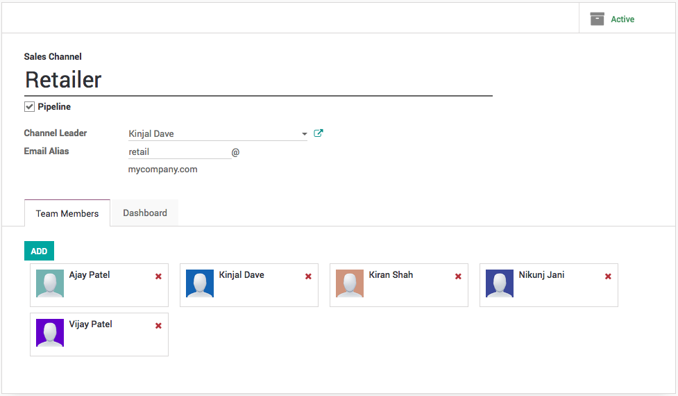
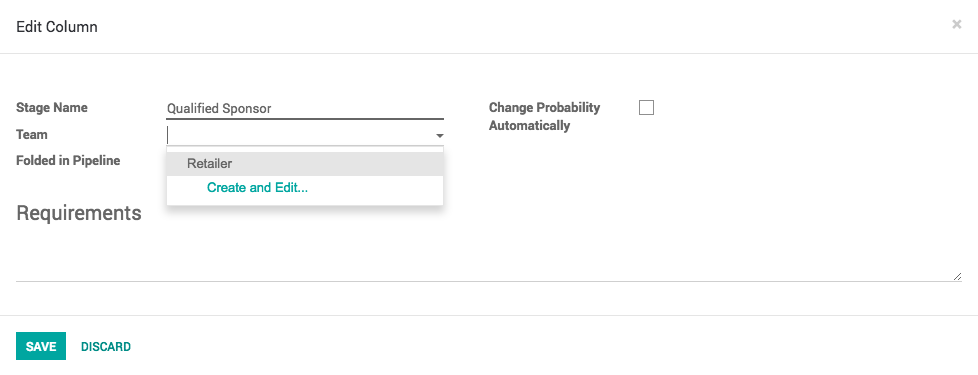

.. _multiplesalesteam:

.. index::
   single: Multiple Sales Team

Manage multiple sales teams
===========================

You can spread your sales activities into the multiple sale teams
depending on the product, service or region, the purpose of setting
different sales team might also be to setup the different sales process
too.

Business case
-------------

The company have a different customer segments **retailer** and
**distributors** and they wants to manage through different set of
people as the business rules are different along with the sales tactics.

Configuration
-------------

Assumed that the **CRM** application is installed.

Create a new sales channel
~~~~~~~~~~~~~~~~~~~~~~~~~~

To create a new **Sales Channel,** goto **Configuration / Sales
Channels** under the **CRM** Application. There you can set an email
alias to it, every message sent to that email address will create a
lead/opportunity under that sale team.

|image0|

Add members to your sales channel
~~~~~~~~~~~~~~~~~~~~~~~~~~~~~~~~~

You can add members to any channel; that way those members will see the
pipeline structure of the sales channel when opening it. Any
lead/opportunity assigned to them will link to the sales channel.
Therefore, you can only be a member of one channel. This will ease the
process review of the team manager.

|image1|

Channel specific sales stages
~~~~~~~~~~~~~~~~~~~~~~~~~~~~~

To jump to the stages for the specific sales challen goto **Reporting /
Sales Channels** under the **CRM** Application, click on the Pipeline to
see the sales process for the specific sales team. The default stages
will be looking as below.

|image2|

Click on the **Add new column** to create a new stage in the sales team,
lets create **Qualified Sponsor** stage and drag and drop between the
**Qualified** and **Proposition** stage.

|image3|

The stage can be set for the specific team by adding **Team** on the
configuration of that stage. Click on the gear icon to **Edit Stage**,
by default this stage will be available to all the sales channel, when
no **Team** set on stage.

|image4|

Sales channel dashboard
-----------------------

To see the operations and results of all the sales channel at a glance,
the sales manager has an access to the **Sales Channel Dashboard** under
**Reporting**.

|image5|

It is shared with the whole ecosystem so every revenue stream is
included in it: Sales, eCommerce, PoS, etc.

Sales pipe for specific channel
~~~~~~~~~~~~~~~~~~~~~~~~~~~~~~~

Click on the **Pipeline** button on sales channel to see the sales pipe
for any specific channel, you will find all of its opportunities related
to that sales channel.

|image6|

.. tip:: Lead score is an application which help you to assign the leads
  to the respective team members with in team.

.. |image1| image:: ./static/multiple_sales_team/media/image14.png

.. |image2| image:: ./static/multiple_sales_team/media/image13.png

.. |image3| image:: ./static/multiple_sales_team/media/image6.png

.. |image5| image:: ./static/multiple_sales_team/media/image12.png

.. |image6| image:: ./static/multiple_sales_team/media/image9.png
