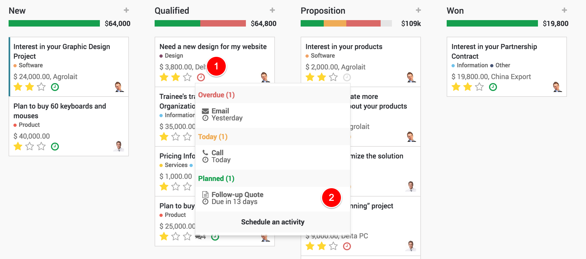
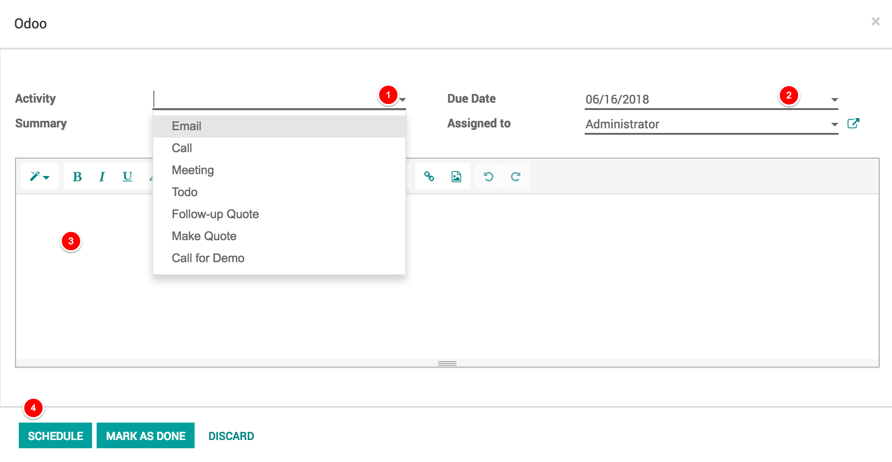

.. _planactivities:

.. index::
   single: Plan Activity
   single: Track Activity

====================================
Get organized by planning activities
====================================
Planning activities is the perfect way to keep on track with your work. Get reminded of what needs to be done and schedule the next activities to undertake.

Your activities are available wherever you are in Odoo. It is easy to manage your priorities.

.. image:: images/crm_01.png
   :alt: activities
   :align: center

Track activities
----------------
Activities can be trakced on every single document, Here is an example for opportunities:

Schedule next activity
----------------------
Activities can be planned and managed from the chatters or in the kanban views.

Set your activity types
-----------------------
A number of generic activities types are available by default in Odoo (e.g. call, email, meeting, etc.). If you would like to set new ones, go to ``Settings / General settings / Activity types``.

Schedule meetings
-----------------
Activities are planned for specific days. If you need to set hours, go with the Meeting activity type. When scheduling one, the calendar will simply open to let you select a time slot.

Video
-----
Access the video at https://www.youtube.com/watch?v=zO5u0EjzlkY

.. raw:: html

    

        <iframe src="https://www.youtube.com/embed/zO5u0EjzlkY" frameborder="0" allowfullscreen style="position: absolute; top: 0; left: 0; width: 700px; height: 385px;"></iframe>
    

