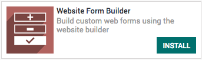
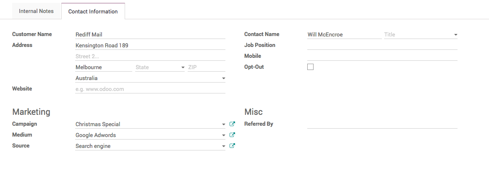
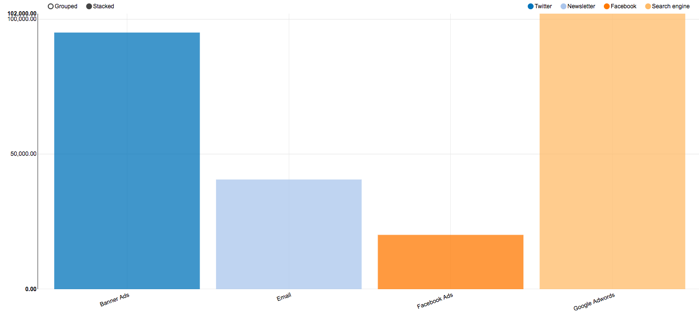

Measure which marketing campaign bring more opportunities
=========================================================

The biggest challenge for every business is *how do I drive more traffic
to my online store?*, If you able to get the visitor you can convert
them into customers. There are many ways to increase the visitors,
advertise on the social media marketing is one of the proven way to get
attract move visitor.

But the questions is *which social media can bring more opportunities to
me?*, depending on your product and consumer you should choose the
social media platform to invest for the marketing, still it is worth to
track which marketing platform bring how many users on your website.

Business case
-------------

The *My Company* is running a electronic ecommerce store, they want to
invest in the paid marketing on different social media platform such as
Facebook, Pinterest, Instagram and Google.

The want to see *which marketing platform how many new opportunities?*
so that they can focus more on the platform which brings more business.

Configuration
-------------

Assumed that the **Website Builder** and **eCommerce** applications are
already installed. What we need is an Link tracker application which is
supporting application to the website.

|image0|

Install the **Website Link Tracker** application if it is not installed
automatically.

Contact us form
~~~~~~~~~~~~~~~

Install the contact us form on the website, so that when user fill the
contact detail to get more information about the product, you can have
an opportunity created in the CRM application.

Generate leads/opportunities from your website contact page -
https://odoobooks.com/en/11.0/crm/generate_lead_from_webstie.html

Form Builder
~~~~~~~~~~~~

It would be great if you will be able to add the contact us form on any
other webpages in your website, it will allows user to make a quick
contact to you.

|image1|

As soon as the application installed you will see a new widget on the
website called Form Builder.

Add contact us form on product page
-----------------------------------

You can add the contact us page on the frequently sold product page,
which help us to generate the leads. Drag and drop the **Form builder**
widget, select the option Create a lead.

|image2|

The default fields will be added to the screen, **Opportunity**, you can
change the label to **Subject** and add additional fields from the
widget customization option, such as Name, Email and Mobile.

|image3|

Create a link to share
~~~~~~~~~~~~~~~~~~~~~~

You can share any website page from your website with the link tracker,
It can be a Product, Shop, Home Page, Job Post or News from the Blogs.
To create a sharable link that generates statistics, visit that page and
go to **Promote / Track this Page**.

|image4|

Click on the **Get tracked link** button will generate the link that can
be share and that link generates the statistical analysis, such as how
many people visited by date, and form which country.

Creating an opportunities
-------------------------

Visitor visit the page through the link you shared on the **Google
Searching**, the visitor will be tracked and same information will be
attached to the **Campaign**, **Medium** and **Source**, when
opportunities created.

|image5|

Campaign Analysis
-----------------

The number of opportunities can be grouped by the **Source** and
**Medium** to check which platform bring how many opportunities coming
from which marketing platform.

|image6|

Can be analysed in detail by applying group by **Source** and then
**Medium**. It will give us more clear view on from where the
opportunities coming from.

|image7|

.. |image0| image:: ./static/visitor_to_opportunitie/media/image12.png

.. |image2| image:: ./static/visitor_to_opportunitie/media/image15.png

.. |image3| image:: ./static/visitor_to_opportunitie/media/image16.png

.. |image4| image:: ./static/visitor_to_opportunitie/media/image13.png

.. |image7| image:: ./static/visitor_to_opportunitie/media/image7.png
