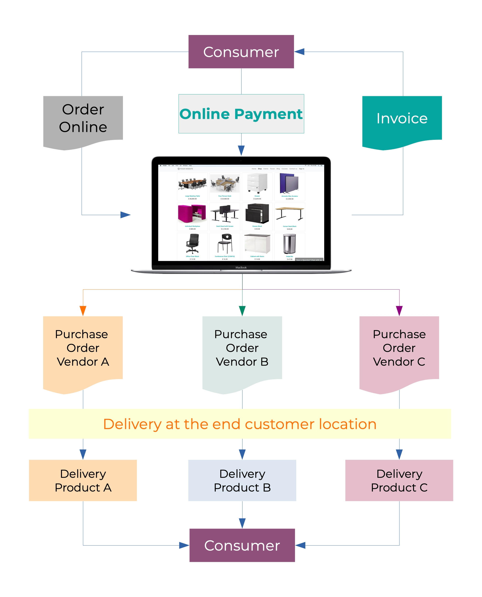
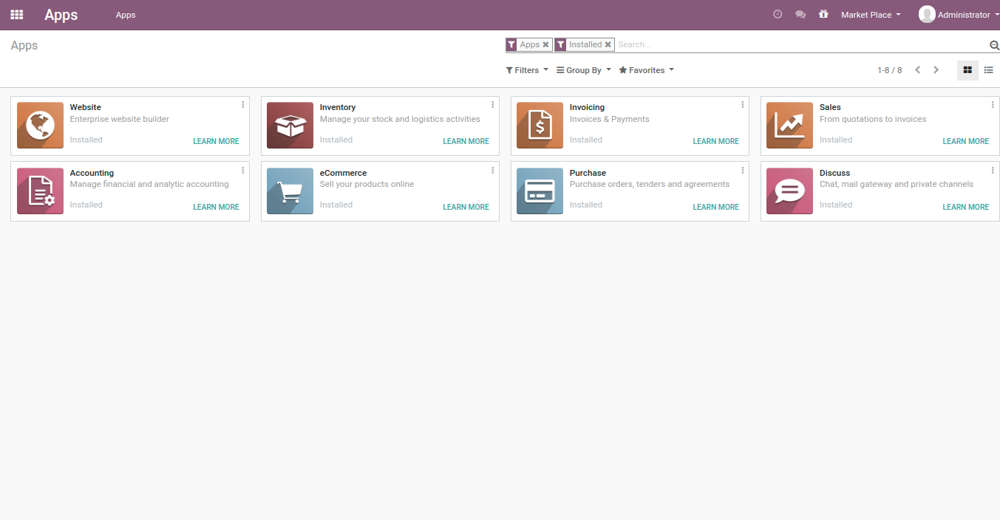
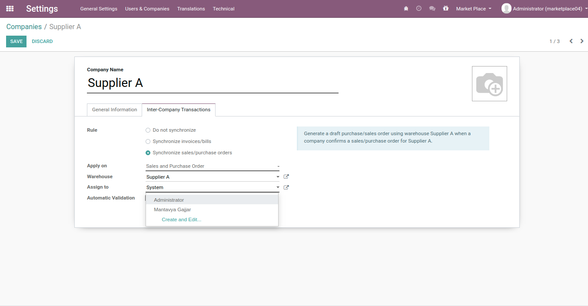
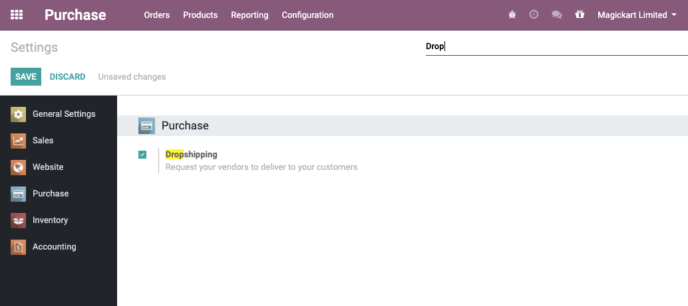
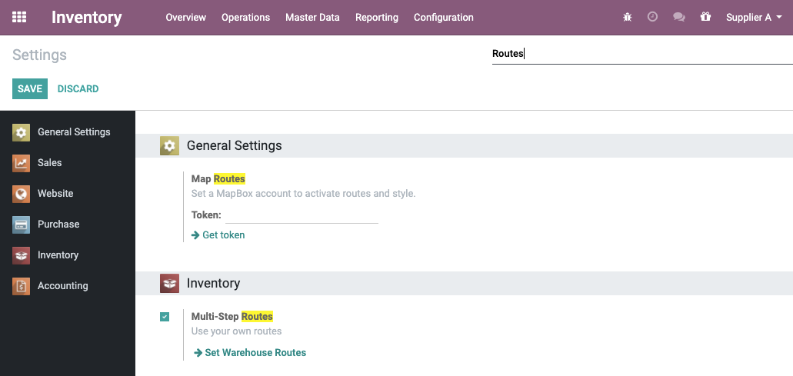
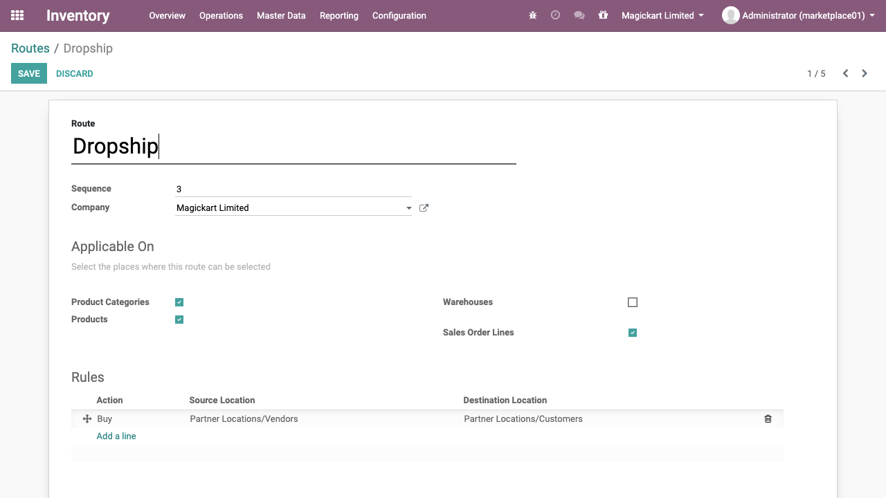
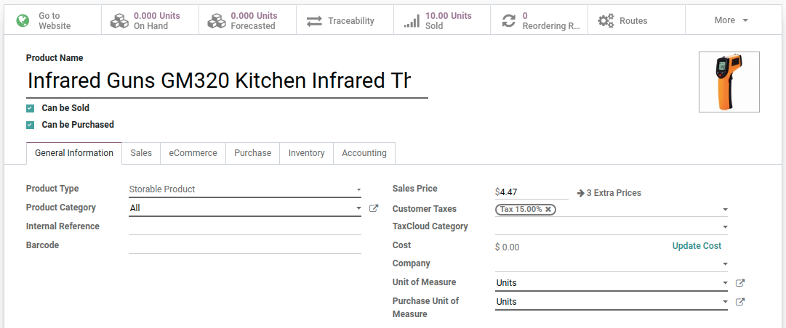
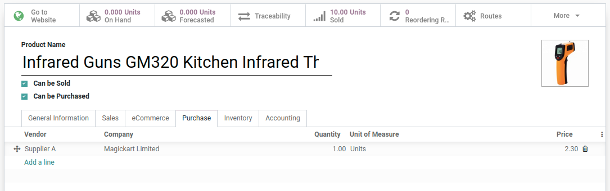
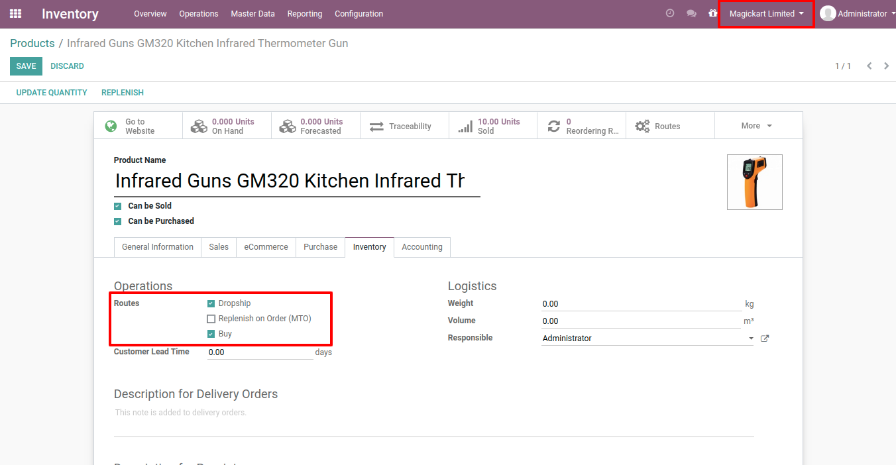
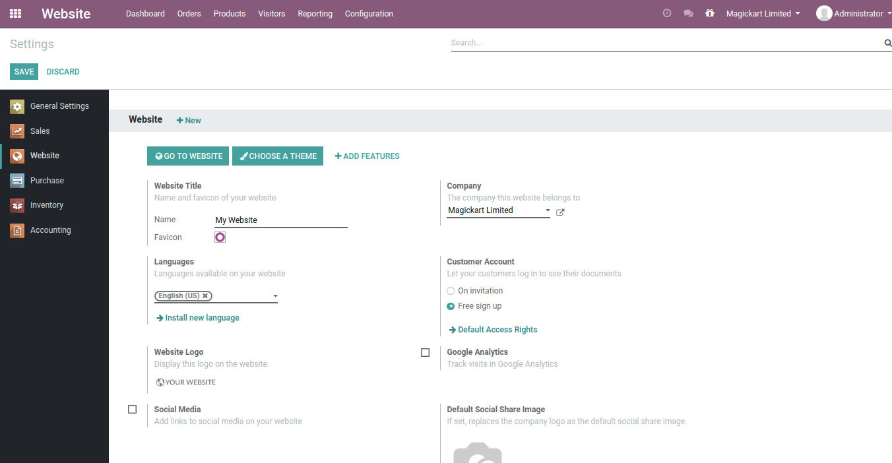

.. _odoomarketplace:

.. index::
   single: Marketplace

.. meta::
  :description: Setup Marketplace with Odoo eCommerce, out-of-the-box without customisation
  :keywords: marketplace, dropship, shopping cart, delivery, invoicing, sale, purchase, inter-company

=====================================
Setup Marketplace with Odoo eCommerce
=====================================
An online marketplace is a website or app that facilitates shopping from
many different sources. The operator of the marketplace does not own any
inventory, their business is to present other people’s inventory to a
user and facilitate a transaction. Alibaba and Amazon are the best
examples of an online marketplace, they sell everything to everybody.
Let’s see how you can set up your marketplace with Odoo apps using an
out-of-the-box approach.

Business case
-------------

Magickart wants to set up its marketplace where all the manufacturers
can register their products to sell. The marketplace is targeting both
types of customers, businesses, and consumers.

Let’s set up the marketplace where consumers can have a seamless buying
experience and the complex backend operations become more transparent
and clear with the Odoo apps using the out-of-the-box approach.

=============================== ================================
**Product Name**                **Supplied by Vendor**
=============================== ================================
Infrared Thermometer Gun        Supplier A
New Design Electric Hammer Nail Supplier B
=============================== ================================

There are thousands of products listed on the marketplace but for an
example, we are going to take two examples, when a customer buys both
products they should receive a single invoice and two different
deliveries from the respective supplies.

Business Flow Mapping
---------------------

Let’s first understand how the marketplace business works in reality.

Vendors who are interested to sell their products in the market place
they register with the market place with their account where they can
have access to add or update the product and its details, they can also
get the sale orders which are received on the market place along with
the delivery address.

The marketplace does the listing of the products on the e-commerce
platform, accept the order form customer, process the online payment,
and send the delivery address to the vendor.

The vendor sends an invoice to the market place and delivery to the end
customer, the marketplace later release the payment to the vendor based
on the specific intervals based on the payment to each vendor.

So, the marketplace is mainly earning from the commission they received
from the product price. Let’s take an example vendor add the product at
$100, that is listed on the marketplace at $125 means they ask a 25%
margin on the products.

|image0|

Apps Installed
--------------

The marketplace is buying and selling a business, so we need sales,
purchase, and inventory applications as it is web-based so we need an
eCommerce application too.

|image1|

Configuration
-------------

The configuration to set up the marketplace in Odoo is tricky, the first
configuration is to create the companies required.

================================ ======================================
Company Name
================================ ======================================
Magickart Limited                Change the name of the default company
Supplier A                       Create a new new company
Supplier B                       Create a new new company
================================ ======================================

In order to set up the accounting application and load the chart of
accounts for each company, please go through the below video and load
the chart of accounts for each company.

Video
~~~~~
Setup chart of accounts for multiple companies

Access the video at https://www.youtube.com/watch?v=I8ImxGA501k

.. raw:: html

    

    <iframe width="100%" class="youtube-video" src="https://www.youtube.com/embed/I8ImxGA501k" frameborder="0" allow="autoplay; encrypted-media" allowfullscreen></iframe>
    

Step1 Setup inter-company transactions
~~~~~~~~~~~~~~~~~~~~~~~~~~~~~~~~~~~~~~

Install the inter-company company transaction connector application,
search for inter-company, you will get **Inter-Company Module for
Sale/Purchase Orders and Invoices**.

Let’s set up the inter-company transaction when a purchase order is
confirmed in the marketplace company “Magickart” a sales order should be
created in the respective vendor company. Please go through the below
video to set up and test the inter-company sales and purchase order
synchronization.

Video
~~~~~
Inter-company sales and purchase order synchronization

Access the video at https://www.youtube.com/watch?v=8J2OfV5i6FM

.. raw:: html

    

    <iframe width="100%" class="youtube-video" src="https://www.youtube.com/embed/8J2OfV5i6FM" frameborder="0" allow="autoplay; encrypted-media" allowfullscreen></iframe>
    

.. note:: If you have any security errors while accessing sales orders please
remove the company from all contacts and try.

.. tip:: Use Administrator user instead of system user on the inter-company
settings.

|image2|

Step2 Setup Dropship route
~~~~~~~~~~~~~~~~~~~~~~~~~~

In this step, we will set up the dropship and some inventory rules.

First, let's activate the Drop shipping from the Purchase → Configuration
→ Settings look at the below screen.

|image3|

The next step is to activate the Multi-Step Routes from Inventory →
Configuration → Settings.\ |image4|

Once the feature is activated, goto Inventory → Configuration → Routes,
and search for the Dropship route, the company field is empty on that
rule, selects the company **Magickart Limited** company on the Dropship
route.

|image5|

Step3 Create and configure the product
~~~~~~~~~~~~~~~~~~~~~~~~~~~~~~~~~~~~~~

Create a product, enter the name, and other details such as a Sales
Price.

|image6|

The important details are supplier details, as soon as we (Marketplace)
got the order from the customer to whom we should ask to re-supply it.
Enter the supplier details, the supplier will be one of the vendors who
is supplying the product to the end customer on behalf of Marketplace.

|image7|

One more important step is to configure the procurement
routes.

|image8|

If your step 2 is configured correctly you can see the Dropship route
only when you are in a Magickart company.

Tip:: You can create multiple products supplied by the different
suppliers, follow the steps 1 and 3.

Step4 Setup website for marketplace
~~~~~~~~~~~~~~~~~~~~~~~~~~~~~~~~~~~

Setup the website for the marketplace company so that customers can
signup and place an order to the marketplace company “Magicmart”.

|image9|

Test Marketplace
----------------

Signup on the website (eCommerce), place an order to the marketplace and
let's check the backend part. Please go through the below video to see
how customers have great experience to checkout the product and check
the status of the order, invoice and delivery.

Video
~~~~~
Access the video at https://www.youtube.com/watch?v=D4EBmOjIS70

.. raw:: html

    

    <iframe width="100%" class="youtube-video" src="https://www.youtube.com/embed/D4EBmOjIS70" frameborder="0" allow="autoplay; encrypted-media" allowfullscreen></iframe>
    

