========================
Managing Employee Leaves
========================
Planning and forecasting tasks and projects required the updated
information for the resource availability. Leave management application
helps to provide the updated information for employee unavailability.
Leave management application in Odoo can be used independant or
integrated with Project Forecasting application for the better planning
of any long term project.

There are many business cases where tracking of employee leaves are
necessary, let’s see how Odoo Leaves application will answer all those
business cases.

Business case
=============

The types of leave and number of leave available for each leave types
are as below in our business case.

* The leave cycle starts from January 2018
* Working schedule for all the employees are morning 8 am to 5 pm with 1 hour of lunch break
* Full time employees have 12 Legal leaves for the year 2018
* Part time employees have 12 half leaves for the year 2018
* All employees are eligible to get the 6 Sick Leaves during the year
  2018, however employees can have more sick leaves if needed with medical certificates
* Employee can have the Compensatory Days off in some cases where
  employee have worked on off days

Let’s configure all the above business cases in Odoo and get the updated
leave information for all the employees.

Configuration
=============

Install the Leaves application form Apps menu on your instance, only an
Administrator user can perform installation operation.

|image0|

Make sure that you have a updated leave policy ready, let’s take a
business case and configure the number of leave available to each
employees for each leave types.

Working schedule
----------------

As per business case the working schedule for all the employees are
morning 8 am to 5 pm with 1 hour of lunch break. To configure the
working schedule please goto *Settings → Technical → Resources → Working
Time*, create a one if the default working schedule does not meet your
requirement.

|image1|

I have created the Standard 40 Hours/Week schedule, almost all the
employees are working under this schedule. Leave the **Starting Date**
and **End Date** empty if you would like to use this schedule throughout
the year or until the changes required in working time.

Default Working Schedule
------------------------

This can be set as a default working schedule for every new employee
created in the system, goto *Configurations → Settings* under the
**Employees** application.

|image2|

Warning: Changing the **Company Working Hours** will not change the
working schedule for the existing employees, the new employees created
after the change will have this working schedule as a default.

When you have a new employee joining in the company, the default company
working hours will be applied to that employee, however it can be change
if required for the specific employees at the time of creation or later.

|image3|

Employees number of leaves also required to compute the salary statement
for every month so that unpaid leaves can be deducted from the salary.

Tip: The working schedule can be change for specific employees directly
on the employee configuration.

Employee Tags
-------------

Create an associate employee with tags are an important feature that
allows us to automate allocation of leave quickly, the leave can be
allocated either by Employee or by Tags, immagin when you have thousand
of employees and you have to assign different types of leaves. When you
work by Employee it increase a lots of work for the HR office or
manager.

Create and assign the tags to the employee carefully, as based on the
tags leaves will be allocated. In our business case we will create a
**Fulltime** and **Parttime** two different tags to differentiate the
employees at the time of leave allocation.

The simplest way to create the tags is directly from the employee form,
just type the tag name and choose option to create that tag with Odoo’s
quick create feature.

|image4|

Click on Create “Fulltime” link to create and assign created tag to new
employee being created.

Note: You can assign multiple tags to the employee that helps you to
group the employees and search them quickly when needed.

You can verify the list of employees for the correct assignation of tags
from the employee directory. Goto Employees and enter **Fulltime** and
search for the Tags.

|image5|

Make sure that you have verified the list of assigned employee on each
tags, fix it before you proceed for the leave allocation.

Leave Types
-----------

Default leave types are already given in the Odoo as a standard data,
however you can create more if needed according to your business case.

The leave types can be access from *Configuration* menu under the Leaves
application.

|image6|

You can create a new type of change the existing according to the
business rules you need. You can change the below fields to adapt your
business rules on leave type.

**Apply Double Validation:** Check this field when you want that the
approval of the leave will be done by Department Manager and HR Manager.

**Allow to Override Limit:** The number of leave are always predefined,
however you can allow to request for more leave than the
defined/allocated, i.e. sick leaves can be requested more than assigned.

**Meeting Type:** Once a leave is validated, Odoo will create a meeting
of this type on the correspondent calendar.

**Color in Report:** This color will be used to To display the specific
types of leave in with color in PDF report.

|image7|

As a business case **Sick Leaves** may extend. So, check **Allow to
Override Limit** field on the view.

Leave Allocation
================

Leaves can allocated by HR Manager or Officer or Department Manager at
anytime to employees. The yearly leave allocation will be done by HR
Officer or Manager in the beginning of every year while Department
Manager can allocate the Compensatory leaves. Let’s create the yearly
leave allocation.

To assign the leave goto *My Leaves → Allocation Request* under the
**Leaves** application and click on CREATE button.

|image8|

By default you can assign the leaves to selected employees, employees
can also create the allocation request to ask for the compensatory
leave, which will be reviewed and approved by Manager or HR Office
later.

Leave by Employee Tags
----------------------

It is advisable to allocate all the yearly leaves to the employees by
their tags, it will save lots of time to create many records, each for
an individual employee.

|image9|

Select the Leave Type and enter the Duration (duration is always in
days). Change the Mode from By Employees to By Employee Tags and select
the specific tag in Employee Tag field, it is group of employees to whom
we are going to assign the 12 legal leaves.

By default the leave allocation will be in draft, it has to be requested
for the approval, click on CONFIRM button to ask for the approval, HR
Manager have the rights to approve the allocation request.

As soon as the allocation request approved, Odoo will create an
individual leave allocation request for each employee who belongs to
selected tag.

|image10|

Compensatory Leaves
-------------------

Employee can create a leave request manually, enter the appropriate
**Description**, **Duration** and select the type *Compensatory Days* in
the **Leave Type** field.

|image11|

As an employee you have already applied, you have to wait for the
approval for your department manager or hr manager.

Leave Summary
=============

As soon as the yearly leave allocated, it is advisable for all the
employees to check their leave summary for the allocated leaves. Leave
summary for an individual employees can be checked from Leaves
application, the first screen will be leave summary.

|image12|

Employee can see their leaves it can be allocated or requested, whether
their status approved or rejected. The actual leaves available to the
employees will be displayed on the employees form.

|image13|

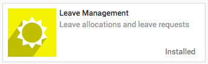
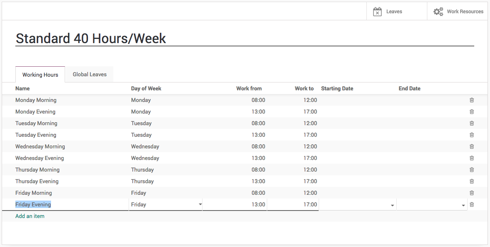
.. |image2| image:: ./media/image17.png
   :width: 6.5in
   :height: 2.51389in
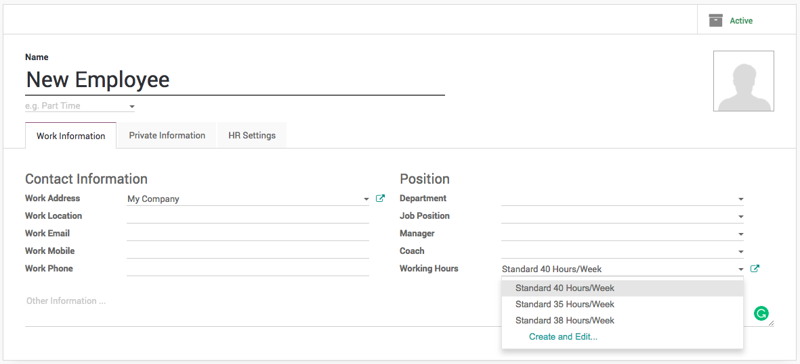
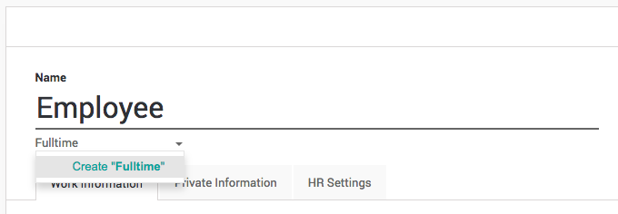
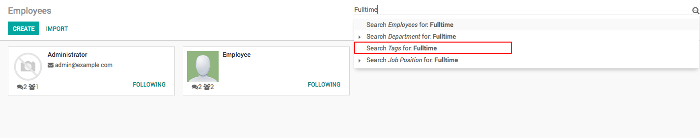
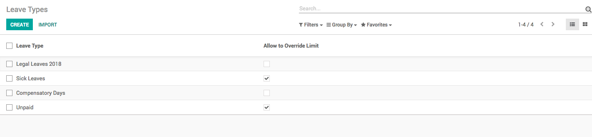
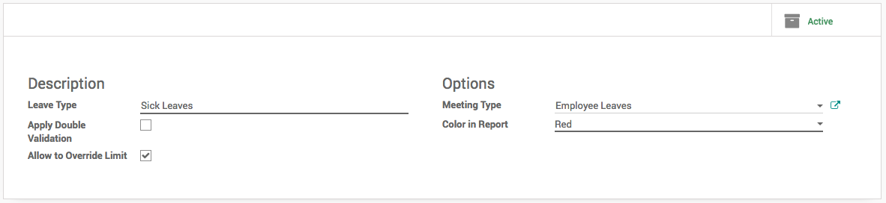
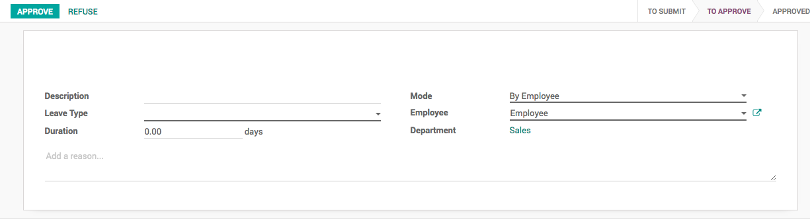
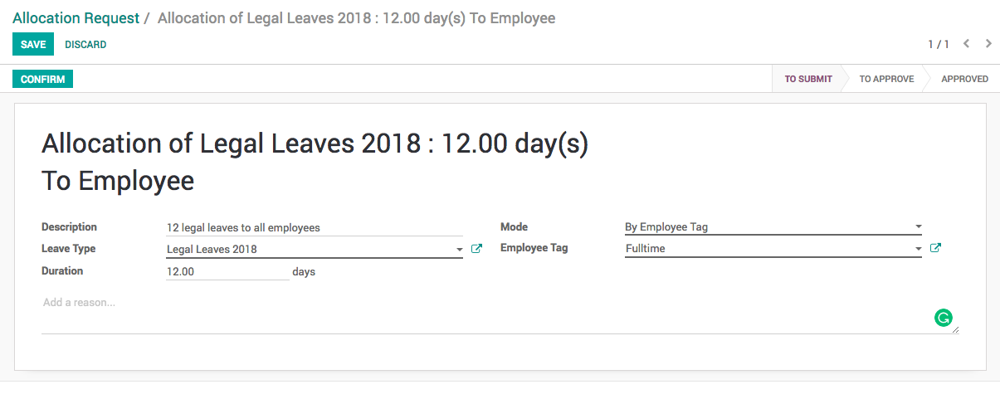
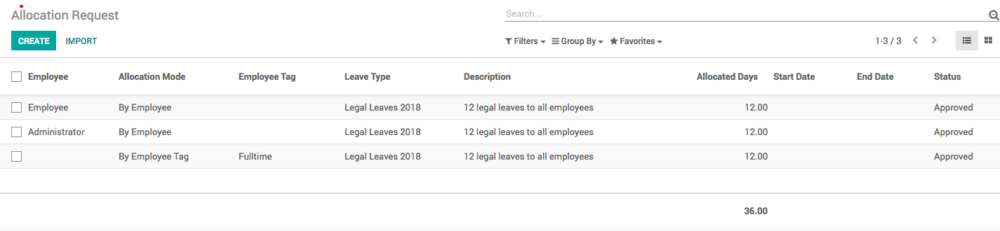
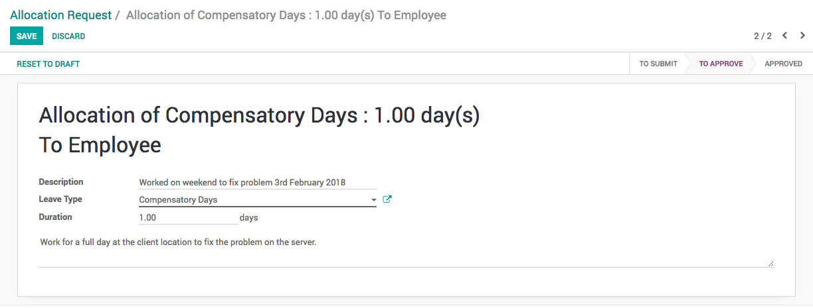
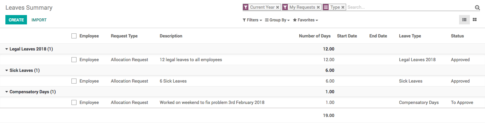
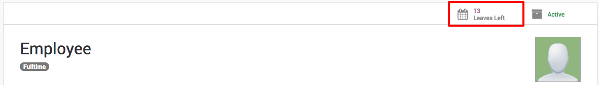
