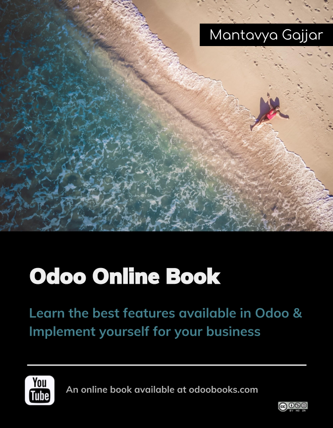

.. Odoo Book documentation master file, created by
   sphinx-quickstart on Mon Feb 10 23:08:02 2014.
   You can adapt this file completely to your liking, but it should at least
   contain the root `toctree` directive.

.. index::
   single: Home

================
Odoo Online Book
================

This book is dedicated for entrepreneur who wants to implement all-in-one business application out-of-the box for their business.

**Odoo Online Book** is an online book written based on Community and Enterprise Edition. This book covers best implementation practice for most used applications such as Sales, Purchase, Inventory, Financial Accounting and Manufacturing. 

:ref:`Read More → <about>`

Book Index
----------
.. toctree::
   :maxdepth: 1
   
   about.rst
   author.rst
   reviewer.rst
   toc.rst

Indices and tables
------------------

* :ref:`genindex`

.. note:: Please comment on the page below, if you have any question related to that topic. You can also send an email to mail@mantavyagajjar.in to propose new topics you would like to have on the book.