.. _subcontracting:

=============================================
Setup subcontracting in manufacturing process
=============================================
Most manufacturing companies outsource some part of the job contracting work to
other manufacturing companies to get the best expertise methodology and resource
to produce the world class product (i.e Most reputed companies smart phones are
assembled in China is the best example of the subcontracting)

In this document we will show you steps to setup the subcontracting business flow,
Issue the raw material to your contractor and get the semi-finished product which
will be consumed later to prepare the final product in our factory.

Let’s take an example of Table, to produce the table we need 1 table top and table
frame, 4 lags and some consumable like bracket and bolt, assumed that table is
laminated by third party contractor where we supply wood sheet and lamination
sheet to prepare the laminated table top.

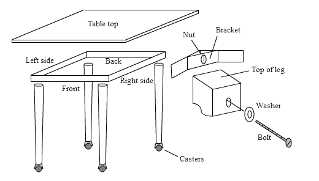

Configuration
-------------
Install manufacturing, purchase, inventory applications in order to create the
full subcontracting flow.

Create location
~~~~~~~~~~~~~~~
By default production is the location where all the manufacturing order processed,
all the material issued from stock location to Production location, and once
production completed the final product pushed back to the stock location.

We need seperate location which is not part of our warehouse, we will called it
subcontracting. It will be easy to track the material issued to the subcontractor,
also we can define reorder level on that location.

.. tip:: You can enable the multi location from ``Inventory / Configuration / Settings``,
    select Storage Locations and apply the setting.

To create the location go to ``Inventory / Configuration / Location``, create an
internal location named as Contractor under the WH.

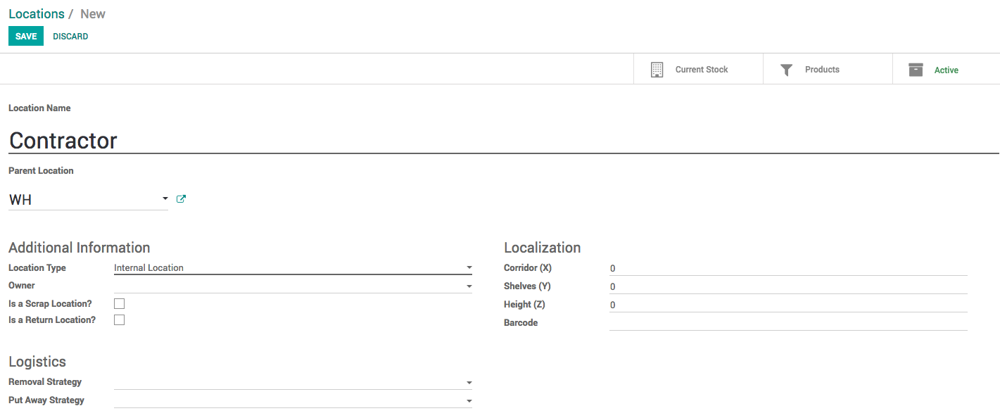

Enable routes
~~~~~~~~~~~~~
Inventory route plays a key role to create the subcontracting flow, using routes
we are able make the custom flow for the inventory, like Issue material to
contractor and receive finished material form contractor.

To create the custom route go to ``Inventory / Configuration / Settings`` and
select Multi-Step Routes, Storage Locations will be selected automatically.

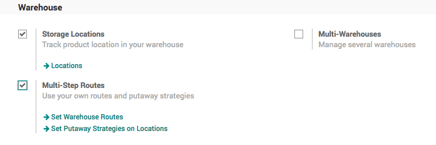

Let’s create a two different routes, which can be selectable on the product routes

* Material - select this route on the product which can be issued to the contractor
* Subcontracting - select this route when you want contractor to be product and
  send it to our warehouse (stock location)

Material Route
~~~~~~~~~~~~~~
Material route, select Product and Product Category under the Applicable On options.

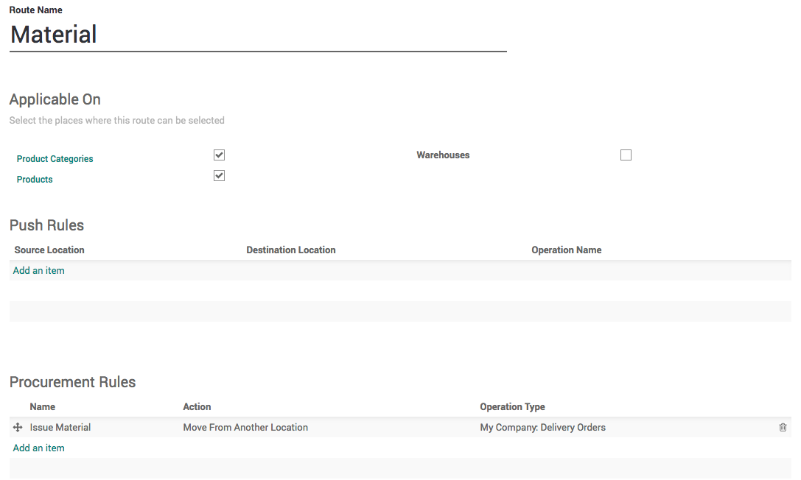

Create a Procurement that applied on the Contractor location and ask our Stock
location to fulfill the requirement by stock transfer.

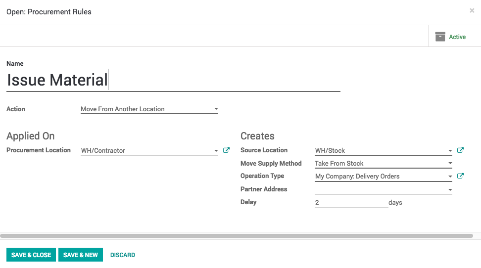

Subcontracting Route
~~~~~~~~~~~~~~~~~~~~
Same way create second route “Subcontracting” that create a manufacturing order
at contractor location when we need that semi-finished material in our stock.

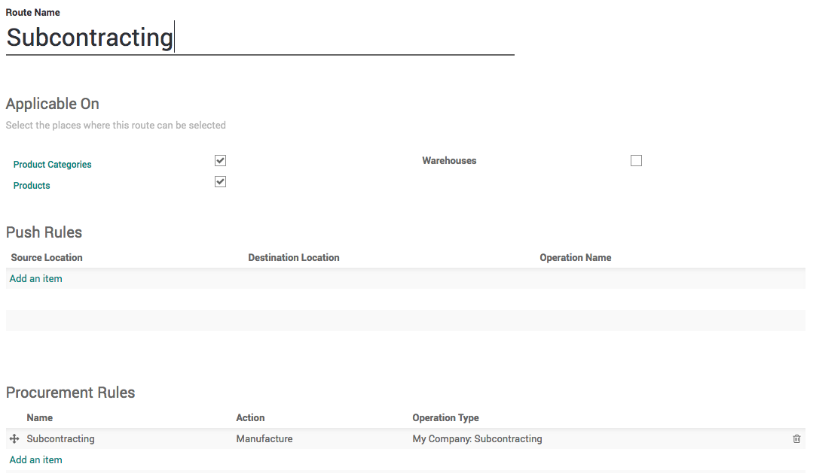

Create a procurement rules that applied on WH/Stock location and ask WH/Contractor
location to fulfil by creating a manufacturing order. This configuration will
create the manufacturing order at Contractor location and looking for the material
at WH/Contractor location and once Tabletop produced it will be pushed to WH/Stock
location.

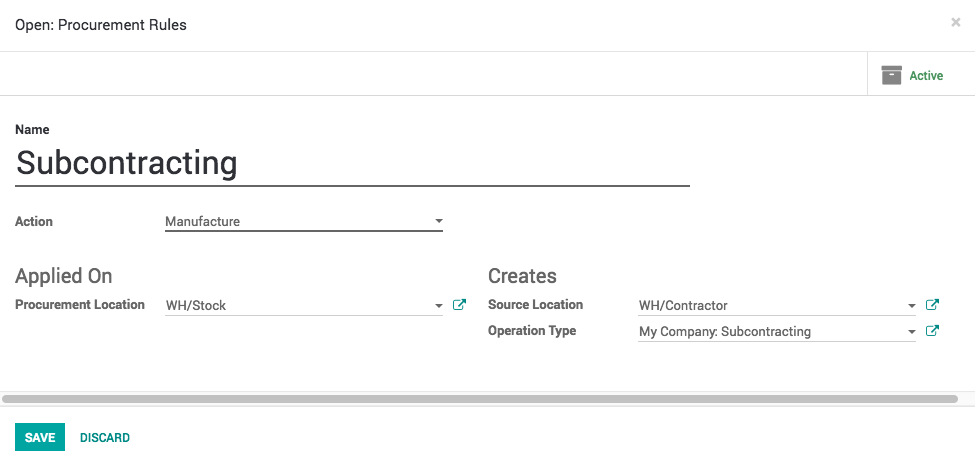

To separate the contractor’s manufacturing orders form the normal manufacturing
orders you should create a new operation type which will be appeared on the
warehouse dashboard.

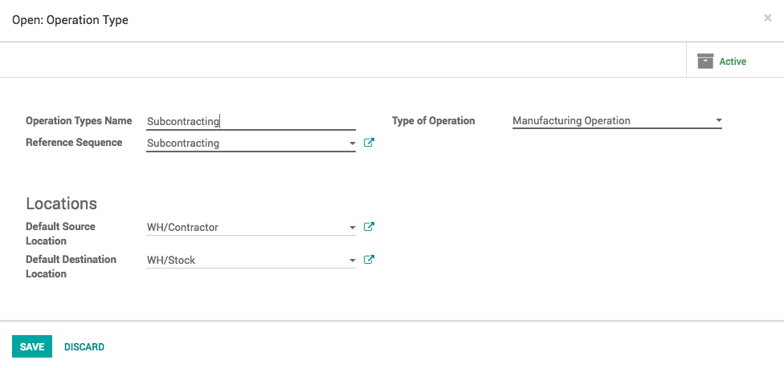

Products
--------
Let's create the Tabletop product and select the correct route on this product,
select Subcontracting as this product is manufactured but at contractor location,
we just need to supply them wooden and lamination sheet.

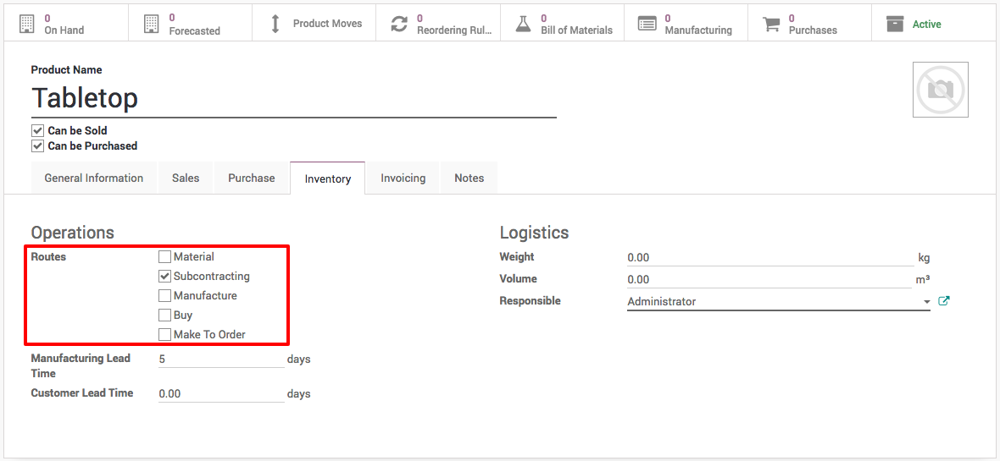

When you create a Wooden and Lamination sheet select the Material and Buy routs
on those products.

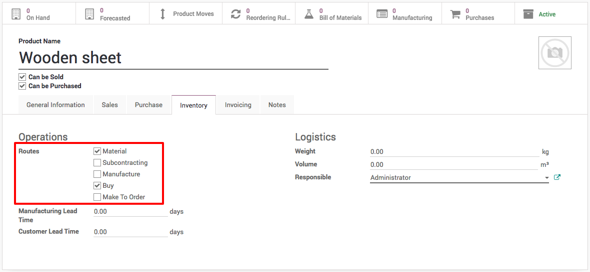

When this products needed at contractor location it will create the delivery
order in our warehouse and when this product required in our warehouse we will
buy it from the vendors.

.. note:: Define the vendor under the purchase tab and define the re-order level
  for both location WH/Stock and WH/Contractor depending on the needs.

Define the other raw material such as lags, table frame, bracket and bolt as
stockable and define respective vendors and re-order level for each products.
The bolt can be defined as consumable with the minimum stock level.

Bill of Material
----------------
Define two different bill or material one for Tabletop and second for the
Table (final product).

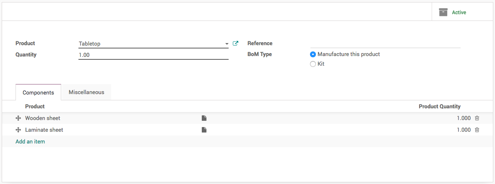

Once you define the bill of material for Table it will be looking as below, print
the BOM Structure form Print manu on the Table’s bill of material.

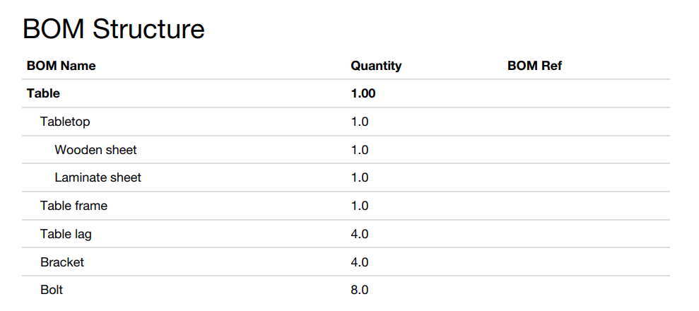

Cost Structure
--------------
Make sure that you have configure the correct cost on each product to compute the
cost of the finished and semi-finished raw material.

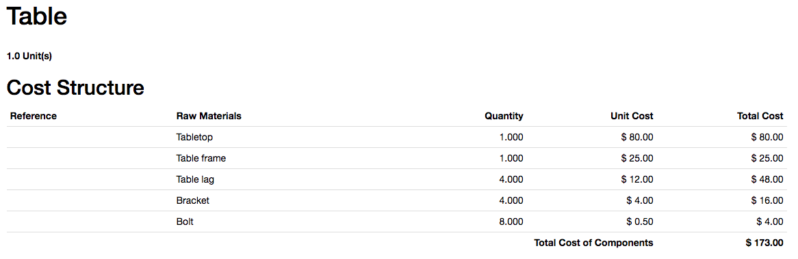

Let’s add a new consumable product on the Table top bill of material to include
the cost of contractor, I have considered that to produce each table top contractor
will charge us $5 as a service and delivery charges.

I have added that cost to the my Table top bill of material, and cost computed
based on the components and service is not $80.

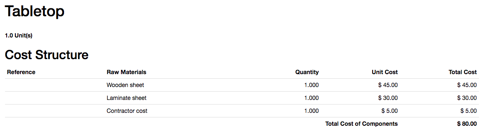

.. tip:: You can also install the Product extension to track sales and purchases app
  to compute the cost of the product based on the cost of material consumed.

  .. image:: subcontracting/sub_01_14.png
     :align: center

Reorder Rules
-------------
Make sure that you defined the reorder rules for each product respectively to the
locations. The reorder rules have to be defined for both WH/Stock and WH/Contractor
location.

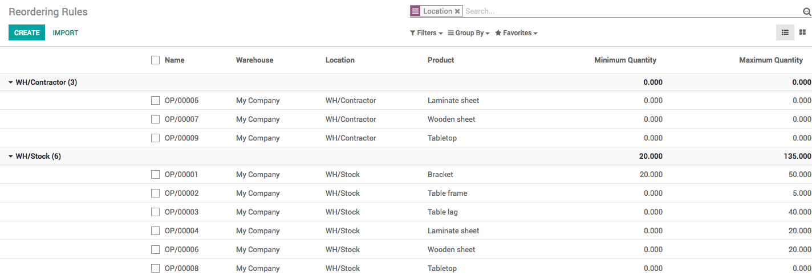

Run the Scheduler from Inventory application, you should get the first request
for quotation under the Purchase application as below.

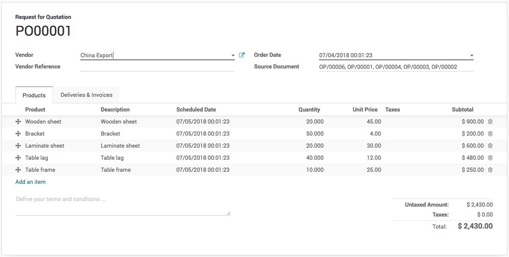

Confirm the purchase and receive the raw material to have the seamless test for
the subcontracting business flow.

Manufacturing order
-------------------
Everything is setup and now we are ready to test our first manufacturing order
that triggers subcontracting flow. Create the manufacturing order for 1 Table,
save and check on Check Availability button.

.. image:: subcontracting/sub_01_17.png
   :align: center

All the material except Tabletop will be marked as available.

Go to Inventory application and run the scheduler 2 times, you will notice after
each scheduler run you will see the updates on the dashboard. First time it will
create the manufacturing order at Subcontracting options and then delivery order
on the Delivery operation.

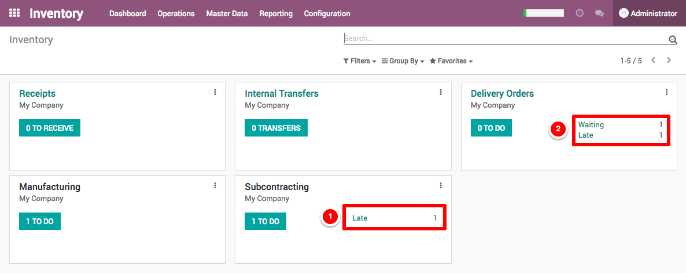

Open the delivery order and process it, as soon as you process the manufacturing
order at Contractor location will be ready to process.

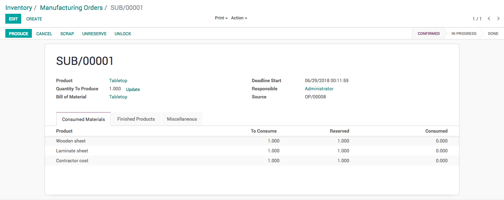

Process and manufacturing the set it mask as done. When contractor’s manufacturing
order processed and mark as done, the Tabletop will be marked as received in our
warehouse and we are ready to process the order for the Table in our factory.

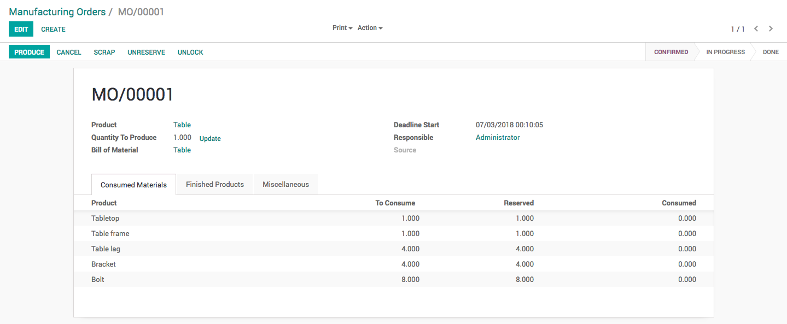

Finally produce the table and set this manufacturing order as done by clicking
on the Mark as Done button. Check the inventory level it has be looking as below.

.. image:: subcontracting/sub_01_21.png
   :align: center

Contractor Bill
---------------
Receive the vendor bill and create it manully.
