.. _subcontractor:

.. index::
   single: Contractor
   single: Job-work
   single: Sub-Contractor

======================================
Subcontracting process for contractors
======================================
Like the we :ref:`setup subcontracting in manufacturing process <subcontracting>`
for companies who outsource the contracting work, the contractor need the setup
at other side, he get the requirement form factory to perform the some part of
the final product. The outsourcing company send the raw material to build the
product and pay for the job work done.

In this document we will show you steps to setup the subcontracting business flow
for the contractors, get the raw material to and produce the semi-finished product
delivery the product get paid for the job work done.

Let’s take an example of Table, to produce the table we need 1 table top and table
frame, 4 lags and some consumable like bracket and bolt, assumed that tabletop is
laminated by third party contractor by us, we get the wood sheet and lamination
sheet to prepare the laminated table top.

.. image:: subcontracting/sub_01_00.png
   :align: center

Configuration
-------------
Install **Sales Management**, **Mathanufacturing** applications, the **Inventory
Management** and **Invoicing** applications will be installed automatically.

Setup Inventory
~~~~~~~~~~~~~~~
In order to setup the contractors workflow the multiple warehouse and some custom
routes is required, lets enable them from the **Inventory** application. Go to
``Inventory / Configuration / Settings`` and activate the *Multi-Warehouses* and
*Multi-Step Routes* the *Storage Locations* will be selected automatically.

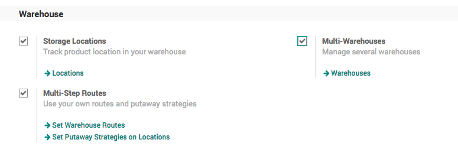

Create Warehouse
~~~~~~~~~~~~~~~~
In order to separate the internal and outsource manufacturing orders we need to
setup the other warehouse, the default warehouse we will use as an internal and
new warehouse we will setup as a **Factory** where we will process all the
outsourcing orders.

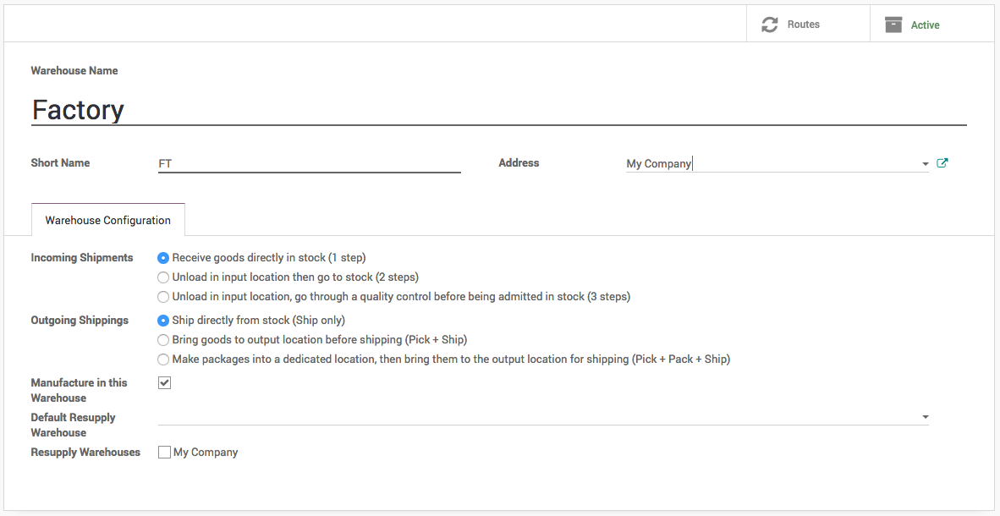

You should get the 8 inventory operations on the Inventory dashboard, 4 operations
for each warehouse. i.e. *Receipts*, *Internal Transfer*, *Delivery Orders* and
*Manufacturing*.

.. tip:: Make sure that you keep selected for *Manufacture in this Warehouse*
  field on the warehouse.

Create Material Route
~~~~~~~~~~~~~~~~~~~~~
The contractor flow is same as the standard manufacturing process, where we create
a manufacturing order and buy the material on demand through purchase process.
In this process we have to ask customer who provide us the manufacturing job, the
material we will get we do not have to pay for it as it does not come through
purchase process.

We will create a new route *Material* which should be selected on the product, which
is going to be supplied by the customer along with the contracting order.

Go to ``Inventory / Configuration / Routes``, create a new route called *Material*

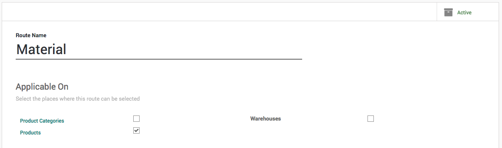

Create a *Procurement Rules* that moves the material from *Vendor Location* to
*Factory Stock* location, select *Factory: Receipts* on **Operation Type** as an
incoming shipment should be created under that operation.

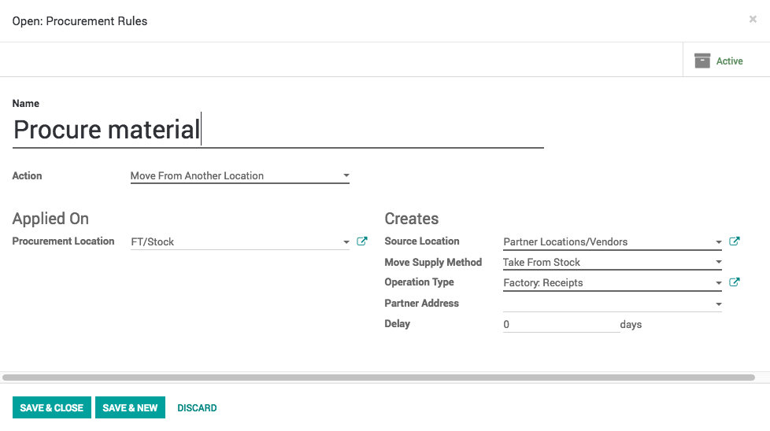

Products
--------
Let’s create the *Tabletop* product, it is *Stockable Product* product,
select the *Manufacturing* and *Make to Order* routes. The manufacturing order
for the tabletop will be created when we have a job order.

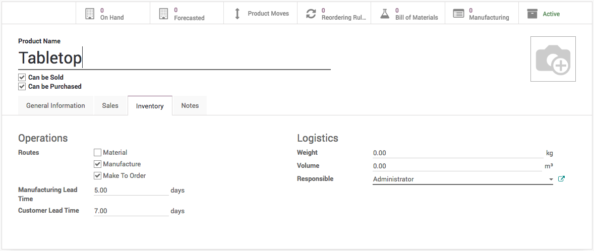

The **Sales Price** on the *Tabletop* product is actually the cost of the production
and not the cost Tabletop. When we sell the *Tabletop* we actually sell the
job work to produce the *Tabletop*.

.. note:: Set the **Manufacturing Lead Time** to *5* and **Customer Lead Time** to 7.
  This will used to compute the schedule dates for the manufacturing order, delivery
  order.

Create a Wooden and Lamination sheet and select the *Material* and *Make to Order*
routes on those products.

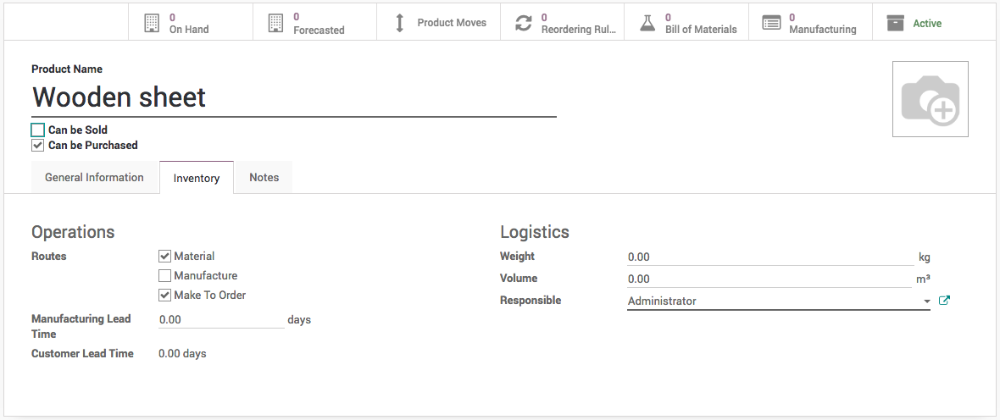

Bill of Material
----------------
Define the bill or material for *Tabletop*, that consume *Wooden sheet* and
*Laminated sheet* as a raw material.

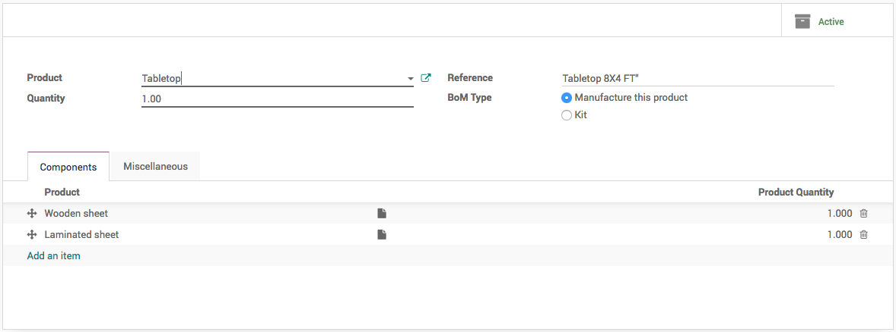

During the manufacturing, contractor cares about the cost of the service and
resources such as electricity and manpower and machine. Set the cost of the
material to 0 and add those cost as a consumable product on the bill of material.
At the end of the manufacturing process you will get the exact cost of the job work.

Reorder Rules
-------------
We don't need any reorder rules as all the material will be procured on demand
from the customer.

Sale Order
----------
Let's assume that we receive the work order to prepare the 10 *Tabletop*
form *China Export*.

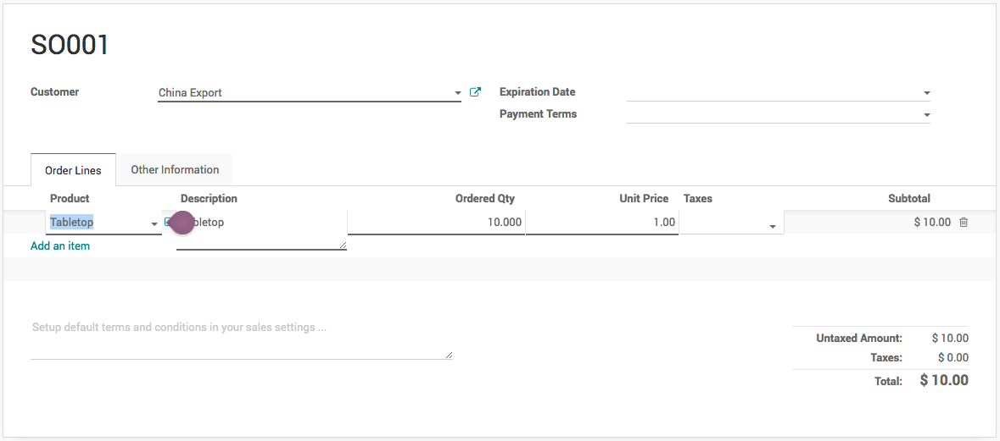

.. tip:: You will find two Delivery attached to the Sales order, one is the actual
  delivery order while second it the incoming shipment which ask for the material
  to supply form the customer to build the Tabletop.

The *Unit price* is the price for the job work to produce for each table. Make
sure that you change the **Warehouse** to *Factory* as we process all the
outsourcing work in that warehouse.

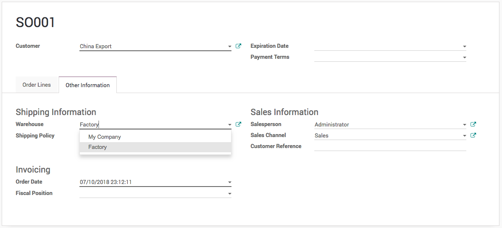

Confirm the order, it creates the *Delivery Order* and *Manufacturing* order and
*Receipts* in the Factory warehouse.

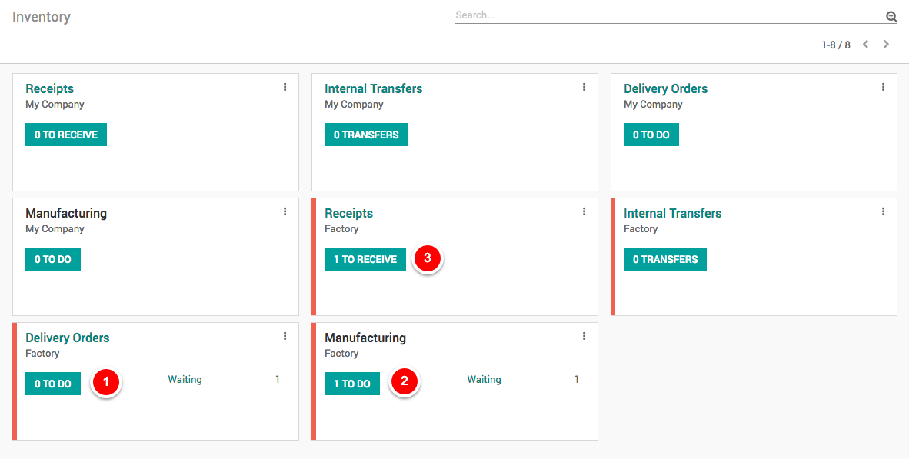

Manufacturing Order
-------------------
The sales order creates the delivery order, that triggers manufacturing order and
that triggers reception order. The complete flow is triggered through Make to order
route so you have *SO001* in **Source Document** on delivery, manufacturing and
incoming shipment.

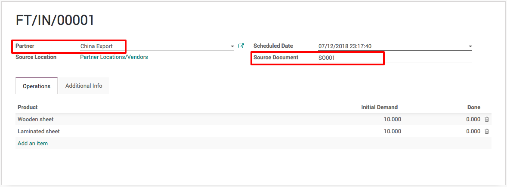

When you have a multiple orders from different customers, manufacturing orders
will be ready to produce only for the customer who supply the material.

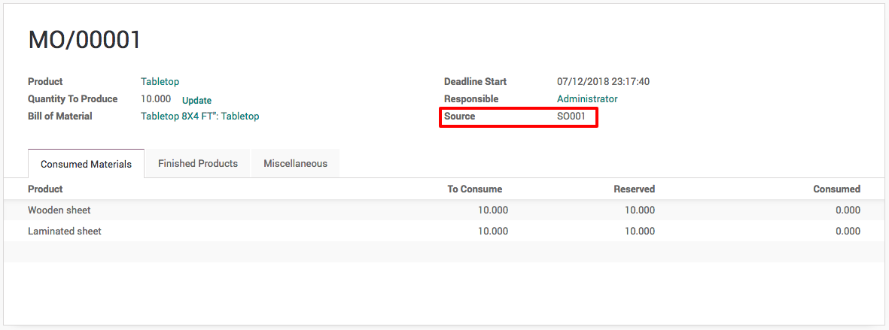

Let's process the incoming shipment at reception and process the manufacturing
order. The delivery order will be ready when manufacturing order completed.

Job work Invoice
----------------
You are ready to prepare the send the invoice for the job work once the delivery done.
Create an invoice and send it to customer, this is the an invoice for the job work
and not for the selling of the Tabletop.

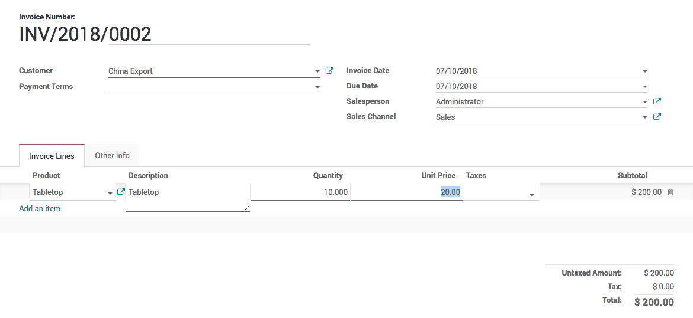

.. tip:: You can set the Invoicing Policy on the Tabletop product that takes
  care for the invoicing process.

Video
-----
Access the video at https://www.youtube.com/watch?v=JPHB5_DiZfI

.. raw:: html

    

        <iframe src="https://www.youtube.com/embed/JPHB5_DiZfI" frameborder="0" allowfullscreen style="position: absolute; top: 0; left: 0; width: 700px; height: 385px;"></iframe>
    

