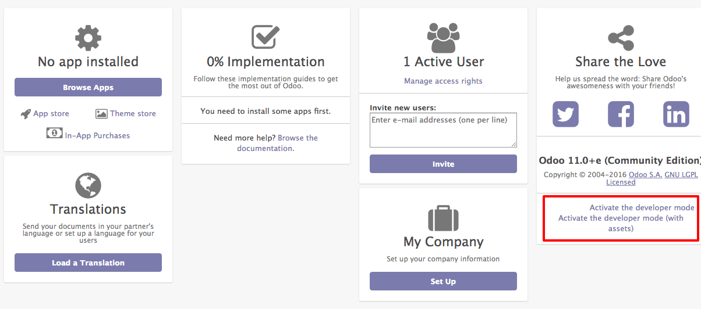

.. _debugmode:

.. index::
   single: Debug mode
   single: Debug assets
   single: Resource bundle
   single: Technical settings
   single: System settings

===========================================
Access system settings using developer mode
===========================================

Odoo application can be viewed in different modes, the default is normal mode suitable for normal users, it designed for great user experience. Odoo runs in three different modes:

* Normal mode: The default mode; most users are in this mode during production use.
* Developer mode: The name itself suggests something related to technical stuff. You can enter into the configuration of the application and Odoo's internal system, as well.
* Developer mode with assets: In addition to the developer mode, this loads all the resources separately such as JavaScript, CSS files, and images, instead of loading them in a bundle.

.. warning:: Developer mode with assets mode may be slower than all the other modes, you developer! you are welcome to this mode.

Enter into Debug mode
---------------------
You can enter into debug mode by adding ``debug`` argument in the URL, i.e. Change ``https://my-company.odoo.com/web?#home`` to ``https://my-company.odoo.com/web?debug=#home``.

The second easy way is to enter into ``Settings``, click on the ``Activate the developer mode`` link below the version information.

You will be able to see the ``Technical`` menu under the ``Settings`` application on successful activation of the debug mode, you can access all the system settings there.

Video
-----
Let's see how to activate the developer mode and debug the assets.

.. raw:: html

    

        <iframe src="https://www.youtube.com/embed/F8T0lzz0P8k" frameborder="0" allowfullscreen style="position: absolute; top: 0; left: 0; width: 700px; height: 385px;"></iframe>
    

