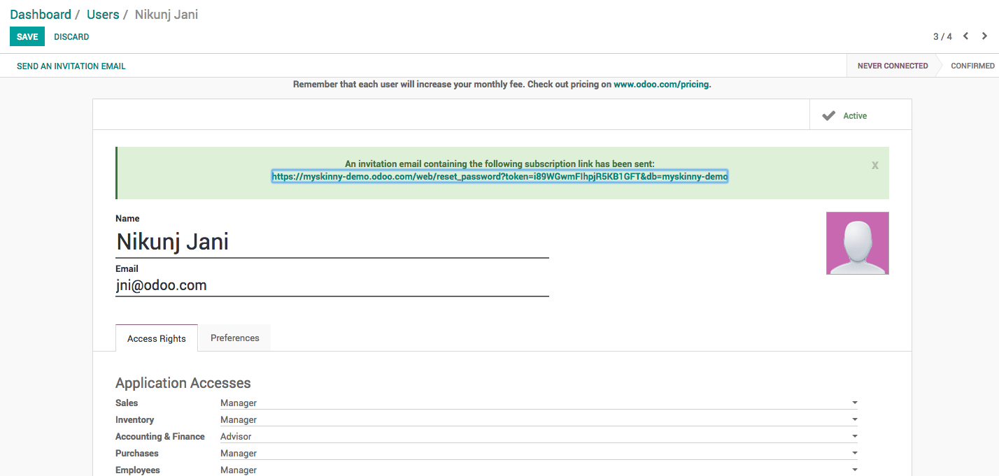

.. _newusers:

.. index::
   single: Manage Users
   single: Create User

==============================
Manage users and access rights
==============================
You have an opportunity to invite your colleagues to signup on the instance during the activation process, you may see the below screen during the signup.

.. image:: images/chapter_01_10.png
   :alt: User list
   :align: center

Enter the Name and Email address of your colleagues and click on the Send Invitation button.

.. image:: images/chapter_01_11.png
   :alt: User list
   :align: center

Create user
-----------
You can create an user manually or import the list of users (email address) to signup. You can create an unlimited users as soon as you are using single application.

You need name and email address to send the signup invitation email. The email will be sent automatically with signup link, when you create a new user.

.. tip:: Make sure that you assign correct access rights before you create the new user. Either user have a full access or user may not be able to access certain features when access rights are not configured properly.

All the users with status ``NEVER CONNECTED`` shows that, they did not sign up, verify the Email address is correct incase, if they did not receive signup email.

Change access rights
--------------------
Odoo assign full (manager for all the applications) access rights to all users created through invitation during activation, you may review their access rights on the user form and change if needed.

.. image:: images/chapter_01_13.png
   :alt: Create new user
   :align: center

You can set custom access rights for new users from ``General Settings``.

.. image:: images/chapter_01_14.png
   :alt: Set custom access rights for new users
   :align: center

Click on the ``Default Access Rights`` like you will see ``Default User Template`` user. Access rights for the new users will be copied from this user.

.. tip:: The additional the rights can be given later from the user configuration before or after user signup.

Let's see how to invite new users to signup and start using the features on Odoo online instance.
