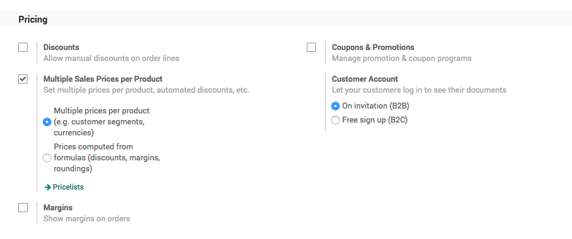
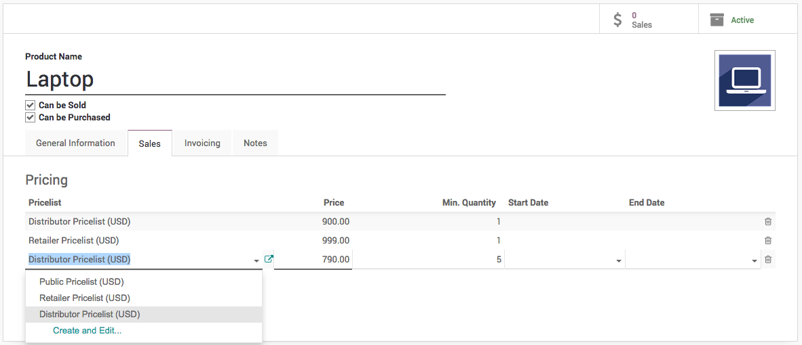
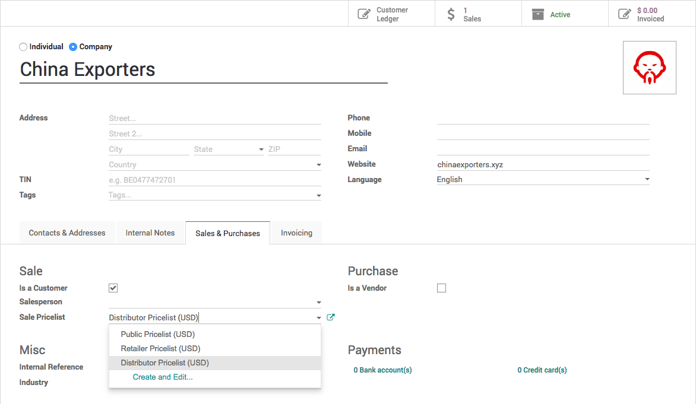
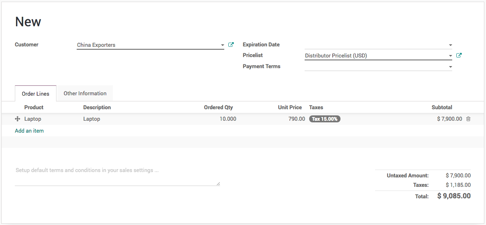

Adapt product price based on customer segment (e.g. Retailer or Distributor)
============================================================================

Sales and distribution business works on the margin basics, the
percentage of margin are fixed for the distributors based on their
turnover. The MRP of the product is decided included the margins for the
retailers, stockist, distributors. In this section you will see how
pricelist can help you to achieve to define the product price based on
the customer type (retailer and distributors).

Business case
-------------

The *My Company* sells the electronic products such as *Computers*,
*Laptops*, and *Printers*, they want to set up the pricing rules for
their *Retailer* and *Distributors*. The price they would like to offer
are as below:

+-----------------+-----------------+-----------------+-----------------+
| **Product**     | **Sales Price   | **Distributors  | **Retailer      |
|                 | (MRP)**         | (Price)**       | (Price)**       |
+=================+=================+=================+=================+
| Laptops         | 1099            | 900             | 999             |
+-----------------+-----------------+-----------------+-----------------+
| Desktop         | 999             | 740             | 799             |
+-----------------+-----------------+-----------------+-----------------+
| Printer         | 499             | 330             | 399             |
+-----------------+-----------------+-----------------+-----------------+
| Tablet          | 799             | 620             | 699             |
+-----------------+-----------------+-----------------+-----------------+

Configuration
-------------

Assumed that the **Sales Management** application installed, let’s see
what are the other configuration you have to do before you execute the
business case.

Pricelist
~~~~~~~~~

To setup the customer segment specific price you have to enable the
feature called **Multiple Sales Prices per Product** available under the
**Sales / Configuration / Settings**. Keep the default option selected
**Multiple prices per product (e.g. customer segments, currencies)**
under the **Sales Pricelist** option, using that you can define the
customer segment specific pricelist.

|image0|

Product
~~~~~~~

Let’s create the products you are selling, to create the products go to
**Sales / Catalog / Products**, create a product, enter the **Name**,
set **Image** and **Sales Price**, the customer specific price you can
define under the **Sales** tab.

|image1|

Create a pricelist if not created before, enter the name of the
pricelist (i.e. Retailer Pricelist) and click on **Create “Retailer
Pricelist”** link, enter the **Price** and **Min. Quantity**, keep the
Min. Quantity to 1 by default if you don’t want to put the constraint on
the minimum order quantity.

You can create a multiple lines for the same pricelist (i.e.
*Distributor Pricelist*) in case you want to offer a special price to
the distributor, when they buy more than 1 quantity. (i.e.
**Distributors** can get the *Laptop* at *790* price, if they order
minimum *5* or more quantities)

The **Start Date** and **End Date** is used to limit the offer for a
specific dates, assume that you want to offer a special price for the
Christmas (i.e. **Start Date** to *20/12/2018* and **End Date** to
*31/12/2018*)

Customer
~~~~~~~~

The customers can be defined as a distributor or retailer by setting the
specific pricelist on them. Pricelist can be set on the customer form
under the **Sales & Purchases** tab.

|image2|

Create sale order
-----------------

Let’s send a quotation to your customer, create the quotation from
**Sales / Orders / Quotation**, depending on the customer the pricelist
will be set on the quotation and the product price will be appeared
accordingly, when you add pdoructs on the quotation.

|image3|

Create a quotation for *China Export* (Distributor), add *50* quantity
of Laptop, the special price *790/unit* applied as we prepare the
quotation for more than *5* quantity.

.. tip:: Pricelist can be changed on the quotation after selecting a
customer. The pricelist selected on the quotation have the higher
priority over the pricelist assigned to the customer.

Now, a salesman can create quotations quickly regardless of the customer
type and price offered to them, of course a correct pricelist have to be
configured when you create customer, it can be reviewed later depending
on the turnover.

