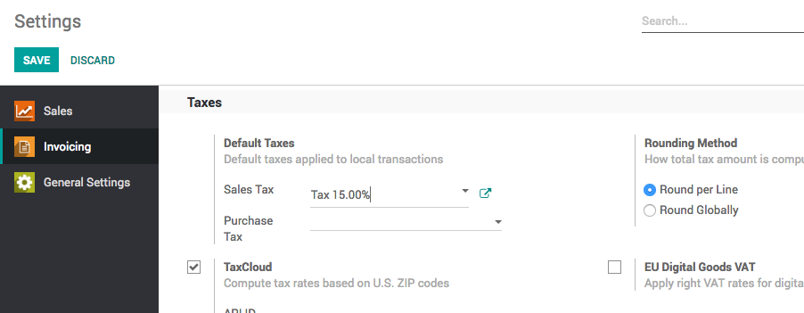

Apply default taxes on products or sales order
==============================================

Taxes applied in your country are installed automatically for most
localizations. Default taxes set in orders and invoices come from each
product’s Invoicing tab. Such taxes are used when you sell to companies
that are in the same country/state than you.

Business case
-------------

Let’s set the default sales and purchase tax to Tax 15.00%.

Configuration
-------------

To change the default taxes set for any new product created go to
**Invoicing / Configuration / Settings**.

|image0|

Create new product
------------------

The default tax will be applied to all the products created after
setting the default tax on the invoicing configuration.

|image1|

Create sales order
------------------

The same tax will be applicable on the sales order which was previously
set as a default tax on the product form.

|image2|

.. |image1| image:: 04/media/image4.png
   :width: 6.5in
   :height: 2.02778in
.. |image2| image:: 04/media/image3.png
   :width: 6.5in
   :height: 2.63889in
