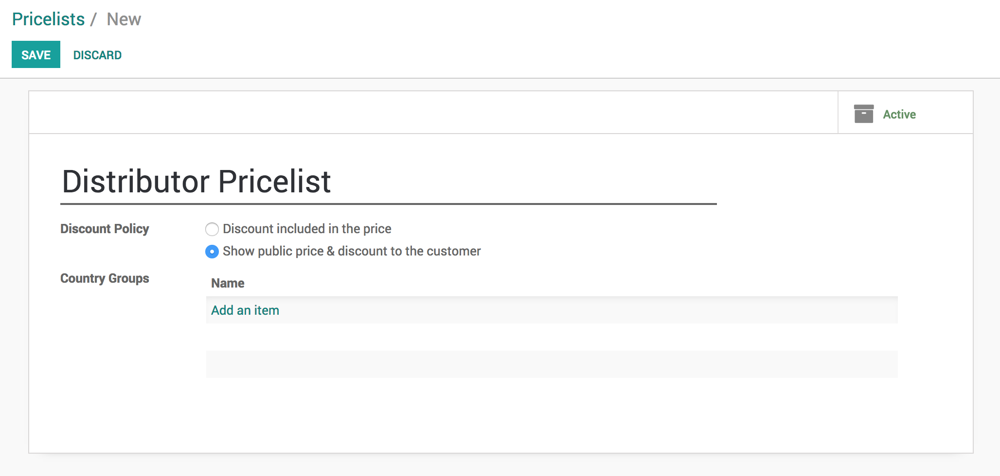
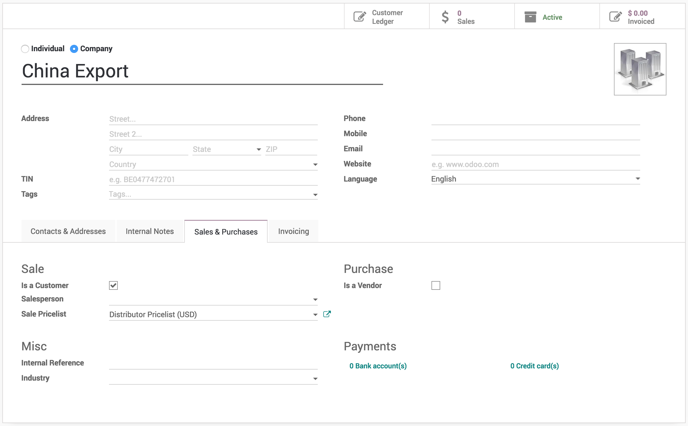

Compute and apply discount automatically based on the pricelist
===============================================================

Allowing discounts on quotations is a common sales practice to improve
the chances to convert the prospect into a customer, when you are not
offering discount to all the customers, keep it manual and offer when
customer demands.In case you have to apply discount for specific
customer or products every time, it is quite difficult for salesman to
remember those products or customer and apply the discount manually on
each quotation.

Business case
-------------

The trading company “\ *My Company*\ ” manufactures the *Computer Desk*
and selling to their distributors and to retail customers.

They sell to retail customer at a public price of 3200 but when they
sell to distributors the price would be 2240, and they show the
percentage of the discount which was offered on the public price.

Configuration
-------------

Assumed that you have installed the **Sales Management** application.

Discount
~~~~~~~~

By applying discount on the quotation, the product price will get
decreased, the discount will be visible to the customer on quotation,
this will encourage the customer to close the deal quickly.

The discount feature has to be enabled to show the percentage of the
discount offered to the customer on quotation, it can be activated from
**Sales / Configuration / Settings**.

Product Pricing
~~~~~~~~~~~~~~~

You need a pricelist to apply the product price based on the business
rules such as discount or periodically price variations for a
product(s). Let’s go to **Sales / Configuration / Settings** and
activate the **Multiple Sales Prices per Product options** as of now we
will keep the **Multiple prices per product (e.g. customer segments,
currencies)** option selected by default.

Let’s create a *Distributor Pricelist,* the Public Pricelist available
as a default, the pricelist can be accessed from **Sales / Catalog /
Pricelists**. Create pricelist name it as *Distributor Pricelist* and
change the **Discount Policy** to *Show public price & discount to the
customer*.

|image0|

The discount policy decides, whether the discount will be computed based
on the pricelist and will be visible to customer on quotation or not.
When you choose *Discount included in the price* the product price will
be computed by applying the discount (%) and discount will not be
visible to customer on quotation.

.. tip:: The *Discount included in the price* option can be used to
  apply the price variation such as commodity price, it may decrease or
  increased.

Create a product
~~~~~~~~~~~~~~~~

Let’s create the product and define the pricing rules so depending on
the customer the price will be applied automatically. The **Pricing**
rules can be applied under the **Sales** tab on product form.

|image1|

I have created two pricing rules, one for *Distributor Priclist* and
another for *Public Pricelist*. The customer which do not comes under
any of those pricing rules the **Sales Price** defined on the product
will be applied in that case.

Create a customer
~~~~~~~~~~~~~~~~~

Create a customer *China Export* of type distributor, we will offer the
*Computer Desk* to them at a special price.

|image2|

To define this customer as a distributor, select the *Distributor
Pricelist (USD)* in **Sales Pricelist** field available under the
**Sales & Purchase** tab.

Create a quotation
------------------

Create a quotation from **Sales / Orders / Quotations**, select the
*China Export* as a customer, a *Distributor Pricelist (USD)* will be
selected automatically on the quotation. Now add the product *Computer
Desk* on the order lines, **Unit Price** will be set to *3200* but
**Subtotal** computed and shows *2240* as an automatic *30%* discount
computed and set on the **Discount** field based on the *Distributor
Pricelist*.

|image3|

The 30% is computed based on the difference between price offered to
distributors and the product **Sales Price**. *I.e. 3200 - 2240 = 960
which is 30% of the 3200 price*.

Video
-----
Access the video at https://www.youtube.com/watch?v=J41EpiT0a5g

.. raw:: html

    

        <iframe src="https://www.youtube.com/embed/J41EpiT0a5g" frameborder="0" allowfullscreen style="position: absolute; top: 0; left: 0; width: 700px; height: 385px;"></iframe>
    

.. |image1| image:: static/compute_and_apply_discount_from_pricelist/media/image7.png
   :width: 6.5in
   :height: 2.80556in

.. |image3| image:: static/compute_and_apply_discount_from_pricelist/media/image5.png
   :width: 6.5in
   :height: 3.02778in
