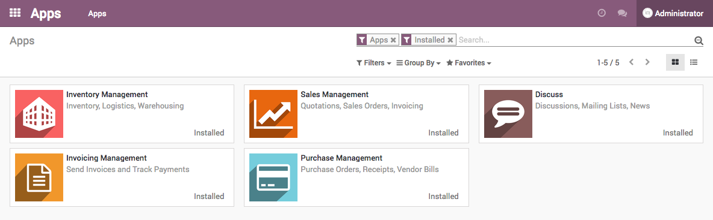
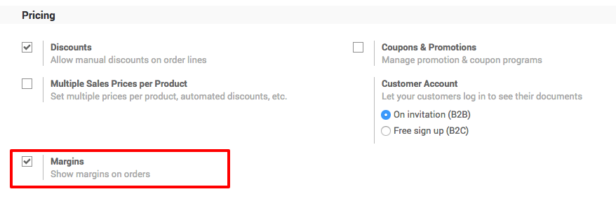
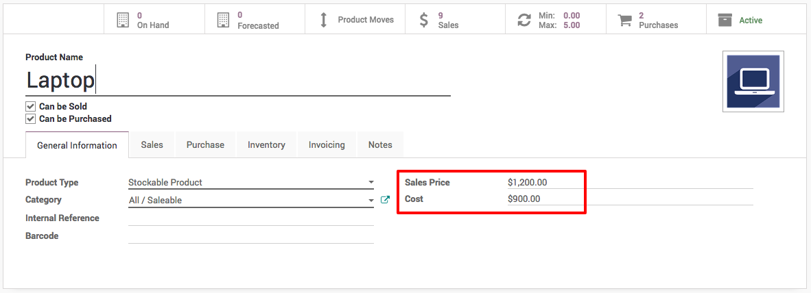

.. _salesmargin:

.. index::
   single: Sales Margin

=============================
Compute marging on sale order
=============================
Some business wants the realtime computation of the marging so that sales
manaer or person can propose the best price to the customer.

Let's take the business case, sales manager check the margin on order and decide
whether we can allow additional discount to the customer or not.

Configuration
-------------
Install the **Sales Management**, **Purchase Management** applications.

Installation of sales and purchase will install other applications
such as **Inventory Management** and **Invoicing Management**.

Margins
~~~~~~~
Go to ``Sales / Configuration / Settings`` select **Margins** and apply the setting.
This will show margins on orders.

Products
~~~~~~~~
Enter the product **Sales Price** and **Cost** accordingly, enter the latest
sales and cost price.

I have entered $1200 sales price and $900 cost price, also defined the $900
purchase price on the vendor pricelist.

.. tip:: Product **Cost** will be computed automatically when you set the product
  costing method to *Average Cost (AVCO)* or *First in First Out (FIFO)*. The FIFO
  method docues not give you correct costing in some case.

Create Sales order
------------------
Let's create a quotation, select the customer on quotation and product on order line.
The margin will be computed as soon as you select the product, the differance
between **Unit Price** and **Cost** is margin. The **Margin** be computed
based on the differance for each lines on sale order.

.. image:: images/chapter_02_37.png
   :alt: Sales Settings
   :align: center

Now, it will be easy for the sales manager to check what's the margin on quotation.
For **SO004** it is 25%, its a good deal to go with, let's move forward and confirm the order.

Video
-----
