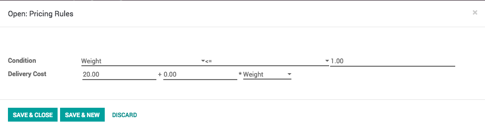
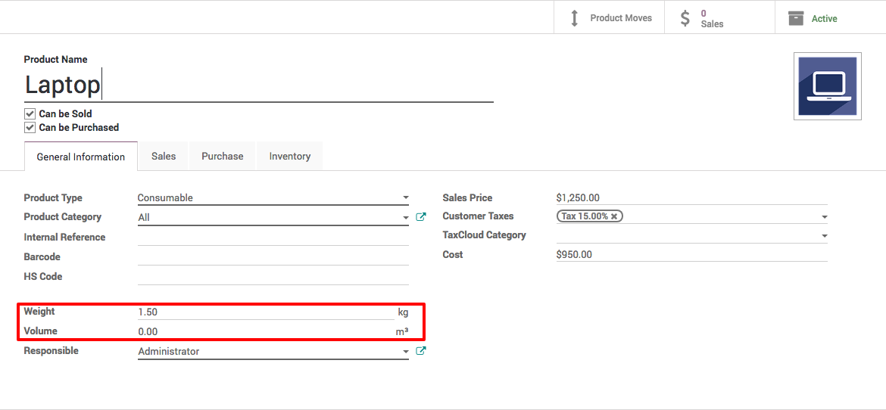
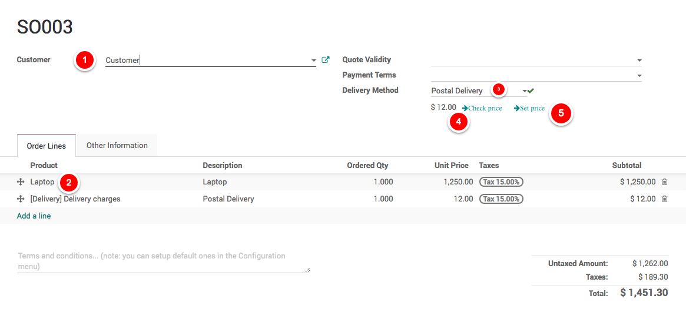

.. _deliveryweight:

================================================
Calculate shipping rates based on product weight
================================================
Odoo can handle various delivery methods, but it is not activated by default.
Delivery methods can be used for normal sale of you can also use for your e-commerce order.

Delivery methods allow you to manage the transport company, the price and the destination.

.. tip:: You can even integrate Odoo with external shippers to compute the real price and the packagings.

Configuration
-------------
Activate the Shipping Costs feature form ``Sales / Configuration / Settings``.

.. image:: images/chapter_02_21.png
   :alt: Shipping Costs Configuration
   :align: center

.. note:: Activating the Shipping Costs will install the Inventory application if it was not installed previously.

Setup the delivery charges
~~~~~~~~~~~~~~~~~~~~~~~~~~
Let's assume that you deliver the product to your customer through postal service and the service changres you based on weight.
Postal service deliver to all over the USA at $20 fixed rates if the weight upto 1kg, when weight is above 1kg, they charge $8 for every 1kg.

.. image:: images/chapter_02_22.png
   :alt: Delivery Cost Grid
   :align: center

Goto ``Sales / Configure / Delivery Methods`` and create a new method *Postal Delivery*,
select *Based on Rule* for **Provide** as the delivery cost is based on the weight and create a two rules.

Setup product weight
~~~~~~~~~~~~~~~~~~~~
Do not forget to add the correct product weight while creating the products.

.. tip:: Compute and set the product weight including weight of delivery package.

Adding delivery cost to the quotation
-------------------------------------
You can now choose the Delivery Method on your sale order.
If you want to invoice the price of the delivery charge on the sale order, click on Set price,
it will add a line with the name of the delivery method as a product.

Video
-----
Access the video at https://www.youtube.com/watch?v=o1QOCiWOnwk

.. raw:: html

    

        <iframe src="https://www.youtube.com/embed/o1QOCiWOnwk" frameborder="0" allowfullscreen style="position: absolute; top: 0; left: 0; width: 700px; height: 385px;"></iframe>
    

