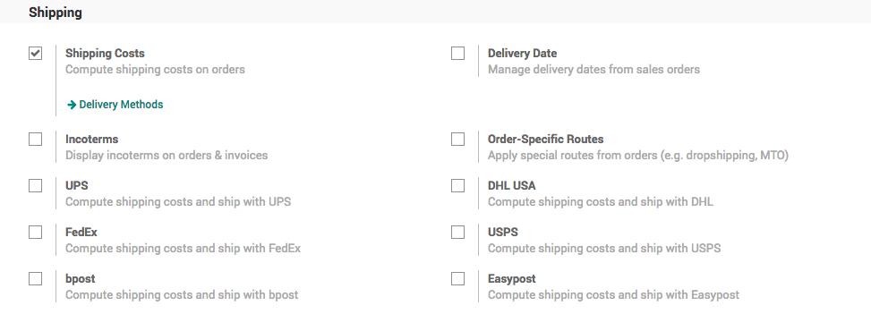
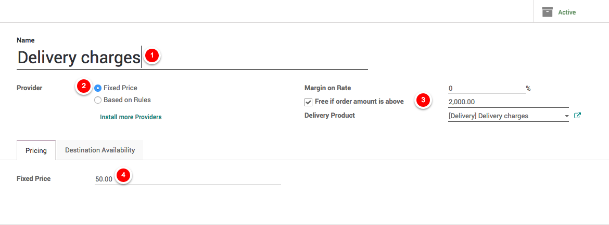
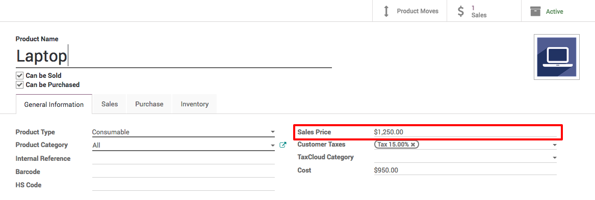
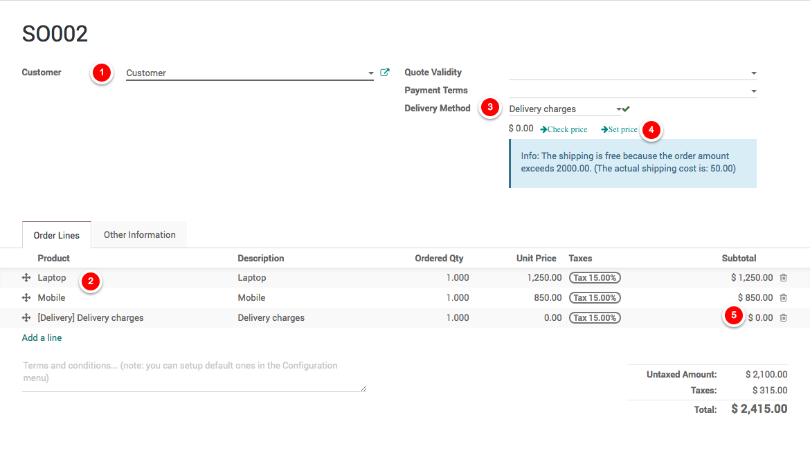

.. _freedelivery:

.. index::
   single: Free delivery based on order amount
   single: Free delivery

===============================================
Free delivery if order total is more then $2000
===============================================
Odoo can handle various delivery methods, but it is not activated by default.
Delivery methods can be used for normal sale of you can also use for your e-commerce order.

Delivery methods allow you to manage the transport company, the price and the destination.

.. tip:: You can even integrate Odoo with external shippers to compute the real price and the packagings.

Configuration
-------------
Activate the Shipping Costs feature form ``Sales / Configuration / Settings``.

.. note:: Activating the Shipping Costs will install the Inventory application if it was not installed previously.

Setup the delivery charges
~~~~~~~~~~~~~~~~~~~~~~~~~~
Let's assume that you deliver the product at fixed $50 and you deliver for free when total order value is more than $2000.

Goto ``Sales / Configure / Delivery Methods`` rename the existing method *Free delivery charges* to *Delivery charges*
add the $50 in the **Fixed Price**.

.. tip:: If you have a multiple delivery methods having a fixed price, please create a saparate Delivery Product for each method.

Setup product price
~~~~~~~~~~~~~~~~~~~
Do not forget to add the correct product price when creating the products.

Adding delivery cost to the quotation
-------------------------------------
You can now choose the Delivery Method on your sale order.
If you want to invoice the price of the delivery charge on the sale order, click on Set price,
it will add a line with the name of the delivery method as a product.

Video
-----
Access the video at https://www.youtube.com/watch?v=JPpUPbTeJD0

.. raw:: html

    

        <iframe src="https://www.youtube.com/embed/JPpUPbTeJD0" frameborder="0" allowfullscreen style="position: absolute; top: 0; left: 0; width: 700px; height: 385px;"></iframe>
    

