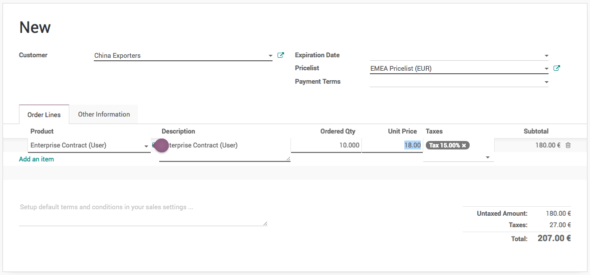

.. index::
   single: Product price based on country (€ or $)

Adapt product price based on customer country or location (e.g. Price in € or $)
================================================================================

An international sales and distribution business network required
accurate price conversion or the price rules according to the customer’s
country. During quotation process some business prefer to have the rate
conversion while some business wants to define the price based on the
geographic locations irrespective of currency conversion. You can
configure both business case using the pricelist.

Business case
-------------

Odoo wants to apply pricing rules for the customer irrespective of the
currency conversion based on the customer location. They divide whole
world into three different region and specific price for each region.

+-----------------+-----------------+-----------------+-----------------+
| **Product**     | **America       | **Europe &      | **ASIA (USD)**  |
|                 | (USD)**         | Middle East     |                 |
|                 |                 | (EUR)**         |                 |
+=================+=================+=================+=================+
| Odoo Enterprise | 28              | 24              | 16              |
| (Users)         |                 |                 |                 |
+-----------------+-----------------+-----------------+-----------------+

Configuration
-------------

Assumed that the **Sales Management** application installed,
**Invoicing** application will be installed as an dependant of the sales
application.

Multi Currency
~~~~~~~~~~~~~~

You need a multiple currency support, to prepare a quotation in foreign
currency. **Multi-Currencies** feature can be activated from **Invoicing
/ Configuration / Settings** available under the **Currencies** section.

|image0|

.. tip:: Select **Automatic Currency Rate** to get the accurate currency
  conversion rate when you do want a currency conversion to prepare the
  quotation, set *Daily* for the **Internal** field, the rate can be
  updated from different exchange services such as *European Central
  Bank*, *Federal Tax Administration* or *Mexican Bank*.

Pricelist
~~~~~~~~~

To setup the price based on the customer segment or country, you have to
enable the **Multiple Sales Prices per Product** feature available under
the **Sales / Configuration / Settings** under the **Pricing** section.
Keep the default option **Multiple prices per product (e.g. customer
segments, currencies)** selected under the **Sales Pricelist** option.

|image1|

To create a new pricelist goto Sales / Catalog / Pricelist, create a
three different pricelist, set the Currency field on each pricelist.
Let’s create a pricelist for european and middle east customers where we
offer the price in EUR (€).

|image2|

Enter *EMEA Pricelist* in the **Name** field\ *,* select *EUR* in the
**Currency** field and add the *Europe* in the **Country Group** field.

.. note:: The country group is used to assign pricelist automatically
  when customer is being created. So, even if your salesman forget to
  assign pricelist the system will assign automatically when customer’s
  country is set on the customer.

Product
~~~~~~~

Let’s create the product *Laptop*, goto **Sales / Catalog / Products**
to create the product, enter **Name**, set **Image** and **Sales
Price**, the country specific price or currency specific price can be
defined under the **Sales** tab.

|image3|

Select the Pricelist and enter the Price, the price enter is respective
of the currency defined on the pricelist (i.e. in this case we have
defined 24 USD and 18 EUR).

You can create a multiple lines for the same pricelist, in case you want
to offer a special price to customers, when they buy more than 1
quantity.

The **Start Date** and **End Date** is used to limit the offer for a
specific dates, assume that you want to offer a special price for the
*Christmas* (i.e. **Start Date** to *20/12/2018* and **End Date** to
*31/12/2018*)

Customer
~~~~~~~~

Create a customer, enter the name, city, country and other contact
details such as email and mobile and save the customer detail, as soon
as you save the customer the pricelist will be assigned on the customer
automatically based on the customer’s country, review the pricelist set
on the customer form under the **Sales & Purchases** tab.

|image4|

However, you can change it manually, if system detect wrong pricelist,
you may choose same country on more than one country group which was
assigned to different pricelists.

Create a quotation
------------------

Let’s send a quotation to your european customer, create the quotation
from **Sales / Orders / Quotation**, pricelist will be set on the
quotation and currency of the quotation will be changed accordingly, the
product price will be appeared accordingly, when you add products on the
quotation.

|image5|

Create a quotation for *China Export*, add *10* quantity of *Enterprise
Contract (Users)*, 14 EUR */user* applied as we prepare the quotation in
EUR currency.

Now, a salesman can create quotations quickly regardless of the customer
type and price offered to them, of course a correct pricelist have to be
configured when you create customer, it can be reviewed later depending
on the turnover.

Price based on currency conversion
----------------------------------

Remove all the lines on the product **Pricing** and set correct **Sales
Price** on the product form.

|image6|

The price defined on the product is respective to the company currency
(USD). Let’s create a quotation for the same customer and see what price
will be proposed by the pricelist.

|image7|

Video
-----
Access the video at https://www.youtube.com/watch?v=YMXc4W5cHNg

.. raw:: html

    

        <iframe src="https://www.youtube.com/embed/YMXc4W5cHNg" frameborder="0" allowfullscreen style="position: absolute; top: 0; left: 0; width: 700px; height: 385px;"></iframe>
    

.. |image0| image:: static/price_based_on_customer/media/image15.png

.. |image1| image:: static/price_based_on_customer/media/image9.png

.. |image2| image:: static/price_based_on_customer/media/image13.png

.. |image3| image:: static/price_based_on_customer/media/image11.png

.. |image4| image:: static/price_based_on_customer/media/image16.png

.. |image6| image:: static/price_based_on_customer/media/image10.png

.. |image7| image:: static/price_based_on_customer/media/image14.png
