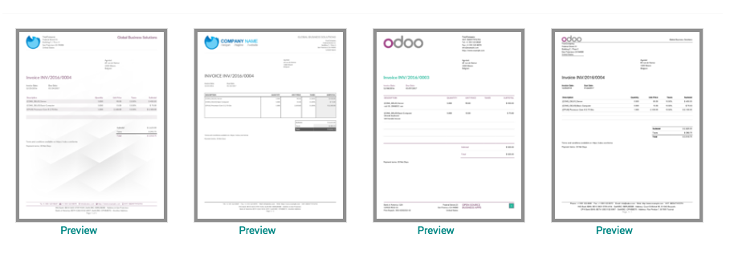

.. index::
   single: Report Layout
   single: Quotation Layout

Change your quotation layout
============================

All the legal documents such as sales order or invoice required to be
printed on the company letterhead with header and footer. You can choose
a document layout from 4 different layouts available in Odoo according
to your need.

Business case
-------------

Let’s switch to the beautiful layout. So, not only quotation but all the
legal document will be printed with the same layout.

Configuration
-------------

The quotation layout can be changed from the **Settings / General
Settings** under the **Document Template** section you can change the
document layout.

|image0|

Enter the company information such as name, address, currency and logo.
Bottom of the popup windows you can choose the layout for all your legal
document which will be printed with header and footer.

.. tip:: Do not forget to select the company logo, you can click on
  Preview link to check how it looks before you choose.

Choose the appropriate layout and apply the setting.

Print quotation
---------------

The default layout will be switched to the selected one on the
configuration, now your quotation will be printed with the new layout.
|image1|

.. |image1| image:: static/change_your_quotatio_layout/media/image2.png
