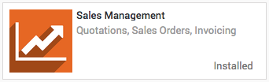
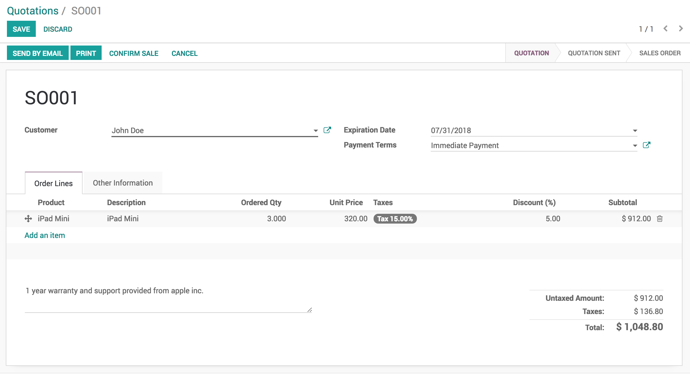
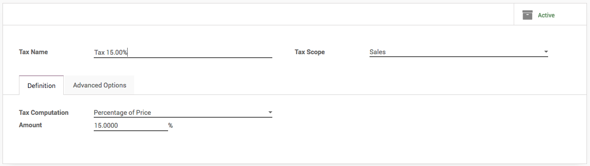

.. index::
   single: Create quotation

Create your first quotation
===========================

Quotations are documents sent to prospects to offer an estimated price
for a particular set of products or services. The prospects can accept
the quotation, in which case the seller will have to issue a sales
order, or refuse it.

Business case
-------------

For example, *My Company* sells electronic products and a client *John
Deo* showed interest in buying 3 *iPads* to facilitate their operations.
I would like to send them a quotation for those *iPads* with a sales
price of *320 USD* per *iPad* with a **5% discount**.

Configuration
-------------

Install the **Sales Management** application. In order to be able to
issue quotation, you’ll need to install the **Sales Management**
application from the **Apps** in the Odoo backend.

|Sales Management Application|

Discounts on sales order line
~~~~~~~~~~~~~~~~~~~~~~~~~~~~~

Allowing discounts on quotations is a common sales practice to improve
the chances to convert the prospect into a customer.

In our business case, we want to grant 5% discount to our customer *John
Deo* on the sale price. To enable the feature, go into the **Sales**
application, select **Configuration / Settings** and, under **Pricing**
section, select it and **APPLY** to allow manual discounts on order
lines.

|image1|

Create your quotation
---------------------

To create your first quotation, go to **Sales / Quotations** and click
on **CREATE**. Then, complete your quotation as follows:

Customer and Products
~~~~~~~~~~~~~~~~~~~~~

The basic elements to add to any quotation are the prospects or customer
(the person you will send your quotation to) and the products you want
to sell.

From the quotation view, choose the prospect from the **Customer**
drop-down list and under **Order Lines**, click on **Add an item** and
select your product. Do not forget to manually add the number of items
under **Ordered Quantity** and the **Discount** if applicable.

|image2|

To apply 5% discount enter 5 in the **Discount (%)**. The discount
should be entered between 0 to 100, it computes discount in percentage.

If you don’t have any customer or product created before on your Odoo
instance yet, you can create them on the fly directly from your
quotations:

-  To add a new customer, click on the **Customer** drop-down menu and
      click on **Create and edit**. In this new window, you will be able
      to record all the customer details, such as the address, website,
      phone number and person of contact.

-  To add a new product, under **Order Line**, click on **Add an item**,
      click on **Create and Edit** on the drop-down list of **Product**
      field. You will be able to record your product information
      (product type, cost, sale price, invoicing policy, etc.) along
      with a picture.

Taxes
~~~~~

To parameter taxes, simply go on the **Taxes** field of the order line
and click on **Create and Edit**. Fill in the details (for example if
you are subject to a 15% taxe on your sales, simply fill in the right
amount in percentage) and save.

|image3|

Terms and conditions
~~~~~~~~~~~~~~~~~~~~

You can select the expiration date of your quotation and add your
company’s terms and conditions directly in your quotation (see picture
below).

Preview quotation
-----------------

You can check the quotation before you send to the customer by email,
click on the **PRINT** button (upper left corner). You will see the
popup window that ask for company master details such as address,
contact, email, VAT number, and report layout you want to set for your
company.

|image4|

Click on the **SAVE** button to apply the settings, now you are ready to
print your first quotation. Click on the **PRINT** button again, you
will get the printable PDF version of your quotation.

.. tip:: Update your company’s details (address, website, logo, etc) can
  be changed later by clicking on the link **Change Document Template**
  under the **Settings / General Settings**.

Video
-----
Access the video at https://www.youtube.com/watch?v=OTfJhgRTPVw

.. raw:: html

    

    <iframe width="100%" height="350" src="https://www.youtube.com/embed/OTfJhgRTPVw" frameborder="0" allow="autoplay; encrypted-media" allowfullscreen></iframe>
    

.. |image1| image:: static/create_my_first_quotation/media/image4.png

.. |image4| image:: static/create_my_first_quotation/media/image10.png
