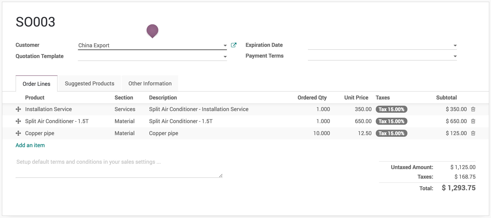

.. index::
   single: Sections on sales orders

Sections on sales orders, sort products in sections with subtotals and page-breaks
==================================================================================

Some business who delivers products and services, they need to prepare a
quotation that differentiate the products based on Service and Material
part. This section will help customer to understand what the total cost
of the Material and Service separately.

Business case
-------------

Let’s take an example of the trading and service company who wants to
send the quotation for Air-condition, related material to install it and
Installation service.

Configuration
-------------

Assumed **Sales Management** application is installed.

Sections on sales orders
~~~~~~~~~~~~~~~~~~~~~~~~

Goto **Sales / Configuration / Settings** and enable **Sections on Sales
Orders** feature that allows to create sections, sort products in
sections with subtotals and page-breaks.

|image0|

Configure the sections
~~~~~~~~~~~~~~~~~~~~~~

The two sections *Service* and *Material* are available by default, you
can configure those sections from **Sales / Configuration / Report
Layout Categories**.

|image1|

There are 4 parameters available which can configure each section, that
decided how section will be printed on reports.

-  **Name** - name of the section to be displayed on the report

-  **Add subtotal** - if selected, the subtotal will be displayed for
      section

-  **Add pagebreak** - if selected, once this section print on page, the
      next section will be printed on the next page. Uncheck **Add
      pagebreak** in *Service* section, if you would like to see all the
      section on single page.

-  **Sequence** - decided the order of the section to be printed on the
      report

Create a sales order
--------------------

Create a sales order, select customer and products such as *Split Air
Conditioner - 1.5T*, *Copper pipe* and *Installation Service*, beside
each product you have to select this product comes into which section.

|image2|

Print sales order
-----------------

You are ready to print your sales order by sections with subtotals for
each sections.

|image3|

Video
-----
Access the video at https://www.youtube.com/watch?v=2sOuEdYRSmE

.. raw:: html

    

        <iframe src="https://www.youtube.com/embed/2sOuEdYRSmE" frameborder="0" allowfullscreen style="position: absolute; top: 0; left: 0; width: 700px; height: 385px;"></iframe>
    

.. |image0| image:: static/sections_on_sales_orders/media/image5.png

.. |image1| image:: static/sections_on_sales_orders/media/image7.png

.. |image3| image:: static/sections_on_sales_orders/media/image8.png
