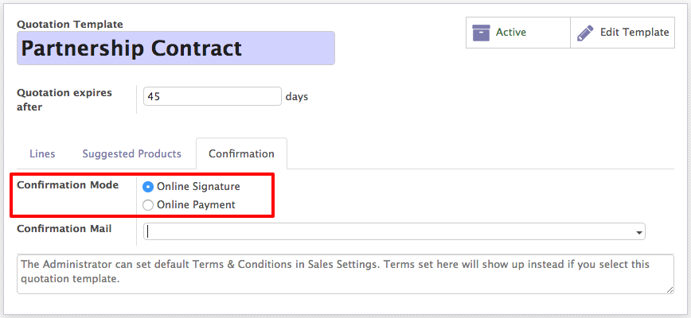

.. _quotationtemplate:

==============================
How to create quick quotation?
==============================
If you often sell the same products or services, you can save a lot of time by creating custom quotation templates. By using a template you can send a complete quotation in no time.

Configuration
-------------
For this feature to work, go to ``Sales / Configuration / Settings`` and activate Quotations Templates.

.. image:: images/chapter_02_01.png
   :alt: Sales Settings
   :align: center
   :width: 695px

Create your first template
--------------------------
You will find the templates menu under ``Sales / Configuration``. You can then create or edit an existing one. Once named, you will be able to select the product(s) and their quantity as well as the expiration time for the quotation.

.. image:: images/chapter_02_02.png
   :alt: Quotation Template
   :align: center
   :width: 695px

On each template, you can also specify discounts if the option is activated in the Sales settings. The base price is set in the product configuration and can be altered by customer pricelists.

Edit your template
------------------
You can edit the customer interface of the template that they see to accept or pay the quotation. This lets you describe your company, services and products. When you click on Edit Template you will be brought to the quotation editor.

.. image:: images/chapter_02_03.png
   :alt: Edit Quotation Template
   :align: center
   :width: 695px

This lets you edit the description content thanks to drag & drop of building blocks. To describe your products add a content block in the zone dedicated to each product.

.. image:: images/chapter_02_04.png
   :alt: Quotation Template - Edit Product Information
   :align: center
   :width: 695px

.. note:: The description set for the products will be used in all quotations templates containing those products.

Use a quotation template
------------------------
When creating a quotation, you can select a template.

.. image:: images/chapter_02_05.png
   :alt: Create a quotation
   :align: center
   :width: 695px

Each product in that template will be added to your quotation.

.. tip:: You can select a template to be suggested by default in the Sales settings.

Confirm the quotation
---------------------
Templates also ease the confirmation process for customers with a digital signature or online payment. You can select that in the template itself.

Every quotation will now have this setting added to it. Of course you can still change it and make it specific for each quotation.

Video
-----
Let's see how quotation template can help you to create the beautiful quotation quickly. Access the video at https://www.youtube.com/watch?v=2b7QcMnA3EA

.. raw:: html

    

        <iframe src="https://www.youtube.com/embed/2b7QcMnA3EA" frameborder="0" allowfullscreen style="position: absolute; top: 0; left: 0; width: 700px; height: 385px;"></iframe>
    

