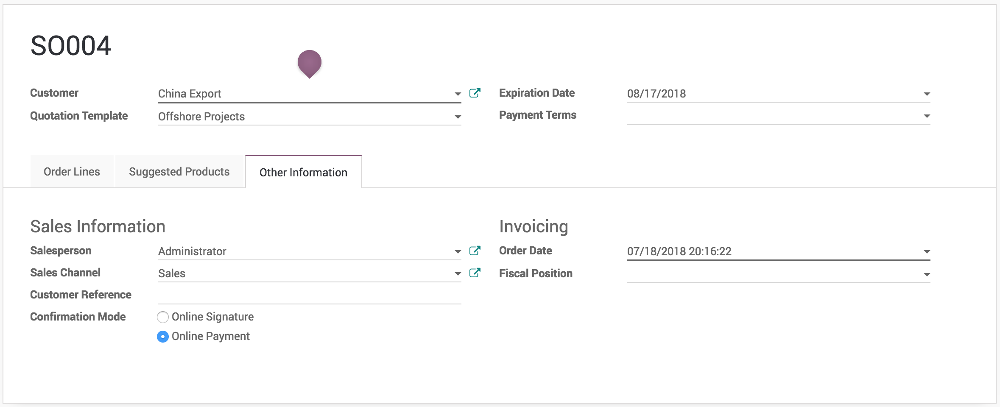
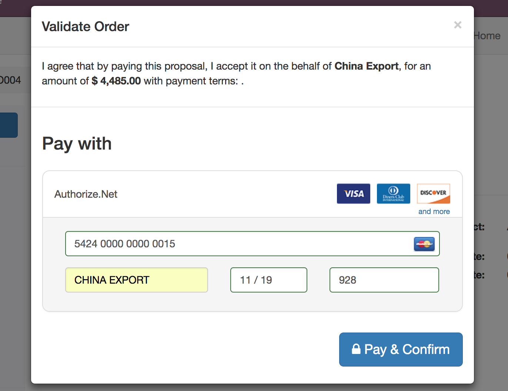

.. index::
   single: Online customer approval and payment on quotation

Online customer approval and payment on quotation
=================================================

Sending an online quotation can speed up the negotiation process,
customer can negotiate and approve the quotation online, this can boost
up your sales process and minimise the sales cycle.

Getting online approval on quotation is good but getting paid online is
great, it will be really cool to get online payment from the customer
along with the approval of quotation.

Business case
-------------

The service company who is selling the *Support pack* which is service
offered at fixed price. As soon as customer make the online payment,
they can start getting the support by sending support request. The
company wants to get the online payment instead of signature from the
customer to start the support service.

Configuration
-------------

Assumed that you have installed **Sales Management** application,
configure the quotation template for the support packs.

Online payment
~~~~~~~~~~~~~~

The **Confirmation Mode** on the quotation template available on the
**Configuration** tab is set to *Online Signature* by default, change it
to *Online Payment*. The customer have to pay online to confirm the
quotation by themselves.

Accept online payment
~~~~~~~~~~~~~~~~~~~~~

Installing the **Sales Management** application also installed the
**Invoicing** application, the payment acquire needs to be activated
from the list of payment acquires (payment gateways) available in Odoo.
All the payment acquires can be found and activated from **Invoicing /
Configuration / Payment Acquirers**.Install and configure the payment
acquirer, which suits your requirement.

I have installed and configure the *Authorised.net* payment acquirer.

|image0|

.. tip:: Do not forget to **Publish** configured payment acquire to
  force customer to pay by that and unpublish other acquire such as **Wire
  Transfer**.

I have also made change to **Payment Flow** from *Redirect to the
acquirer website* to *Payment from Odoo* as i want to process the
payment directly from Odoo without redirecting to acquirer website. You
can switch to **Production** as soon as everything configured and
working properly.

Create and send quotation by email
----------------------------------

Create a quotation select customer, select quotation template. Before
you send the quotation to customer make sure that **Confirmation Mode**
is set to *Online Payment* on quotation under the **Other Information**
tab.

|image1|

.. tip:: You can change the **Confirmation Mode** for each quotation
  regardless of the configuration on quotation template.

Accept and pay online
~~~~~~~~~~~~~~~~~~~~~

Customer can review the quotation online, once it suite their need that
can accept the quotation by clicking on the **Accept Order** and make
the online payment on the quotation.

|image2|

The quotation accepted and paid by the customer online will convert
quotation to sales order in backend.

.. warning:: Make sure that customer has correct contract details before
  they process for the online payment. Some payment acquirer required
  complete customer details.

.. tip:: Customer can accept and pay online quotation which are not
  expired yet. The expiration date will be computed on quotation based on
  the number of days defined on quotation template in **Quotation expires
  after** field. However the specific **Expiration Date** can be set on
  the quotation manually before you send the quotation by email.

The quotation converted to sales order and It will automatically
triggers the next business process in backend such as creating a
delivery order, manufacturing order or create a task or project in the
project management depending on your configuration.

|image3|

The Transaction is attached to the confirmed sales order, you can click
on the transaction and get the status and reference about the online
payment made by customer. It is set to **Done** and **Acquirer
Reference** number is available on the transaction when payment was
successfully processed.

|image4|

Reject quotation
~~~~~~~~~~~~~~~~

The quotation will be set to **Cancelled** state in the backend once it
has been rejected by the customer online, however it can be reset to
draft modified and send it back to the customer when you are in
negotiation process.

Video
-----
Access the video at https://www.youtube.com/watch?v=x08JPYRX0x4

.. raw:: html

    

    <iframe width="100%" height="380" src="https://www.youtube.com/embed/x08JPYRX0x4" frameborder="0" allow="autoplay; encrypted-media" allowfullscreen></iframe>
    

.. |image0| image:: static/online_customer_approval_and_payment_on_quotation/media/image9.png

.. |image3| image:: static/online_customer_approval_and_payment_on_quotation/media/image7.png

.. |image4| image:: static/online_customer_approval_and_payment_on_quotation/media/image6.png
