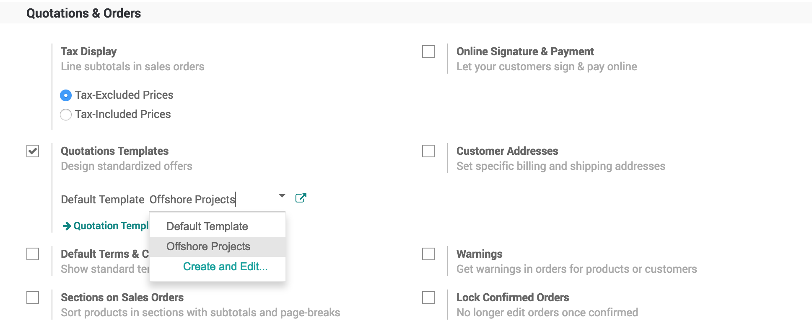

.. index::
   single: Quotation Templates

Create quick quotation using quotation template
===============================================

If you often sell the same products or services, you can save a lot of
time by creating standard quotation templates. By using a quotation
template you can send a complete quotation in no time.

Business case
-------------

The service company who is selling the offshore projects to their
customers with standard set of service products such as Project manager
days, Developer days, and Project setup fee. The developers days are
minimum to 20 days and project manager are one third of the developer
days.

Configuration
-------------

Assumed that **Sales Management** application is installed.

Quotation template
~~~~~~~~~~~~~~~~~~

Quotation template is a great feature that allows user to create offers
with group of products those are sold together.

|image0|

Create a products
~~~~~~~~~~~~~~~~~

Create the list of products that you are going to sale together, in our
business case the list of products of type service are as below:

-  Offshore Project Setup Fee
-  Project Manager Consulting Days
-  Developer Days

Create your quotation template
~~~~~~~~~~~~~~~~~~~~~~~~~~~~~~

The quotation templates can be found under **Sales / Configuration /
Quotation Template**, create or edit an existing template. Enter the
appropriate name of the template and select the list of product(s) and
their quantity as well as the expiration time for the quotation.

|image1|

.. tip:: You can also specify discount, if discount option is activated
  in the Sales settings.

|image3|

.. tip:: You can select a template to be suggested by default in the
  Sales settings.

Send quotation by email
~~~~~~~~~~~~~~~~~~~~~~~

You have to send the quotation by email, so that the quotation can be
viewed, accept or reject or paid online by the customer.

Quotation viewed by customer
~~~~~~~~~~~~~~~~~~~~~~~~~~~~

As a salesman you can start the follow-up on the quotation as soon as
you see that a quotation viewed by customer. Everytime customer open the
quotation preview you will have a message in chatter, this features of
the quotation template help salesman to understand the customer interest
on quotation.

|image4|

.. tip:: You may remove the attached quotation (pdf file) at the time sending
  quotation by mail, if you want your customer should open quotation online.

Video
-----
Access the video at https://www.youtube.com/watch?v=tt70LD6Nhs8

.. raw:: html

    

    <iframe width="100%" class="youtube-video" src="https://www.youtube.com/embed/tt70LD6Nhs8" frameborder="0" allow="autoplay; encrypted-media" allowfullscreen></iframe>
    

.. |image1| image:: static/quick_create_quotation_using_quotation_template/media/image4.png

.. |image2| image:: static/quick_create_quotation_using_quotation_template/media/image7.png

.. |image3| image:: static/quick_create_quotation_using_quotation_template/media/image9.png

.. |image4| image:: static/quick_create_quotation_using_quotation_template/media/image10.png
