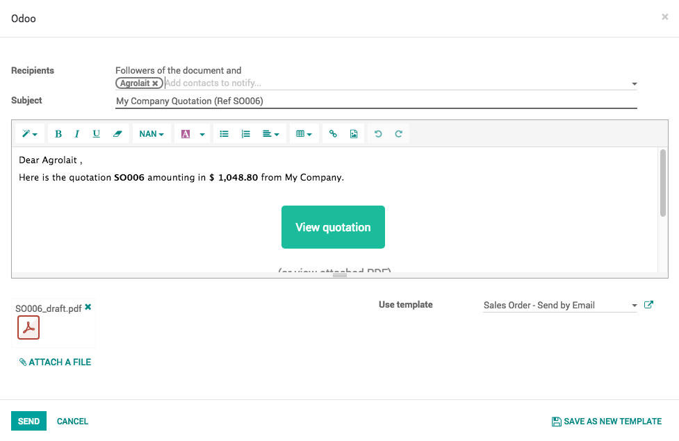

Send quotation by email
=======================

Quotations are documents sent to customers to offer an estimated price
for a particular set of goods or services. The customer can accept the
quotation, in which case the seller will have to issue a sales order, or
refuse it.

In traditional business process people use to send the quotation by
courier, it is not efficient way as it delayed the negotiation and
quotation confirmation process, Odoo allows you to send the quotation by
email and real-time discuss through email on the quotation.

Business case
-------------

Let’s send your first quotation by email, so that customer can view and
start negotiation on the quotation.

Configuration
-------------

You don’t need any configuration when you are using Odoo online. Email
feature is already configure and working out-of-the-box on Odoo online
platform.

You need to configure the external email server, if you are not using
Odoo online platform, to be precise you need to configure an incoming
and outgoing mail servers.

|image0|

Tip: If you configure only Outgoing Email Servers you will be able to
send the quotation but not receive any feedback from prospects through
email

Email address on customer
~~~~~~~~~~~~~~~~~~~~~~~~~

Make sure you have entered the correct email address in the **Email**
field, when you create a new customer.

Send by mail
------------

Assumed that the quotation is prepared and ready to share with prospect,
click on the **SEND BY EMAIL** button to send the quotation by email,
automatic email will be prepared based on the predefined template which
prepare the beautiful email with content and attachment on the email,
review the email content, you can also add the content if you wish and
send by clicking on the **SEND** button.

|image1|

Enter email address
~~~~~~~~~~~~~~~~~~~

You may be asked to enter the email address before send an email, if you
have not entered the email at the time of creating the customer.

|image2|

Enter the valid email address and you are ready to send the quotation by
email.

Chatter
~~~~~~~

All the communication made to this quotation can be tracked in chatter,
messages send to customer or received from the customer are available
below quotation. All the communication history will be preserved and
available when quotation gets converted to sales order.

.. |image0| image:: 02/media/image4.png
   :width: 6.5in
   :height: 1.94444in

.. |image2| image:: 02/media/image5.png
   :width: 6.5in
   :height: 2.68056in
