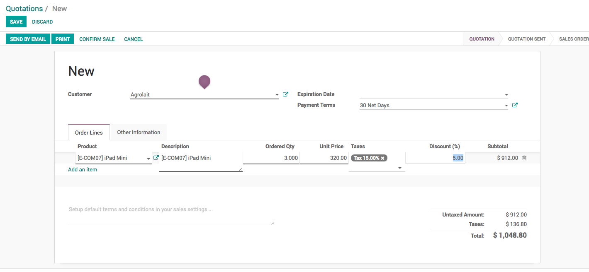
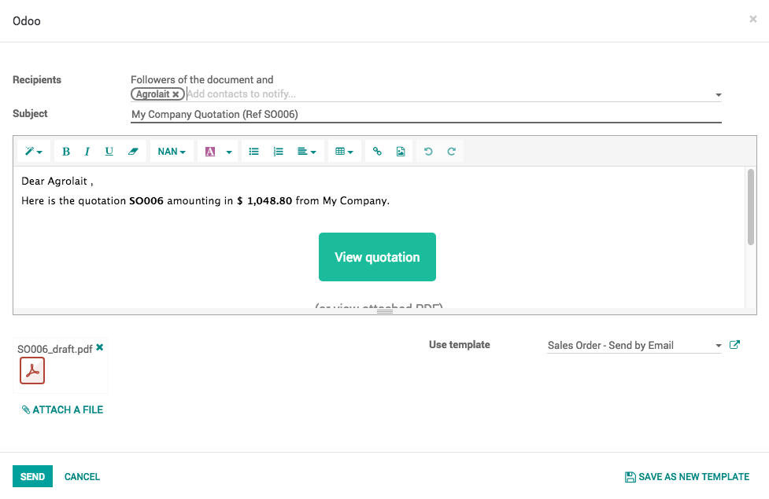
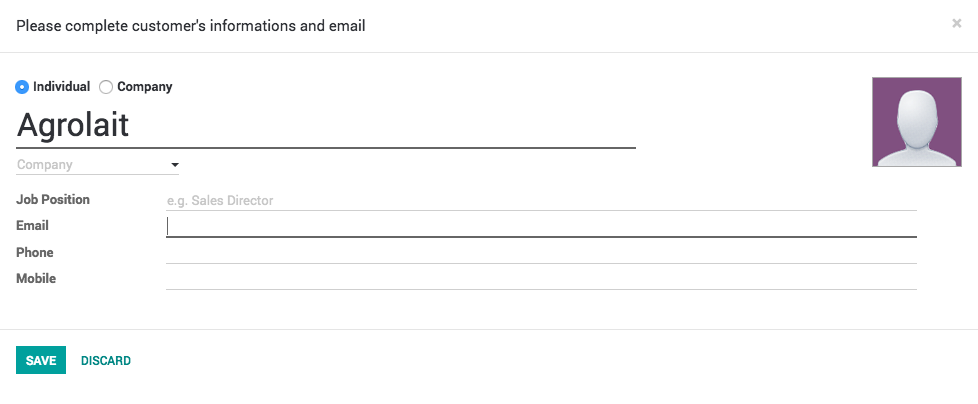

.. _sendquotationbyemail:

.. index::
   single: Send Quotation by Email

===============================
How to send quotation by email?
===============================
Quotations are documents sent to customers to offer an estimated price for a
particular set of goods or services. The customer can accept the quotation, in
which case the seller will have to issue a sales order, or refuse it.

In traditional business process people use to send the quotation by courier,
it is not effecient way as it leads to delay in confirmation of the quotation,
Odoo allows you to send the quotation by email and real-time discuss through
email or chat on the quotation.

This section will show you how you can send quotation by email.

Configuration
-------------
Install the Sales Management application to be able to send the quotation by email,
you’ll need to install the Sales Management module from the app module in the Odoo backend.

.. image:: images/chapter_02_15.png
   :alt: Sales Settings
   :align: center

Create your quotation
---------------------
To create your first quotation, click on ``Sales / Quotations`` and click on
Create. Then, complete your quotation as follows:

Customer and Products
~~~~~~~~~~~~~~~~~~~~~
The basic elements to add to any quotation are the customer (the person
you will send your quotation to) and the products you want to sell.
From the quotation view, choose the prospect from the Customer drop-down list
and under Order Lines, click on Add an item and select your product.
Do not forget to manually add the number of items under Ordered Quantity
and the discount if applicable.

If you don't have any customer or product recorded on your Odoo environment yet,
you can create them on the fly directly from your quotations :

* To add a new customer, click on the Customer drop-down menu and click on Create and edit. In this new window, you will be able to record all the customer details, such as the address, website, phone number and person of contact.
* To add a new product, under Order line, click on add an item and on Create and Edit from the drop-down list. You will be able to record your product information (product type, cost, sale price, invoicing policy, etc.) along with a picture.

.. tip:: Do not forget to add the email address while creating a new customer.

Send by Email
-------------
Click on the Send by Email button to send the quotation by email,
review the email content you can also add the content and send by clicking on
the **SEND** button.

Enter email address
~~~~~~~~~~~~~~~~~~~
You may be asked to enter the email address before send an email, if you have
not entered the email at the time of creating the customer.

Enter the valid email address and you are ready to send the quotation by email.

Video
-----
Access the video at https://www.youtube.com/watch?v=TUcNeJ4CSVg

.. raw:: html

    

        <iframe src="https://www.youtube.com/embed/TUcNeJ4CSVg" frameborder="0" allowfullscreen style="position: absolute; top: 0; left: 0; width: 700px; height: 385px;"></iframe>
    

