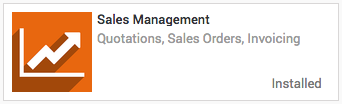
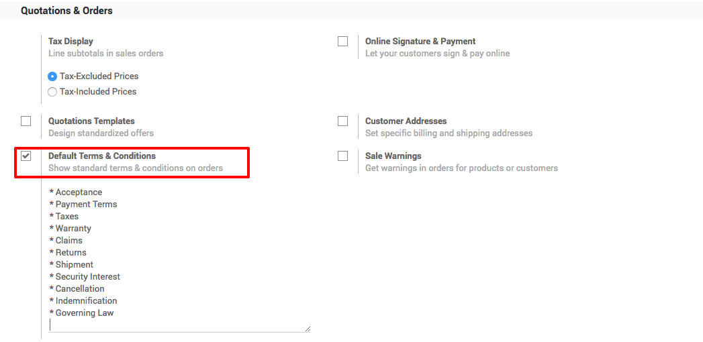
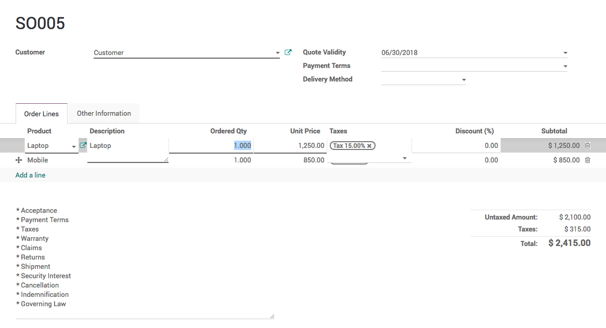
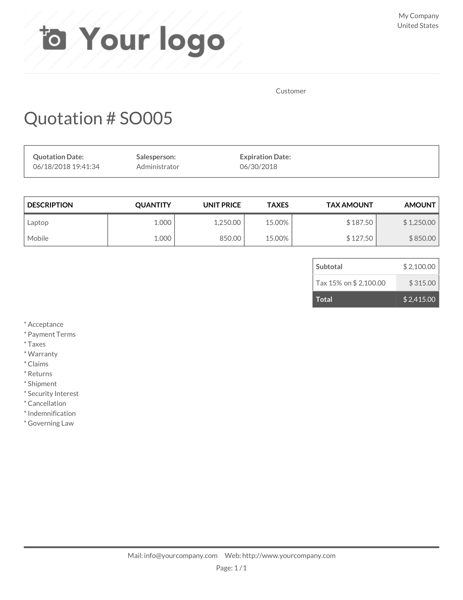

.. _defaulttermsandconditions:

.. index::
   single: Terms and Conditions
   single: Default terms and conditions

===============================================================
How to set default terms and condition for every new quotation?
===============================================================
Quotations are documents sent to customers to offer an estimated price
for a particular set of goods or services along with the business terms and condions.
The customer can accept the quotation, in which case the seller will have to issue a sales order, or refuse it.

This section will show you how to set the default terms and condition for every new quotation.

Configuration
-------------
Install the Sales Management module to be able to send quotation,
you’ll need to install the Sales Management module from the app module in the Odoo backend.

Set default terms and conditions
~~~~~~~~~~~~~~~~~~~~~~~~~~~~~~~~
Every quotation issued to the prospect need to have some default terms and conditions,
those terms and conditions are accepted by the customer at the time of accepting the quotation.

The standard terms and conditions includes the below points:

* Acceptance
* Payment Terms
* Taxes
* Warranty
* Claims
* Returns
* Shipment
* Security Interest
* Cancellation
* Indemnification
* Governing Law

Prepare and set the default terms and conditions under
the ``Sales / Configuration / Setting``.

Create your quotation
---------------------
To create your first quotation, click on ``Sales / Quotations`` and click on the Create button.
The default terms and conditions should be filled and appeared on the printed quotation.

By setting the term and conditions in the global settings, you can be sure
that all the quotation follow the same terms and conditions, prepared and send by
all the sales person.

Print quotation
~~~~~~~~~~~~~~~
Quotation can be printed along with term and conditions.

Video
-----
Access the video at https://www.youtube.com/watch?v=hqY5eZxgfRs

.. raw:: html

    

        <iframe src="https://www.youtube.com/embed/hqY5eZxgfRs" frameborder="0" allowfullscreen style="position: absolute; top: 0; left: 0; width: 700px; height: 385px;"></iframe>
    

.. seealso::
  * :doc:`send_quotation_by_email`
