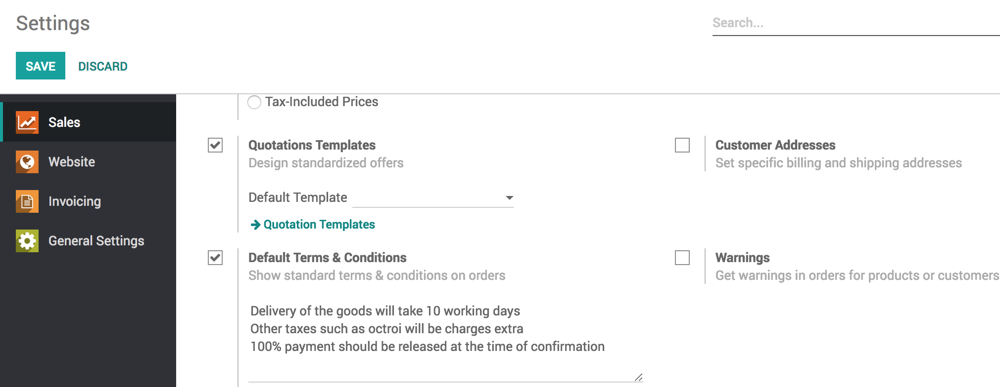

Set default terms and condition on quotation
============================================

Every quotation issued to the prospect need to have terms and
conditions, those terms and conditions are accepted by the customer at
the time of accepting the quotation.

The most common terms and conditions includes the payment terms,
delivery date, and tax clarification, there are many other points as
below can be included in the terms and conditions:

-  Acceptance

-  Payment Terms

-  Taxes

-  Warranty

-  Claims

-  Returns

-  Shipment

-  Security Interest

-  Cancellation

-  Indemnification

-  Governing Law

Business case
-------------

Let’s take an example of the trading company, they need to define the
terms and conditions required by their nature of business, the terms and
conditions should be applied to all the quotation created by any
salesman. They want to set the below point as a default terms and
conditions:

-  Delivery of the goods will take 10 working days

-  Other taxes such as octroi will be charges extra

-  100% payment should be released at the time of confirmation

Configuration
-------------

Assumed that the **Sales Management** application is already installed.

Default terms and conditions
~~~~~~~~~~~~~~~~~~~~~~~~~~~~

Let’s go to Sales / Configuration / Settings, enable the default terms
and conditions and enter all the conditions those required to be set by
default on all the quotation.

|image0|

Click on **SAVE** to apply the settings.

Create a quotation
------------------

Goto **Sales / Orders / Quotations** and create a new quotation, you
will notice that quotation is empty but the default terms and conditions
are set on it.

|image1|

The salesman can make the changes as per the requirement but you can be
sure that salesman will never forget to add the default terms and
conditions.

.. tip:: The payment terms will be added automatically at the end of
  every quotation as a part of the terms and conditions in the printed
  quotation if any.

.. |image1| image:: static/set_default_terms_and_condition/media/image4.png
   :width: 6.5in
   :height: 2.875in
